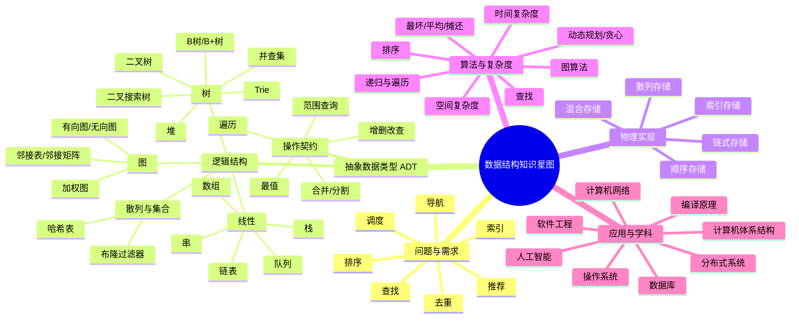

# 数据结构导学：从"存数据"到"设计计算世界"

> 来源：课程导学文档（shanec 于 2026-09-14 提供）。原文保留，不改不删。
> 消化产出：`wiki/resources/concept/数据结构分析框架.md`、`wiki/projects/数据结构 Introduction.md`、`D:/Projects/数据结构 Introduction/`

欢迎来到数据结构课。  
这门课表面上学的是数组、链表、栈、队列、树、图、哈希表；但真正学的是：**如何把现实问题翻译成计算机能高效处理的形式**。数据结构不是一堆要背的结构，而是一套"表示 + 操作 + 效率 + 权衡"的设计语言。

一句话主线：

> **数据结构 = 数据的逻辑关系 + 物理存储 + 操作集合 + 效率权衡。**

你以后每学一个结构，都可以问自己四个问题：

1. 它表示什么关系？线性、层次、网络、集合？
2. 它支持哪些操作？查找、插入、删除、遍历、范围查询、最值？
3. 它怎么存？顺序、链式、索引、散列、混合？
4. 代价是什么？时间、空间、最坏情况、平均情况、并发、磁盘？

---

## 一、一张可以不断扩展的"数据结构知识星图"

下面这张图不是最终版，而是**骨架**。随着课程推进，你可以在每个分支下继续加节点。它可以用纸笔画，也可以用 Obsidian、Logseq、Notion、XMind、Mermaid 等工具维护。



这个图的关键不是"画得好看"，而是**可扩展**。每学一个新知识点，就做三件事：

1. 把它挂到某个逻辑结构或问题分支下；
2. 写一张知识卡片；
3. 连几条边：前置、对比、组合、应用、关联课程。

知识卡片模板可以这样：

```text
知识点：哈希表
所属：逻辑结构/散列与集合；物理实现/数组+链表或开放寻址
ADT：insert(k,v), delete(k), search(k)
核心操作复杂度：平均 O(1)，最坏 O(n)
前置：数组、链表、哈希函数
对比：二叉搜索树、跳表
组合：哈希表 + 双向链表 = LRU 缓存
应用：字典、缓存、数据库索引、路由表、去重
关联课程：数据库、操作系统、网络、分布式系统
开放问题：扩容、冲突、并发、一致性哈希
```

这样，你的知识不是孤立点，而是一张会生长的网。

---

## 二、用真实问题启发思考

下面这些问题没有唯一答案。重要的是练习"选择结构"的思维。

1. **通讯录/学生成绩管理**  
   10 万条记录，支持按学号查、按姓名查、按拼音前缀搜、按成绩排序。  
   思考：数组、哈希表、二叉搜索树、Trie、堆分别适合哪一部分？读多写少还是写多读少？

2. **编辑器撤销与重做**  
   无限撤销、重做，还要保存历史。  
   思考：栈够吗？双栈？持久化栈？内存爆炸怎么办？  
   关联：软件工程、操作系统、版本控制。

3. **操作系统任务调度**  
   就绪队列、优先级、公平性、实时任务。  
   思考：普通队列、优先队列、堆、红黑树、时间轮分别适合什么场景？  
   关联：操作系统、实时系统。

4. **文件系统目录**  
   路径查找、目录树、硬链接、软链接、inode。  
   思考：树如何表示目录？哈希如何加速查找？B+树为什么适合磁盘？  
   关联：操作系统、数据库、存储系统。

5. **社交网络好友关系**  
   好友、共同好友、好友推荐、连通分量。  
   思考：邻接表还是邻接矩阵？BFS/DFS 能做什么？十亿用户怎么存？  
   关联：图论、推荐系统、分布式计算。

6. **地图导航**  
   最短路径、实时路况、换乘、避开拥堵。  
   思考：Dijkstra、A*、堆、分层图、图数据库。  
   关联：图算法、人工智能、GIS。

7. **数据库索引**  
   等值查询、范围查询、排序、事务。  
   思考：B+树、哈希索引、LSM 树、布隆过滤器分别解决什么问题？  
   关联：数据库、磁盘、并发控制。

8. **编译器符号表**  
   变量、作用域、类型、函数调用。  
   思考：哈希表 + 栈 + 树 + 图如何配合？  
   关联：编译原理、程序语言、软件工程。

9. **缓存系统 LRU/LFU**  
   快速查找、快速淘汰、并发访问。  
   思考：哈希表 + 双向链表为什么能 O(1)？LFU 呢？  
   关联：操作系统、分布式缓存、Redis。

10. **搜索提示与倒排索引**  
    输入前缀，返回热门搜索词。  
    思考：Trie、哈希、Top-K 堆、倒排索引、分布式索引。  
    关联：搜索引擎、自然语言处理、大数据。

11. **Git 版本控制**  
    提交历史、分支、合并、回滚。  
    思考：DAG、拓扑排序、Merkle 树、持久化数据结构。  
    关联：软件工程、分布式系统、密码学。

12. **推荐系统与机器学习**  
    用户-物品关系、相似度、向量检索。  
    思考：图、哈希、KD 树、HNSW、倒排索引。  
    关联：人工智能、数据挖掘、高性能计算。

每个问题都可以用"六问法"分析：

- 数据规模多大？
- 主要操作是什么？
- 读写比例如何？
- 是否需要有序、范围、最值？
- 内存、磁盘、网络、并发约束是什么？
- 能接受最坏情况吗？还是平均好就行？

---

## 三、把数据结构放回整个学科

数据结构是计算机科学的"骨架"，它连接数学、系统和应用。

| 学科/领域 | 数据结构角色 | 典型问题 |
|---|---|---|
| 离散数学 | 集合、关系、图、树、逻辑 | 如何形式化描述数据关系 |
| 算法 | 排序、查找、图算法、动态规划 | 如何设计高效步骤 |
| 操作系统 | 队列、页表、文件系统、LRU | 如何管理进程、内存、文件 |
| 编译原理 | 符号表、语法树、DAG、数据流 | 如何分析和生成程序 |
| 数据库 | B+树、哈希、LSM、布隆过滤器 | 如何快速查询和存储 |
| 计算机网络 | 路由表、Trie、队列、图 | 如何转发、路由、过滤 |
| 人工智能 | 搜索、图、堆、Trie、向量索引 | 如何表示知识和推理 |
| 分布式系统 | 一致性哈希、Merkle 树、跳表 | 如何分片、复制、容错 |
| 软件工程 | 接口、模块化、测试、性能 | 如何构建可维护系统 |
| 体系结构 | 缓存、局部性、内存层级 | 如何让程序跑得更快 |

所以，数据结构不是孤立课程。它是你理解操作系统、数据库、网络、编译、AI 的"共同语言"。

---

## 四、学习建议：三问、四步、避坑

**三问：**

1. 数据之间是什么关系？
2. 要支持什么操作？
3. 代价和约束是什么？

**四步：**

1. 画图：先画逻辑关系，不急着写代码。
2. 定义 ADT：操作是什么，契约是什么。
3. 选择/实现物理结构：顺序、链式、索引、散列。
4. 分析复杂度：时间、空间、最坏、平均、摊还。

**避坑：**

- 不要只背代码，要会比较和选择。
- 不要忽略边界：空结构、重复元素、极端规模。
- 不要只看平均，关键系统要看最坏。
- 不要只学单机，很多结构在磁盘、并发、分布式下会变形。
- 不要孤立学习，每学一个结构，问它替代谁、被谁组合、用在哪里。

---

## 结语

数据结构课真正要给你的，不是几十个名词，而是一种能力：  
**看到问题，能想到表示；看到表示，能想到操作；看到操作，能想到代价；看到代价，能做出权衡。**

当你能把通讯录、导航、数据库、操作系统、社交网络都映射到一张不断扩展的知识星图上，你就不是在"学数据结构"，而是在建造自己的计算世界地图。
