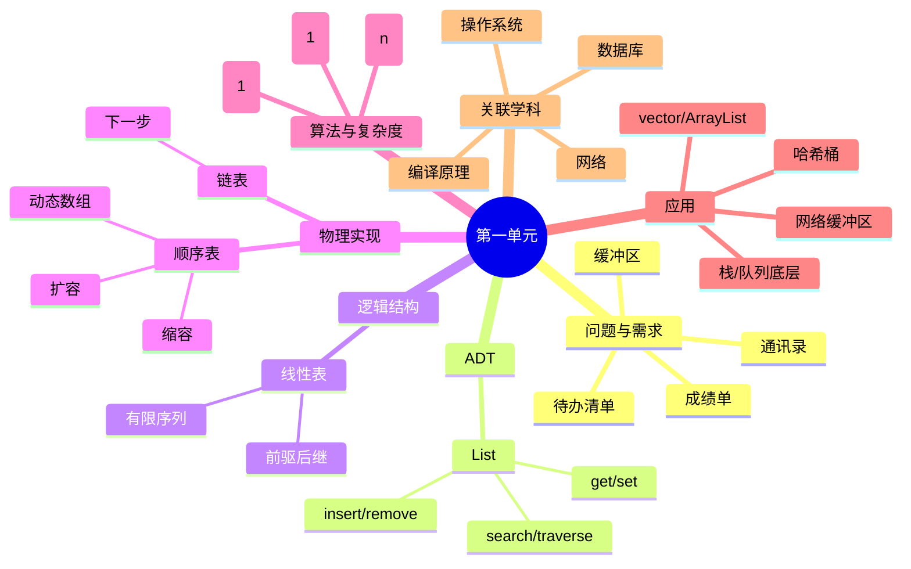

# 第一学习单元：线性表与顺序表（动态数组）

> 来源：课程单元文档（shanec 于 2026-09-14 提供）。原文保留，不改不删。
> 消化产出：`wiki/resources/concept/线性表.md`、`顺序表.md`、`摊还分析.md`、`wiki/projects/线性表.md`、`D:/Projects/线性表/`

---

## 最开始学什么？先学哪个结构？

如果按大多数数据结构课程的顺序：

1. **先学绪论：数据结构基本概念、抽象数据类型、算法与复杂度分析；**
2. **第一个具体结构：线性表；**
3. **第一个具体实现：顺序表，也就是动态数组；**
4. **紧接着对比学习：单链表。**

所以，如果只选一个"结构"开始，答案是：

> **线性表。**  
> 更具体地说，是 **抽象数据类型 List + 顺序表/动态数组**。

为什么不是栈、队列、树、图？  
因为栈和队列是"受限的线性表"，树和图是更复杂的非线性结构。线性表是后续几乎所有结构的基础：栈、队列、串、哈希桶、堆、图的邻接表，都离不开它。

---

## 0. 本单元在知识星图中的位置



你的任务不是背下这张图，而是随着学习不断给它加节点、连边。

---

## 1. 问题驱动：为什么需要线性表？

先不要急着写代码。请思考一个真实问题：

### 场景：学生成绩管理

你需要保存一个班 100 个学生的成绩，并支持：

- 按序号查看第 i 个学生成绩；
- 修改某个学生成绩；
- 插入一个新学生成绩；
- 删除一个学生成绩；
- 查找某个分数是否存在；
- 遍历所有成绩。

请用"六问法"分析：

1. **数据规模多大？** 100？10 万？10 亿？
2. **主要操作是什么？** 随机访问多，还是插入删除多？
3. **读写比例如何？** 读多写少，还是写多读少？
4. **是否需要有序、范围、最值？**
5. **约束是什么？** 内存连续？缓存？并发？磁盘？
6. **能接受最坏情况吗？** 还是平均好就行？

如果数据量小，普通数组就够了。  
但如果数据量会增长，数组的"定长"就不够了。  
如果频繁在中间插入删除，数组的"移动元素"也会很慢。

于是我们引入第一个抽象：

> **线性表：有限个元素组成的有序序列。**

它的逻辑关系很简单：除了第一个，每个元素都有前驱；除了最后一个，每个元素都有后继。

---

## 2. 定义 ADT List：先定契约，再谈实现

ADT，抽象数据类型，关注的是"能做什么"，不是"怎么存"。

你可以先写下 List 的操作契约：

| 操作 | 含义 | 约定 |
|---|---|---|
| `init()` | 初始化空表 | 表长为 0 |
| `size()` | 返回元素个数 | 非负 |
| `empty()` | 是否为空 | true/false |
| `get(i)` | 取第 i 个元素 | i 越界则报错 |
| `set(i, e)` | 修改第 i 个元素 | i 越界则报错 |
| `insert(i, e)` | 在第 i 个位置插入 e | i 合法，表长加 1 |
| `remove(i)` | 删除第 i 个元素并返回 | i 合法，表长减 1 |
| `append(e)` | 尾部追加 | 等价于 insert(size, e) |
| `search(e)` | 查找 e 的位置 | 找不到返回 -1 |
| `traverse()` | 遍历所有元素 | 按顺序访问 |

引导思考：

- 位置从 0 开始还是从 1 开始？  
  国内教材常用 1-based，代码常用 0-based。你必须明确约定，否则插入删除很容易错。
- 允许重复元素吗？  
  允许。查找返回第一个匹配位置即可。
- 越界怎么办？  
  可以抛异常、返回错误码、断言。接口要一致。

---

## 3. 逻辑结构 vs 物理实现

这是数据结构课最重要的思维之一：

> **逻辑结构**：数据之间是什么关系。  
> **物理实现**：数据在内存里怎么放。

线性表的逻辑结构是线性的。  
但物理实现可以有两种：

1. **顺序存储：顺序表 / 动态数组**
2. **链式存储：链表**

本单元先学顺序表。

---

## 4. 顺序表：用连续内存表示线性表

顺序表的核心思想：

- 用一段连续内存保存元素；
- 记录当前元素个数 `size`；
- 记录当前容量 `capacity`；
- 当 `size == capacity` 时扩容。

它其实就是大多数语言里的：

- C++ `std::vector`
- Java `ArrayList`
- Python `list`
- C# `List<T>`

### 4.1 顺序表的结构

```text
data: [10, 20, 30, 40, _, _, _, _]
size = 4
capacity = 8
```

逻辑上它们是线性序列：10 -> 20 -> 30 -> 40。  
物理上它们挨着存放，所以可以通过地址计算直接访问：

```text
address(i) = base + i * sizeof(T)
```

这就是为什么 `get(i)` 和 `set(i)` 是 O(1)。

引导思考：

- 为什么数组下标从 0 开始？  
  因为地址计算最简单：`base + i * size`。如果从 1 开始，就要多减一次。
- 连续内存有什么好处？  
  缓存友好，随机访问快。
- 有什么坏处？  
  插入删除要移动元素；容量固定，需要扩容；大片连续内存可能分配失败。

---

## 5. 核心操作与复杂度

先看操作，再看代码。

| 操作 | 顺序表复杂度 | 原因 |
|---|---|---|
| `get(i)` | O(1) | 直接地址计算 |
| `set(i, e)` | O(1) | 直接地址计算 |
| `search(e)` | O(n) | 需要逐个比较 |
| `insert(i, e)` | O(n) | 需要把 i 之后元素后移 |
| `remove(i)` | O(n) | 需要把 i 之后元素前移 |
| `append(e)` | 摊还 O(1) | 多数情况直接放，偶尔扩容复制 |
| `traverse()` | O(n) | 访问每个元素一次 |

### 重点：为什么尾部追加是"摊还 O(1)"？

假设容量从 1 开始，每次满了就翻倍：

```text
1 -> 2 -> 4 -> 8 -> 16 -> ...
```

连续追加 n 次，复制元素的总次数大约是：

```text
1 + 2 + 4 + ... + n/2 < 2n
```

所以总代价是 O(n)，平均到每次追加就是 O(1)。  
这就是**摊还分析**：单次最坏可能是 O(n)，但长期平均是 O(1)。

引导思考：

- 如果每次满了只增加 1 个容量，会怎样？  
  每次追加都要复制，总代价 O(n²)。
- 如果每次扩大 10 倍呢？  
  复制次数少，但内存浪费可能很大。
- 扩容因子 1.5 和 2 有什么区别？  
  2 增长快、浪费多；1.5 更省内存，但复制更频繁。很多工程库用 1.5 或 2。

---

## 6. 顺序表代码框架

下面给一个简化版 C++ 顺序表，重点看思路，不追求工程完美。

```cpp
#include <stdexcept>
using namespace std;

class SeqList {
private:
    int* data;
    int size;
    int capacity;

    void resize(int newCap) {
        int* newData = new int[newCap];
        for (int i = 0; i < size; ++i) {
            newData[i] = data[i];
        }
        delete[] data;
        data = newData;
        capacity = newCap;
    }

public:
    SeqList(int cap = 8) {
        if (cap <= 0) cap = 8;
        data = new int[cap];
        size = 0;
        capacity = cap;
    }

    ~SeqList() {
        delete[] data;
    }

    int getSize() const {
        return size;
    }

    bool empty() const {
        return size == 0;
    }

    int get(int i) const {
        if (i < 0 || i >= size) throw out_of_range("index out of range");
        return data[i];
    }

    void set(int i, int e) {
        if (i < 0 || i >= size) throw out_of_range("index out of range");
        data[i] = e;
    }

    void insert(int i, int e) {
        if (i < 0 || i > size) throw out_of_range("index out of range");
        if (size == capacity) {
            resize(capacity * 2);
        }
        for (int j = size; j > i; --j) {
            data[j] = data[j - 1];
        }
        data[i] = e;
        ++size;
    }

    int remove(int i) {
        if (i < 0 || i >= size) throw out_of_range("index out of range");
        int old = data[i];
        for (int j = i; j < size - 1; ++j) {
            data[j] = data[j + 1];
        }
        --size;
        return old;
    }

    void append(int e) {
        insert(size, e);
    }

    int search(int e) const {
        for (int i = 0; i < size; ++i) {
            if (data[i] == e) return i;
        }
        return -1;
    }
};
```

请你自己回答：

- `insert` 中 `for` 循环为什么从 `size` 开始？
- `remove` 中为什么到 `size - 1` 结束？
- 如果 `i == size`，插入是否合法？  
  合法，表示尾部插入。
- 删除后要不要缩容？  
  可以，但不要频繁缩容，否则可能"抖动"。常见策略：当 `size < capacity / 4` 时缩到一半。

---

## 7. 顺序表 vs 链表：提前建立对比意识

虽然链表下一步才学，但你现在就要开始对比。

| 维度 | 顺序表 | 单链表 |
|---|---|---|
| 随机访问 | O(1) | O(n) |
| 头部插入 | O(n) | O(1) |
| 尾部插入 | 摊还 O(1) | O(n) 无尾指针 / O(1) 有尾指针 |
| 中间插入 | O(n) | 找位置 O(n) + 改指针 O(1) |
| 删除 | O(n) | 找位置 O(n) + 改指针 O(1) |
| 内存 | 连续，缓存友好，可能预留浪费 | 分散，指针有额外开销，缓存不友好 |
| 扩容 | 需要复制 | 不需要连续大块内存 |

引导思考：

- 如果你的系统读多写少，选谁？
- 如果频繁在头部插入删除，选谁？
- 如果数据量巨大且内存碎片化，选谁？
- 如果要求缓存友好和高性能遍历，选谁？

没有绝对答案，只有权衡。

---

## 8. 常见误区与避坑

1. **位置语义混乱**  
   教材说第 1 个位置，代码说下标 0。写代码前先统一。

2. **越界检查遗漏**  
   `get`、`set`、`insert`、`remove` 都要检查。

3. **扩容后指针/迭代器失效**  
   C++ `vector` 扩容后，原来的指针、引用、迭代器可能失效。

4. **删除不缩容导致内存浪费**  
   但缩容太积极会导致频繁复制。

5. **浅拷贝问题**  
   如果元素是指针或对象，复制时要考虑深拷贝。

6. **只测正常情况**  
   必须测空表、满表、头插、尾插、中间删、越界。

---

## 9. 实验任务

### 任务 1：实现并测试顺序表

实现上面的 `SeqList`，至少支持：

- `insert`
- `remove`
- `get`
- `set`
- `search`
- `append`
- `size`
- `empty`

写测试用例：

- 空表删除
- 越界访问
- 头部插入
- 尾部插入
- 中间插入
- 删除后查找
- 连续追加 100000 个元素

### 任务 2：复杂度实验

对比：

- 在头部插入 10000 个元素
- 在尾部追加 10000 个元素

记录时间，解释差异。

### 任务 3：知识卡片

为你自己写一张卡片：

```text
知识点：顺序表 / 动态数组
所属：线性表 -> 顺序存储
ADT：List
核心操作：get/set/insert/remove/search/append
复杂度：get O(1)，insert/remove O(n)，append 摊还 O(1)
前置：数组、内存地址、复杂度
对比：链表
组合：栈、队列、哈希桶、缓冲区
应用：vector、ArrayList、Python list
关联课程：操作系统、数据库、网络
开放问题：扩容因子、缩容策略、并发安全
```

---

## 10. 关联整个学科

顺序表不是孤立知识，它在很多地方出现：

- **操作系统**：页表、进程表、文件描述符表常用数组。
- **数据库**：行存储、页内记录、索引节点常用连续数组。
- **计算机网络**：环形缓冲区常用数组实现。
- **编译原理**：符号表可以用数组或哈希桶。
- **人工智能**：向量、矩阵、张量底层都是连续数组。
- **软件工程**：选择 `vector` 还是 `list`，直接影响性能。

引导思考：

- 为什么数据库页大小通常是 4KB 或 8KB？  
  和磁盘、内存、连续存储有关。
- 为什么网络缓冲区常用环形数组？  
  避免频繁移动数据，复用空间。
- 为什么 Python 的 `list` 是动态数组，而不是链表？  
  因为随机访问和缓存友好非常重要。

---

## 11. 本单元自测

1. 用一句话解释什么是线性表。
2. 顺序表的 `get(i)` 为什么是 O(1)？
3. `insert(i, e)` 最坏情况为什么要移动多少元素？
4. 什么是摊还 O(1)？请用动态数组扩容解释。
5. 顺序表和链表各自最适合什么场景？
6. 如果让你设计一个待办清单，你会选顺序表还是链表？为什么？
7. 如果数据量是 10 亿，顺序表还能直接放内存吗？不能怎么办？

---

## 12. 下一步

完成本单元后，你应该能：

- 定义 List ADT；
- 实现动态数组；
- 分析主要操作复杂度；
- 解释摊还分析；
- 说出顺序表的优缺点；
- 把本单元挂到知识星图中。

下一步就是：

> **单链表：它如何解决顺序表插入删除慢的问题？又失去了什么？**

带着同样的问题去学链表：

1. 它表示什么关系？
2. 支持什么操作？
3. 怎么存？
4. 代价是什么？

这样，你的数据结构学习就不是背结构，而是在不断扩展一张属于你自己的计算世界地图。
