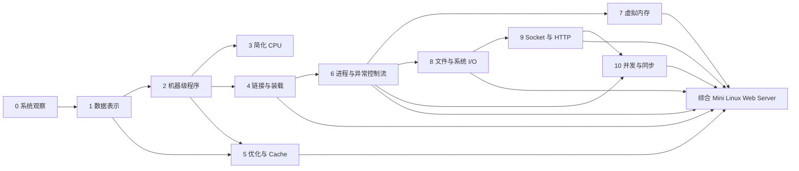

# 计算机系统基础：实验参考指南与可视化索引

> [!abstract] 用法
> 这份索引不是“先读完再实验”的书单，而是配合课程方法论使用：**预测 → 最小实验 → 证据 → 解释/复测 → 迁移**。
>
> - **A 必读**：实验前 20–40 分钟，只读能支撑本次实验的核心节。
> - **B 按需查**：出现“不知道工具/接口究竟保证什么”时查官方文档。
> - **C 扩展**：实验完成后再看，用来建立跨项目联系。
> - **视频**：用于形成直观模型，不替代实验和文字资料。

## 总路线图

## 主教材映射（CS:APP 3e）

| 项目 | 主线章节 | 实验前优先读 |
| --- | --- | --- |
| 0 系统观察 | Ch.1 + Ch.3 §3.10.2 | 1.2–1.7；3.10.2 |
| 1 数据表示 | Ch.2 | 2.1、2.2、2.4；位运算看 2.1.6–2.1.9 |
| 2 机器级程序 | Ch.3 | 3.2–3.7；数组/栈再看 3.8–3.10 |
| 3 简化 CPU | Ch.4 | 4.1–4.3 |
| 4 链接与装载 | Ch.7 | 7.1–7.10；工具看 7.14 |
| 5 优化与 Cache | Ch.5 + Ch.6 | 5.2–5.14；6.2–6.6 |
| 6 进程与异常控制流 | Ch.8 | 8.1–8.5 |
| 7 虚拟内存与分配 | Ch.9 | 9.1–9.9；常见错误看 9.11 |
| 8 文件与系统 I/O | Ch.10 | 10.1–10.11 |
| 9 Socket 与 HTTP | Ch.11 | 11.1–11.6 |
| 10 并发与同步 | Ch.12 | 12.1–12.7 |
| 综合项目 | Ch.10–12 回看 | 按请求路径补读 |

CS:APP 官方学生资源：https://csapp.cs.cmu.edu/3e/students.html  
CS:APP 目录/前言：https://csapp.cs.cmu.edu/3e/pieces/preface3e.pdf

## 第二主线：OSTEP（操作系统部分）

OSTEP 免费在线版：https://pages.cs.wisc.edu/~remzi/OSTEP/

- 项目 6：Ch.4 Processes、Ch.5 Process API、Ch.6 Direct Execution。
- 项目 7：Ch.13 Address Spaces、14 Memory API、15 Address Translation、17 Free Space Management、18–23 Paging/VM。
- 项目 8：Ch.39 Files and Directories、40 File System Implementation；更深可看 41–42。
- 项目 10：Ch.26 Concurrency and Threads、27 Thread API、28 Locks、29 Locked Data Structures、30 Condition Variables、31 Semaphores、32 Concurrency Bugs。
- 项目 9 若想理解 TCP/IP 本身，OSTEP 不是主教材，优先 Beej + socket 文档。

## 工具与系统调用官方文档

- GDB：https://sourceware.org/gdb/current/onlinedocs/gdb.html
- GNU Binutils（objdump/nm/readelf 等）：https://sourceware.org/binutils/docs/binutils.html
- GNU ld：https://sourceware.org/binutils/docs/ld/
- strace：https://strace.io/
- Linux man-pages：https://man7.org/linux/man-pages/
- GCC online docs：https://gcc.gnu.org/onlinedocs/

> [!tip] 查接口时的习惯
> 先执行 `man 2 <system-call>` 或 `man 3 <library-function>`；网络资料用于补充。你真正要记录的是：**参数、返回值、失败条件、资源所有权、可观察副作用**。

## 视频/课程入口

- MIT 6.172 Performance Engineering：C、汇编、测量、Cache、并行与竞争。https://ocw.mit.edu/courses/6-172-performance-engineering-of-software-systems-fall-2018/
- MIT 6.1810 Operating System Engineering（2026）：系统调用、页表、缺页、锁、网络、文件系统等。https://pdos.csail.mit.edu/6.S081/2026/schedule.html
- Nand2Tetris：从指令集与 CPU 数据通路理解“取指—译码—执行”。https://www.nand2tetris.org/course
- MIT Missing Semester：命令行、调试、性能分析。https://missing.csail.mit.edu/

## 网络专项

- Beej's Guide to Network Programming：https://beej.us/guide/bgnet/
- HTTP/1.0（本课程简化服务器对应的历史规范）：https://www.rfc-editor.org/rfc/rfc1945
- 当前 HTTP 语义参考 RFC 9110：https://www.rfc-editor.org/rfc/rfc9110

## 如何把“读资料”嵌入一次实验

1. **先预测**：没读答案前写 2–4 句预测。
2. **读 A 级材料**：只读能让你开始做实验的节，不追求一次掌握。
3. **做最小实验**：保存命令、代码、输入、输出、环境。
4. **遇到接口语义问题再查 B 级官方文档**：不要凭博客记忆 API。
5. **解释证据**：把“看到了什么”与“因此推断什么”分开。
6. **实验后读 C 级扩展**：把局部现象连到系统模型。
7. **迁移测试**：改变输入、优化级别、进程数、缓冲区大小等一个条件，再预测一次。

## 图解索引

每篇项目文档末尾都加入一张该项目的 Mermaid 机制图；另外可打开：
[交互式总览 HTML](visuals/计算机系统实验总览.html)

> [!warning] 参考资料不是完成标准
> “看懂教材/视频”不能替代“能预测 + 能用工具拿证据 + 能解释差异”。当资料与实验现象不一致时，先检查实验条件与抽象层级，再复测。
