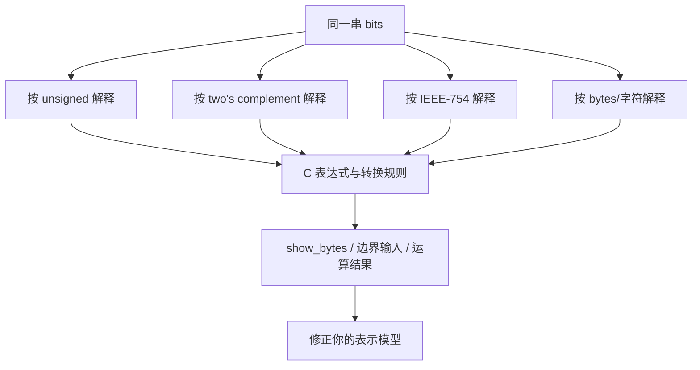

# 自学文档 1：项目 1——数据表示与位运算

> [!abstract] 中心问题
> 同一串 0 和 1，为什么既可以表示负数、整数、字符，也可以表示浮点数？当位数固定以后，计算机还能“精确地”表示多少信息？

> [!info] 本文档怎么用
> 本项目不是背二进制规则，而是建立“**位模式 → 解释规则 → C 语言行为 → 实际字节证据**”这条链。每一节先预测，再写最小程序观察。你需要保留输出，而不是只得到结论。

## 全貌：项目 1 的六个问题

| # | 问题 | 你最终要能回答 |
| --- | --- | --- |
| 1 | 一个 C 对象在内存里到底是什么？ | 本质是一段字节；类型决定这些字节如何解释 |
| 2 | 无符号数与有符号数有什么关系？ | 位模式可相同，解释规则不同 |
| 3 | 补码为什么能统一加减法？ | 固定位宽下，模运算与补码编码相容 |
| 4 | 大端、小端是什么意思？ | 多字节对象的字节排列顺序 |
| 5 | 浮点数为什么会有误差？ | 有限位数只能近似表示大量实数 |
| 6 | 位运算为什么适合系统编程？ | 可以直接操作字段、标志位、掩码和二进制布局 |

建议用 5—7 天完成，每天 1.5—2 小时。

---

## 第 0 章 实验环境与规则

建议目录：

~~~bash
mkdir -p ~/cs-system/project1
cd ~/cs-system/project1
~~~

统一编译：

~~~bash
gcc -std=c11 -Wall -Wextra -Wpedantic -O0 -g demo.c -o demo
~~~

本项目中尽量使用 stdint.h 里的定宽整数：

~~~c
#include <stdint.h>

uint8_t
uint16_t
uint32_t
uint64_t

int8_t
int16_t
int32_t
int64_t
~~~

原因是普通 int 的宽度由实现决定，而项目 1 的核心恰好是“位宽”。

> [!warning] 一条非常重要的边界
> C 语言里的“数学整数”和“固定位宽机器整数”不是同一个东西。尤其不要把“机器通常会怎么做”和“C 标准保证怎么做”混为一谈。

---

# 第 1 章 先别谈整数：对象首先是一串字节

> [!question] 预测
> int x = 0x12345678; 在内存中占几个字节？如果逐字节读取，你预计看到 12 34 56 78，还是 78 56 34 12？

## 1.1 实现一个通用字节查看器

创建 show_bytes.c：

~~~c
#include <stdio.h>
#include <stddef.h>

void show_bytes(const void *ptr, size_t n) {
    const unsigned char *p = ptr;

    for (size_t i = 0; i < n; i++) {
        printf("%02x ", p[i]);
    }
    putchar('\n');
}

int main(void) {
    int x = 0x12345678;

    printf("sizeof(x) = %zu\n", sizeof(x));
    show_bytes(&x, sizeof(x));

    return 0;
}
~~~

运行：

~~~bash
gcc -std=c11 -Wall -Wextra -O0 -g show_bytes.c -o show_bytes
./show_bytes
~~~

典型 x86-64 Linux 上会看到：

~~~text
sizeof(x) = 4
78 56 34 12
~~~

这不是整数“写反了”，而是机器采用小端字节序。

## 1.2 为什么可以用 unsigned char 观察任意对象

C 中对象由若干字节构成。unsigned char 适合逐字节查看对象表示。注意我们做的是“观察字节”，不是把任意地址强行当成任意结构体使用。

你现在应建立第一层模型：

~~~text
变量 x
  ↓
某个类型 int
  ↓
占据若干字节
  ↓
内存中只有位/字节
  ↓
编译器按照 int 的规则解释这些位
~~~

## 1.3 实验：同一函数查看不同类型

加入：

~~~c
int a = -1;
unsigned int b = 1;
float c = 1.0f;
double d = 1.0;

show_bytes(&a, sizeof(a));
show_bytes(&b, sizeof(b));
show_bytes(&c, sizeof(c));
show_bytes(&d, sizeof(d));
~~~

记录：

| 对象 | sizeof | 字节序列 | 你认为它表示什么 |
| --- | ---: | --- | --- |
| int -1 | | | |
| unsigned 1 | | | |
| float 1.0 | | | |
| double 1.0 | | | |

> [!success] 验收点
> 你能解释“内存里没有 -1，也没有 1.0，只有某些位；-1 和 1.0 是解释”。

---

# 第 2 章 无符号整数：最容易建立的机器整数模型

假设只有 4 位：

~~~text
0000 = 0
0001 = 1
...
1111 = 15
~~~

4 位无符号整数的范围：

~~~text
0 ~ 2^4 - 1
~~~

一般 n 位：

~~~text
0 ~ 2^n - 1
~~~

## 2.1 位权

二进制 10110：

~~~text
1×2^4 + 0×2^3 + 1×2^2 + 1×2^1 + 0×2^0
= 16 + 4 + 2
= 22
~~~

十六进制的意义不仅是“另一种进制”，而是每一位十六进制正好对应 4 位二进制：

~~~text
0xA7
A = 1010
7 = 0111

0xA7 = 1010 0111
~~~

这就是系统代码大量使用十六进制的原因。

## 2.2 无符号回绕实验

~~~c
#include <stdio.h>
#include <stdint.h>

int main(void) {
    uint8_t x = 255;
    printf("%u\n", (unsigned)x);

    x = x + 1;
    printf("%u\n", (unsigned)x);
}
~~~

你会看到从 255 回到 0。

不要只记“溢出”。更准确地理解：

~~~text
uint8_t 的算术结果最终落在模 256 的世界里。
~~~

也就是：

~~~text
255 + 1 ≡ 0 (mod 256)
~~~

> [!question] 自测
> uint8_t x = 250; 连续加 10 次 1，最后是多少？先手算，再运行。

---

# 第 3 章 有符号整数与补码

> [!question] 为什么不简单用最高位表示正负？
> 因为那会产生 +0/-0 两个零，而且加法电路处理正负数会更复杂。现代通用机器普遍使用补码。

## 3.1 4 位补码表

~~~text
位模式    有符号解释
0000       0
0001       1
...
0111       7
1000      -8
1001      -7
...
1111      -1
~~~

n 位补码范围：

~~~text
-2^(n-1) ~ 2^(n-1)-1
~~~

为什么负数多一个？因为零只占一个编码，而最高位为 1 的一半编码全部用于负数。

## 3.2 从正数得到负数编码

常见操作：

~~~text
取反 + 1
~~~

例如 8 位 +5：

~~~text
0000 0101
1111 1010    逐位取反
1111 1011    +1

所以 -5 的补码是 1111 1011
~~~

但不要把“取反加一”当定义本身。更深一层的理解是：

~~~text
-5 在 8 位系统里对应 256 - 5 = 251
251 的位模式就是 11111011
~~~

因此补码天然适合模 2^n 算术。

## 3.3 实验：同一位模式，两种解释

~~~c
#include <stdio.h>
#include <stdint.h>

int main(void) {
    uint8_t u = 255;
    int8_t s = (int8_t)u;

    printf("u = %u\n", (unsigned)u);
    printf("s = %d\n", (int)s);
}
~~~

典型环境：

~~~text
u = 255
s = -1
~~~

你要观察的是：

~~~text
11111111
  ├─ 按 uint8_t 解释：255
  └─ 按 int8_t 解释：-1
~~~

## 3.4 有符号溢出不是“可靠回绕”

这个区别必须牢牢记住：

- 无符号整数运算定义为模运算。
- C 中有符号整数溢出属于未定义行为。

因此不要写程序依赖：

~~~c
int x = INT_MAX;
x++;
~~~

然后假定一定得到 INT_MIN。

实验时可以观察编译器结果，但你的结论必须写成：

> “在我的编译器、架构、优化选项下观察到某结果”，而不是“C 语言规定如此”。

---

# 第 4 章 类型转换：位没变，意义可能变

## 4.1 signed 与 unsigned 比较陷阱

观察：

~~~c
#include <stdio.h>

int main(void) {
    int x = -1;
    unsigned int y = 1;

    if (x < y)
        puts("x < y");
    else
        puts("x >= y");
}
~~~

先预测，再运行。

很多初学者会认为 -1 < 1，因此输出 x < y。实际常见结果却相反，因为比较前发生了整数转换。

把值打印成十六进制：

~~~c
printf("x as unsigned = %u\n", (unsigned)x);
printf("x hex = 0x%x\n", (unsigned)x);
~~~

你会看到 -1 转成 unsigned 后成为一个很大的数。

> [!warning] 系统编程中的真实意义
> 长度、数组下标、size_t 常常是无符号类型。如果拿它和负数混合比较，很容易产生边界错误。

## 4.2 符号扩展与零扩展

把较小整数扩展到较大宽度：

~~~text
uint8_t 0xFF → uint32_t
00000000 00000000 00000000 11111111

int8_t -1 → int32_t
11111111 11111111 11111111 11111111
~~~

前者叫零扩展，后者叫符号扩展。

实验：

~~~c
#include <stdio.h>
#include <stdint.h>

int main(void) {
    uint8_t u8 = 0xff;
    int8_t s8 = -1;

    uint32_t u32 = u8;
    int32_t s32 = s8;

    printf("u32 = 0x%08x\n", u32);
    printf("s32 = 0x%08x\n", (uint32_t)s32);
}
~~~

---

# 第 5 章 字节序：地址顺序与数值书写顺序不是一回事

## 5.1 小端

以 0x12345678 为例：

~~~text
数值从高位到低位：
12 34 56 78

假设起始地址为 0x1000，小端内存：
地址      字节
0x1000    78
0x1001    56
0x1002    34
0x1003    12
~~~

最低有效字节放在最低地址。

## 5.2 自己写 endian 检测

~~~c
#include <stdio.h>
#include <stdint.h>

int main(void) {
    uint32_t x = 0x01020304;
    unsigned char *p = (unsigned char *)&x;

    if (p[0] == 0x04)
        puts("little endian");
    else if (p[0] == 0x01)
        puts("big endian");
    else
        puts("unknown");
}
~~~

## 5.3 为什么网络协议会关心字节序

网络协议需要不同机器之间约定一致的多字节整数表示。否则一台机器发送 0x12345678，另一台可能以不同字节顺序解释。

本项目只要求建立概念；真正的 htons、ntohl 会在 Socket 项目中使用。

---

# 第 6 章 位运算：直接操作机器表示

C 的核心位运算：

| 运算 | 含义 |
| --- | --- |
| & | 按位与 |
| \| | 按位或 |
| ^ | 按位异或 |
| ~ | 按位取反 |
| << | 左移 |
| >> | 右移 |

## 6.1 掩码思维

假设一个 8 位状态：

~~~text
bit 0: READY
bit 1: ERROR
bit 2: BUSY
bit 3: ENABLE
~~~

定义：

~~~c
#define READY  (1u << 0)
#define ERROR  (1u << 1)
#define BUSY   (1u << 2)
#define ENABLE (1u << 3)
~~~

设置位：

~~~c
state |= ENABLE;
~~~

清除位：

~~~c
state &= ~ENABLE;
~~~

检测位：

~~~c
if (state & ERROR) {
    // error bit is set
}
~~~

翻转位：

~~~c
state ^= BUSY;
~~~

这四种模式必须做到看到就能理解。

## 6.2 字段提取

假设一个 16 位数中：

~~~text
bits 7..4 是一个 4 位字段
~~~

提取：

~~~c
unsigned field = (x >> 4) & 0xF;
~~~

逻辑是：

1. 右移，把目标字段挪到最低位；
2. 与 0xF，只保留最低 4 位。

## 6.3 实验：自己做 packed field

设计：

~~~text
bits 0..2   type
bits 3..7   level
bits 8..15  value
~~~

要求写出：

~~~c
uint16_t pack(unsigned type, unsigned level, unsigned value);
unsigned get_type(uint16_t x);
unsigned get_level(uint16_t x);
unsigned get_value(uint16_t x);
~~~

测试边界：

- type = 0 / 7
- level = 0 / 31
- value = 0 / 255

并打印十六进制结果。

---

# 第 7 章 浮点数：为什么 0.1 + 0.2 常常“不等于”0.3

> [!question] 先猜
> 如果一个十进制小数只有一位，为什么计算机还会存不准？

因为关键不是十进制位数，而是它能否用有限二进制小数表示。

## 7.1 二进制小数

十进制：

~~~text
0.625 = 6×10^-1 + 2×10^-2 + 5×10^-3
~~~

二进制：

~~~text
0.101₂ = 1×2^-1 + 0×2^-2 + 1×2^-3
       = 0.5 + 0.125
       = 0.625
~~~

有些十进制数在二进制中会无限循环，例如 0.1。

## 7.2 IEEE 754 单精度结构

32 位 float 通常：

~~~text
1 位 sign
8 位 exponent
23 位 fraction
~~~

正常数大致表示为：

~~~text
(-1)^sign × 1.fraction × 2^(exponent-bias)
~~~

项目 1 不要求你背所有特殊编码，但要知道：

- 符号、指数、有效数字是分开编码的；
- 精度有限，所以必须舍入；
- 范围与精度是两个不同维度；
- NaN、+∞、-∞、±0 是特殊值。

## 7.3 用 memcpy 安全观察 float 位模式

~~~c
#include <stdio.h>
#include <stdint.h>
#include <string.h>

int main(void) {
    float f = 0.1f;
    uint32_t bits;

    memcpy(&bits, &f, sizeof(bits));

    printf("f = %.20f\n", f);
    printf("bits = 0x%08x\n", bits);
}
~~~

为什么推荐 memcpy？因为它明确表达“复制对象表示”，避免依赖不安全的类型别名写法。

## 7.4 0.1 + 0.2 实验

~~~c
#include <stdio.h>

int main(void) {
    double a = 0.1;
    double b = 0.2;
    double c = 0.3;

    printf("%.17g\n", a);
    printf("%.17g\n", b);
    printf("%.17g\n", a + b);
    printf("%.17g\n", c);

    printf("(a+b)==c ? %s\n", (a + b == c) ? "yes" : "no");
}
~~~

不要总结成“浮点数不准确”。更准确：

> 浮点表示是有限精度近似；某些数可以精确表示，某些数必须舍入，而且每次运算还可能再次舍入。

## 7.5 加法不满足理想数学中的结合律

尝试：

~~~c
#include <stdio.h>

int main(void) {
    double a = 1e16;
    double b = -1e16;
    double c = 1.0;

    printf("(a+b)+c = %.17g\n", (a+b)+c);
    printf("a+(b+c) = %.17g\n", a+(b+c));
}
~~~

解释时不要只写“计算机有误差”，而要具体指出：当两个数量级差异很大的数相加，小数部分可能低于当前可表示精度。

---

# 第 8 章 综合实验：bitview 位模式查看工具

目标：实现一个命令行程序，用同一输入观察多种解释。

建议支持：

~~~text
./bitview int32 -1
./bitview uint32 4294967295
./bitview float 0.1
./bitview double 0.1
~~~

至少输出：

- 十进制解释；
- 十六进制；
- 每个字节；
- 二进制位；
- sizeof；
- 对 float/double 输出高精度十进制。

二进制打印函数示例：

~~~c
void print_bits(const void *ptr, size_t n) {
    const unsigned char *p = ptr;

    for (size_t i = n; i > 0; i--) {
        unsigned char byte = p[i - 1];

        for (int bit = 7; bit >= 0; bit--) {
            putchar((byte >> bit) & 1 ? '1' : '0');
        }
        putchar(' ');
    }
    putchar('\n');
}
~~~

注意：上面按“高地址字节先打印”只是为了让二进制书写更接近平时从高位到低位的阅读顺序。你必须在报告中说明这一点，否则会把“内存顺序”和“显示顺序”混淆。

---

# 第 9 章 必做实验清单

## 实验 A：对象字节观察

观察：

- int
- unsigned int
- int64_t
- float
- double
- 指针

产出：表格 + 字节输出。

## 实验 B：整数边界

分别测试：

~~~text
uint8_t 255 + 1
uint8_t 0 - 1
int8_t 127
int8_t -128
~~~

写清哪些行为由语言保证，哪些转换依赖实现或需要谨慎解释。

## 实验 C：signed/unsigned 混合比较

至少设计 4 组数据，先预测结果。

## 实验 D：字节序

用 0x01020304 检测本机字节序，并画地址图。

## 实验 E：位字段

完成 pack/get，并进行边界测试。

## 实验 F：浮点

观察：

- 0.1
- 0.2
- 0.3
- 0.1 + 0.2
- 不同加法顺序

---

# 第 10 章 证据留存模板

每个小实验都用这个模板：

~~~markdown
## 问题

## 我的预测
- 结果：
- 原因：
- 我依赖的假设：

## 环境
- OS：
- 架构：
- gcc：
- 编译参数：

## 程序

## 实际输出

## 解释

## 与预测的差异

## 我还不能证明什么
~~~

最后一项非常重要。例如：打印出字节顺序可以证明本机对象表示，但不能由一次实验推出“所有 CPU 都是小端”。

---

# 第 11 章 常见错误

> [!warning] 1. 把十六进制当作一种不同的数据
> 0xff、255、11111111₂ 可以只是同一个数的不同书写方式。

> [!warning] 2. 把“位模式”和“数值”混为一谈
> 0xffffffff 按 uint32_t 可解释为 4294967295；按典型 int32_t 补码解释为 -1。

> [!warning] 3. 认为 float 只是“小数”
> float 是一种特定编码格式，整数也可能无法被它精确表示。

> [!warning] 4. 默认有符号溢出会回绕
> 这在 C 语言层面是不安全的推理。

> [!warning] 5. 位移不考虑类型与位宽
> 位移数量、符号类型、整数提升都会影响结果。做实验时优先使用明确的无符号定宽类型。

---

# 第 12 章 项目验收

你应能不查资料回答：

1. 32 位无符号数范围是什么？
2. 32 位补码整数范围是什么？
3. 为什么同一 0xffffffff 可以表示不同数值？
4. 什么是小端？
5. 为什么 uint8_t 的 255 + 1 得到 0？
6. 为什么不能依赖 int 溢出回绕？
7. signed/unsigned 混合比较为什么危险？
8. 掩码为什么常和位移一起出现？
9. 0.1 为什么不能保证精确表示？
10. 浮点加法为什么可能不满足结合律？

> [!success] 通过标准
> 你不仅能算出答案，还能用“位模式 + 类型规则 + 实验输出”给出证据。

---

# 第 13 章 与后续项目的连接

项目 1 不是孤立的：

- 项目 2 汇编：寄存器里看到的本质仍是这些位；
- 项目 3 CPU：ALU 操作的也是固定位宽位模式；
- 项目 5 Cache：内存按字节和块传输；
- 项目 7 虚拟内存：地址本身也是整数位模式；
- 项目 8 I/O：read/write 处理的是字节序列；
- 项目 9 网络：协议字段必须规定位宽和字节序。

当你以后看到“地址、协议、文件格式、机器指令、状态寄存器”，都可以回到项目 1 的核心问题：

> **这一串位现在按什么规则解释？**

---

# 学习导航：资料、图解与扩展

> [!tip] 阅读策略
> 先用 `show_bytes` 拿到真实字节，再读规则。**不要先背补码/IEEE 754 表格，再去找例子。**

## A. 实验前必读

- **CS:APP 3e Ch.2**：§2.1 Information Storage、§2.2 Integer Representations、§2.4 Floating Point。
- 位运算重点：§2.1.6–2.1.9；整数算术需要时补 §2.3。
- 总索引：[[实验参考指南与可视化索引]]

## B. 做实验时按需查

- C 定宽整数：本机 `man stdint.h` / cppreference 的 fixed-width integer types。
- IEEE 754 只在需要理解舍入与特殊值时扩展，不必在实验开始前通读。
- CS:APP 官方学生资源与 Data Lab 入口：https://csapp.cs.cmu.edu/3e/students.html

## C. 视频/扩展

- MIT 6.172 Lecture 3: Bit Hacks：https://ocw.mit.edu/courses/6-172-performance-engineering-of-software-systems-fall-2018/
- 完成本项目后再尝试“自定义 8 位浮点格式”，用编码规则反推可表示范围与精度。

## 机制图：位本身没有类型

> [!question] 迁移检查
> 给定同一个 32 位十六进制值，分别预测它作为 `uint32_t`、`int32_t`、`float` 时的含义，再用 `memcpy + show_bytes` 验证。

[打开交互式实验总览](visuals/计算机系统实验总览.html)
