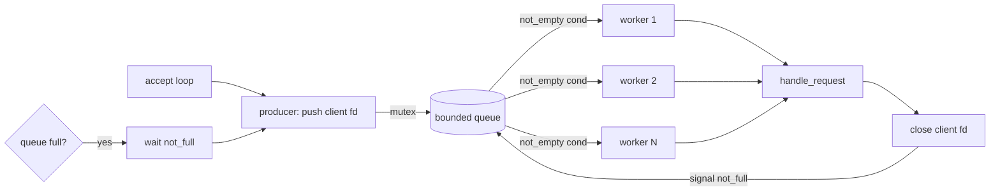

# 自学文档 10：项目 10——并发与同步

> [!abstract] 中心问题
> 多个请求同时推进时，哪些状态是线程私有的，哪些状态被共享？共享状态怎样保证始终正确？

> [!info] 最终成果
> 把项目 9 的顺序 HTTP Server 升级为固定线程池服务器：主线程 accept，有界队列保存 client fd，固定数量 worker 消费任务，mutex 保护队列，condition variable 负责等待非空和非满。另做独立 race counter 实验，比较顺序、每连接线程和线程池三种模型。

## 一、先建立并发模型

Concurrency 指多个任务在时间上交错推进；Parallelism 指多个执行单元在同一时刻真正执行多个任务。单核也可以并发，多核才可能并行。

同一进程中的线程通常共享代码、全局变量、heap 和 fd table；每个线程有自己的寄存器上下文和 stack。

~~~text
Process
├─ shared code
├─ shared heap
├─ shared globals
├─ shared fd table
├─ Thread A → stack A
├─ Thread B → stack B
└─ Thread C → stack C
~~~

## 二、第一个 pthread 程序

~~~c
#include <pthread.h>
#include <stdio.h>

static void *worker(void *arg) {
    const char *name = arg;
    printf("hello from %s\n", name);
    return NULL;
}

int main(void) {
    pthread_t t;

    if (pthread_create(&t, NULL, worker, "worker") != 0)
        return 1;

    pthread_join(t, NULL);
    return 0;
}
~~~

编译：

~~~bash
gcc -std=c11 -Wall -Wextra -O0 -g demo.c -pthread -o demo
~~~

## 三、Data Race：为什么 counter++ 会错

~~~c
long counter = 0;

static void *worker(void *arg) {
    (void)arg;

    for (long i = 0; i < 1000000; i++)
        counter++;

    return NULL;
}
~~~

4 个线程时，直觉上应得到 4000000，但结果可能更小，并且多次运行不同。

机器级可粗略理解为：

~~~text
load counter
add 1
store counter
~~~

两个线程可能交错：

~~~text
counter = 10
A load 10
B load 10
A add 11
B add 11
A store 11
B store 11
最终 11，本来应为 12
~~~

更重要的是：在 C 内存模型中，普通共享变量发生未同步冲突访问属于 data race，行为未定义。不要把它只理解成偶尔少加一次。

## 四、Mutex：保护的是不变量

~~~c
pthread_mutex_t lock = PTHREAD_MUTEX_INITIALIZER;

pthread_mutex_lock(&lock);
counter++;
pthread_mutex_unlock(&lock);
~~~

队列包含：

~~~text
items[]
head
tail
count
~~~

真正需要保证的是整个数据结构的不变量，例如：

~~~text
0 <= count <= capacity
head 和 tail 始终在合法区间
同一个任务不会被两个 worker 同时取出
~~~

因此不要只问“哪个变量要锁”，而要问“哪些操作必须作为一个整体完成”。

## 五、Atomic 适合什么

~~~c
#include <stdatomic.h>

atomic_ulong total_requests = 0;

atomic_fetch_add(&total_requests, 1);
~~~

简单独立计数器适合 atomic。队列包含多个相关字段，单个 atomic count 不能自动保证整个队列正确，因此仍通常需要 mutex。

## 六、Condition Variable：避免忙等

错误思路：

~~~c
while (queue_empty()) {
    // 一直占用 CPU
}
~~~

正确思路：

~~~text
队列为空
↓
消费者睡眠
↓
生产者放入任务
↓
唤醒消费者
↓
消费者重新检查条件
~~~

定义：

~~~c
pthread_cond_t not_empty = PTHREAD_COND_INITIALIZER;
~~~

消费者：

~~~c
pthread_mutex_lock(&q->mutex);

while (q->count == 0)
    pthread_cond_wait(&q->not_empty, &q->mutex);

int fd = pop_locked(q);

pthread_mutex_unlock(&q->mutex);
~~~

生产者 push 后：

~~~c
pthread_cond_signal(&q->not_empty);
~~~

为什么必须 while 而不是 if？因为线程醒来只说明“状态可能变化”，条件可能再次被其他线程改变，也允许 spurious wakeup。醒来后必须重新检查 predicate。

## 七、有界队列

~~~c
#define QCAP 64

typedef struct {
    int items[QCAP];
    size_t head;
    size_t tail;
    size_t count;

    pthread_mutex_t mutex;
    pthread_cond_t not_empty;
    pthread_cond_t not_full;
} fd_queue_t;
~~~

核心不变量：

~~~text
0 <= count <= QCAP
head < QCAP
tail < QCAP
count == 0 表示 empty
count == QCAP 表示 full
~~~

Push：

~~~c
void queue_push(fd_queue_t *q, int fd) {
    pthread_mutex_lock(&q->mutex);

    while (q->count == QCAP)
        pthread_cond_wait(&q->not_full, &q->mutex);

    q->items[q->tail] = fd;
    q->tail = (q->tail + 1) % QCAP;
    q->count++;

    pthread_cond_signal(&q->not_empty);
    pthread_mutex_unlock(&q->mutex);
}
~~~

Pop：

~~~c
int queue_pop(fd_queue_t *q) {
    pthread_mutex_lock(&q->mutex);

    while (q->count == 0)
        pthread_cond_wait(&q->not_empty, &q->mutex);

    int fd = q->items[q->head];
    q->head = (q->head + 1) % QCAP;
    q->count--;

    pthread_cond_signal(&q->not_full);
    pthread_mutex_unlock(&q->mutex);

    return fd;
}
~~~

## 八、线程池服务器结构

~~~text
                 accept thread
                      │
                      │ client_fd
                      ↓
                bounded queue
                 ↓    ↓    ↓
              worker worker worker
                 \     |     /
                   handle_client
~~~

主线程：

~~~text
accept
↓
queue_push(client_fd)
↓
继续 accept
~~~

worker：

~~~text
queue_pop
↓
handle_client(fd)
↓
close(fd)
↓
继续等待任务
~~~

## 九、FD Ownership

必须明确 client fd 的 ownership：

~~~text
accept 成功
→ main owns client_fd

queue_push 成功
→ ownership transfer 到 queue

worker pop
→ worker owns client_fd

handle_client 成功或失败结束
→ worker close(client_fd)
~~~

如果 ownership 不清楚，就可能出现 fd leak、double close、某线程还在使用时另一个线程先 close。

## 十、为什么不能持有 Queue Lock 处理 HTTP

错误：

~~~text
lock queue
pop fd
handle_client(fd)
unlock queue
~~~

这样慢客户端会让整个队列无法被其他 worker 访问。

正确：

~~~text
lock queue
pop fd
unlock queue
handle_client(fd)
~~~

锁只保护队列状态，而不是整个连接生命周期。

## 十一、每连接一个线程：作为对照实验

模型：

~~~text
accept
↓
pthread_create
↓
new thread handle_client
↓
detach
↓
main 继续 accept
~~~

优点是直观；缺点是线程数随连接数量增长，资源上界差。它适合作为实验对照，不作为最终版本。

## 十二、线程池与 Backpressure

线程池固定 N 个 worker。当生产速度长期高于消费速度，queue 会达到 QCAP。

系统必须选择：

- 阻塞 producer；
- 拒绝新任务；
- 丢弃；
- 扩容。

核心项目采用 producer 等待 not_full。

这体现系统设计的一条通用规律：有限资源系统不可能用无限缓冲消除长期过载。

## 十三、共享日志与共享统计

共享日志若要求每条记录不交错，可以用独立 log mutex。

简单计数可用 atomic，例如 total_requests。若多个字段需要保持整体关系，则先定义一致性要求，再决定是否用 mutex。

建议列出共享状态表：

| Object | Shared | Writers | Protection | Owner |
| --- | --- | --- | --- | --- |
| queue | yes | main/workers | mutex + cond | pool |
| request buffer | no | one worker | none | worker stack |
| client_fd | ownership transfer | one worker | ownership | worker |
| total_requests | yes | workers | atomic | process |
| log | yes | workers | log mutex | process |

## 十四、Deadlock

典型：

~~~text
Thread A: lock A → wait B
Thread B: lock B → wait A
~~~

实践策略：

- 尽量少同时持多个锁；
- 必须持多个锁时规定固定顺序；
- 临界区尽量短；
- 不要持无关锁做阻塞网络 I/O。

核心线程池保持一个 queue mutex 就足够。

## 十五、线程参数生命周期陷阱

危险：

~~~c
for (;;) {
    int fd = accept(...);
    pthread_create(&t, NULL, worker, &fd);
}
~~~

多个线程可能拿到同一个局部变量地址，而下一轮已经覆盖 fd。线程池把 fd 的值复制到队列中，可以避免这一类错误。

## 十六、ThreadSanitizer

独立 race demo 可尝试：

~~~bash
gcc -O1 -g -fsanitize=thread race.c -pthread -o race
./race
~~~

如果当前 WSL/工具链不支持，就记录环境限制，不要把“工具没报”当成同步正确的证明。

## 十七、压力测试

~~~bash
for i in $(seq 1 50); do
    curl -s http://127.0.0.1:8080/ > /dev/null &
done
wait
~~~

观察：

~~~bash
ps -o pid,nlwp,rss,cmd -p <PID>
ls /proc/<PID>/task | wc -l
ls /proc/<PID>/fd | wc -l
~~~

压力前后比较 fd 数。如果请求结束后 fd 持续增长，优先查错误路径和 ownership。

## 十八、三种模型比较

| 模型 | 线程数量 | 资源上界 | 慢连接影响 | 复杂度 |
| --- | --- | --- | --- | --- |
| 顺序 | 1 | 清晰 | 阻塞后续全部 | 低 |
| 每连接线程 | 随连接增长 | 较差 | 主要占自身线程 | 中 |
| 固定线程池 | 固定 N | 清晰 | 占一个 worker | 中 |

不要直接得出“线程池一定最快”。应比较 correctness、resource bound、throughput、latency 和实现复杂度。

## 十九、Throughput 与 Latency

Throughput：

~~~text
单位时间完成多少请求
~~~

Latency：

~~~text
一个请求从开始到完整结束的时间
~~~

增加 worker 可能提高吞吐，也可能增加排队或竞争；单请求延迟并不保证同步下降。

实验固定一批请求，分别使用：

~~~text
1 worker
2 workers
4 workers
8 workers
~~~

记录：

| Workers | Total Time | Requests/s | Failures |
| --- | ---: | ---: | ---: |
| 1 | | | |
| 2 | | | |
| 4 | | | |
| 8 | | | |

## 二十、Graceful Shutdown 进阶

核心版可以先允许 Ctrl-C 结束。

进阶版：

~~~text
SIGINT
↓
设置 shutdown flag
↓
停止 accept
↓
broadcast 唤醒等待中的 worker
↓
worker 检查 shutdown
↓
退出循环
↓
join
↓
destroy mutex/cond
↓
close listen_fd
~~~

难点是：正在 cond_wait 的线程必须被唤醒，才能看到 shutdown。

## 二十一、推荐目录

~~~text
project10/
├── src/
│   ├── main.c
│   ├── queue.c
│   ├── queue.h
│   ├── thread_pool.c
│   ├── thread_pool.h
│   ├── http.c
│   └── net.c
├── www/
├── tests/
│   ├── race.c
│   └── stress.sh
├── Makefile
└── README.md
~~~

## 二十二、必做实验

| 实验 | 目标 |
| --- | --- |
| race counter | 观察 data race |
| mutex counter | 修复 race |
| atomic counter | 比较适用范围 |
| producer-consumer | 理解 condvar |
| bounded queue | 验证不变量 |
| thread-per-connection | 建立对照 |
| thread pool | 最终服务器 |
| stress | 多客户端稳定 |
| /proc task/fd | 线程与 fd 证据 |
| worker benchmark | 吞吐趋势 |

## 二十三、报告模板

~~~markdown
# 项目 10 并发与同步

## 1. Race Counter
## 2. Mutex 修复
## 3. Atomic 对比
## 4. Condition Variable
### predicate
### why while
## 5. Bounded Queue
### state
### invariants
### push
### pop
## 6. Thread Pool
### worker lifecycle
### fd ownership
### queue full
### error paths
## 7. Shared State Inventory
## 8. Stress Test
## 9. /proc Evidence
## 10. Three Models Comparison
## 11. Throughput / Latency
## 12. Known Limitations
~~~

## 二十四、验收自测

1. concurrency 与 parallelism 的区别是什么？
2. 线程共享什么，独立什么？
3. data race 为什么比“少加几次”更严重？
4. counter++ 为什么不天然原子？
5. mutex 应保护变量还是不变量？
6. atomic 适合什么？
7. condition variable 解决什么？
8. 为什么 cond_wait 外必须是 while？
9. 有界队列有哪些不变量？
10. queue full 时为什么必须有策略？
11. client_fd ownership 如何转移？
12. 为什么不能持 queue lock 处理整个请求？
13. thread-per-connection 为什么资源上界差？
14. deadlock 怎样形成？
15. throughput 和 latency 为什么要分开？
16. 怎样用 /proc 发现 fd leak？
17. worker 增加为什么不保证线性加速？

> [!success] 通过标准
> 你能列出服务器所有共享对象，逐个说明谁读、谁写、谁同步、谁拥有、谁释放，并通过压力测试和 /proc 证据验证自己的设计。

---

## 学习导航：资料、图解与扩展

> [!tip] 阅读策略
> 先用独立的 `counter++` race 实验理解“共享状态为什么会错”，再实现队列。锁的目标不是“给变量上锁”，而是维护**数据结构不变量**。

### A. 实验前必读

- **CS:APP 3e Ch.12**：§12.1–12.4 并发模型与线程；§12.5 Synchronization；§12.7 Races/Deadlocks。
- **OSTEP**：Ch.26 Concurrency and Threads、27 Thread API、28 Locks、29 Locked Data Structures、30 Condition Variables、31 Semaphores、32 Concurrency Bugs。
- 总索引：[[实验参考指南与可视化索引]]

### B. 做实验时按需查

- POSIX threads 总览：https://man7.org/linux/man-pages/man7/pthreads.7.html
- mutex/condition variable：优先本机 `man 3 pthread_mutex_lock`、`man 3 pthread_cond_wait`。
- 调试 race 时可尝试编译器 ThreadSanitizer（环境支持时），但仍需能从交错执行解释 bug。

### C. 视频/扩展

- MIT 6.172 Lecture 6 Multicore Programming；Lecture 7 Races and Parallelism：
  https://ocw.mit.edu/courses/6-172-performance-engineering-of-software-systems-fall-2018/
- MIT 6.1810（2026）Locking / Coordination：https://pdos.csail.mit.edu/6.S081/2026/schedule.html

### 机制图：线程池的正确性来自队列不变量

> [!question] 迁移检查
> 分别把 worker 数量设为 1、2、8，并把队列容量设为很小。先预测吞吐、等待位置和资源占用，再用多客户端重复验证。

[打开交互式实验总览](visuals/计算机系统实验总览.html)
