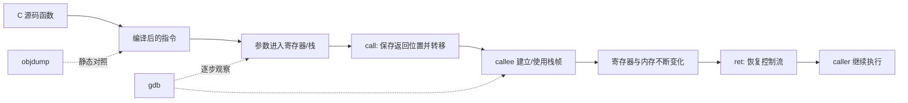

# 自学文档 2：项目 2——机器级程序与函数栈

> [!abstract] 中心问题
> C 语言中的变量、if、for、数组和函数调用，到了 CPU 眼里究竟变成了什么？

> [!info] 学习目标
> 本项目不是背 x86-64 指令表，而是学会沿“C → 汇编 → 寄存器/内存状态变化”追踪程序。最终你应能读懂小函数的控制流、参数传递、返回值、数组访问和一次完整函数调用。

## 全貌：六条主线

| 主线 | 核心问题 |
| --- | --- |
| 寄存器 | CPU 当前把关键数据放在哪里？ |
| 指令 | 每条机器指令改变了什么状态？ |
| 控制流 | if/for/while 怎样变成比较与跳转？ |
| 内存 | 数组与指针怎样变成地址计算？ |
| 调用约定 | 参数、返回值、返回地址如何传递？ |
| 栈 | 函数调用期间，哪些信息暂存在栈上？ |

---

# 第 0 章 环境和编译策略

目录：

~~~bash
mkdir -p ~/cs-system/project2
cd ~/cs-system/project2
~~~

本项目至少保留两套构建：

~~~bash
gcc -std=c11 -Wall -Wextra -O0 -g demo.c -o demo_O0
gcc -std=c11 -Wall -Wextra -O2 -g demo.c -o demo_O2
~~~

生成汇编：

~~~bash
gcc -O0 -S demo.c -o demo_O0.s
gcc -O2 -S demo.c -o demo_O2.s
~~~

反汇编：

~~~bash
objdump -d -Mintel demo_O0 > demo_O0.asm
objdump -d -Mintel demo_O2 > demo_O2.asm
~~~

本文统一推荐 Intel 语法，原因只是阅读更直观：

~~~text
mov destination? 
~~~

注意：Intel 语法一般是：

~~~text
mov destination, source
~~~

而 AT&T 语法通常是 source, destination。不要把两个语法体系混着读。

---

# 第 1 章 CPU 执行程序时最小模型

先把真实 CPU 极度简化成：

~~~text
寄存器 + 内存 + RIP + 指令
~~~

其中：

- 寄存器：CPU 内部极快的小存储；
- 内存：存代码和数据；
- RIP：下一条/当前附近要执行的指令地址；
- 指令：规定“读取什么、计算什么、写回哪里”。

每执行一条指令，本质上是一次状态变换：

~~~text
旧状态 --执行指令--> 新状态
~~~

因此读汇编时不要问：

> “这一行翻译成哪句 C？”

优先问：

> “这一行读取了什么？写了什么？RIP 接下来去哪？”

---

# 第 2 章 x86-64 常见寄存器

常见 64 位通用寄存器：

~~~text
rax rbx rcx rdx
rsi rdi
rbp rsp
r8 r9 r10 r11 r12 r13 r14 r15
~~~

同一个寄存器可以访问低位部分：

~~~text
rax  64 位
eax  低 32 位
ax   低 16 位
al   低 8 位
~~~

在 System V AMD64 ABI 下，常见整数/指针参数：

~~~text
第1个参数 rdi
第2个参数 rsi
第3个参数 rdx
第4个参数 rcx
第5个参数 r8
第6个参数 r9
返回值 rax
~~~

> [!warning]
> 这是 Linux/macOS 常见的 System V x86-64 调用约定。Windows x64 的参数寄存器不同。实验环境统一使用 Linux/WSL。

## 2.1 最小函数

~~~c
long add(long a, long b) {
    return a + b;
}
~~~

O2 下可能接近：

~~~asm
lea rax, [rdi+rsi]
ret
~~~

或者：

~~~asm
mov rax, rdi
add rax, rsi
ret
~~~

你应该能解释：

~~~text
a 在 rdi
b 在 rsi
结果进入 rax
ret 返回
~~~

---

# 第 3 章 mov 不是“变量赋值”，而是数据搬运

常见形式：

~~~asm
mov rax, rbx
mov eax, 3
mov eax, DWORD PTR [rbp-4]
mov DWORD PTR [rbp-8], eax
~~~

方括号通常表示访问内存地址。

例如：

~~~asm
mov eax, DWORD PTR [rbp-4]
~~~

可以理解为：

> 从地址 rbp-4 开始读 4 字节到 eax。

而：

~~~asm
lea rax, [rdi+rsi*4]
~~~

通常只是做地址/算术计算，不读取那个地址指向的内存。

## 3.1 实验：局部变量到底在哪

~~~c
int f(int x) {
    int a = x + 1;
    int b = a * 2;
    return b;
}
~~~

分别 O0/O2 编译。

记录：

- O0 中 a、b 是否存到栈；
- O2 中是否还能找到对应内存槽；
- 是否直接在寄存器里算完；
- 是否有变量被完全消除。

> [!success] 关键认识
> “C 变量”不是机器层必须存在的实体。编译器只需保证程序可观察行为正确。

---

# 第 4 章 if 怎样变成比较和跳转

示例：

~~~c
int abs_like(int x) {
    if (x < 0)
        return -x;
    return x;
}
~~~

常见汇编会出现：

~~~asm
cmp ...
jge ...
neg ...
~~~

cmp 本质上设置条件标志，jxx 根据标志决定是否改变 RIP。

你可以把 if 理解为：

~~~text
算条件
↓
根据条件选择“下一条指令地址”
~~~

## 4.1 动手：画控制流图

选择：

~~~c
int classify(int x) {
    if (x < 0) return -1;
    if (x == 0) return 0;
    return 1;
}
~~~

要求：

1. 编译成 O0 汇编；
2. 找所有条件跳转；
3. 把基本块画成图；
4. 标记每条边的条件；
5. 再看 O2，比较是否出现 cmov 或其他优化。

---

# 第 5 章 for/while：循环就是“向回跳”

示例：

~~~c
long sum(int *a, int n) {
    long s = 0;

    for (int i = 0; i < n; i++)
        s += a[i];

    return s;
}
~~~

你大概率会看到：

~~~text
初始化
↓
条件判断 ←─────────┐
↓                 │
访问 a[i]          │
累加               │
i++ ──────────────┘
~~~

机器层没有“for”这个概念，只有：

- 初始化；
- 比较；
- 条件跳转；
- 更新；
- 无条件/条件跳回。

## 5.1 GDB 单步验证

~~~bash
gdb ./demo_O0
~~~

建议命令：

~~~text
break sum
run
disassemble /m sum
layout asm
info registers
si
info registers
~~~

如果 TUI 不方便，可只用：

~~~text
disassemble sum
x/i $rip
si
~~~

每单步 3—5 条就记录一次：

| 时刻 | RIP | rdi | rsi | rax | rsp | 发生了什么 |
| --- | --- | --- | --- | --- | --- | --- |

---

# 第 6 章 数组访问：地址计算才是核心

对 int a[i]：

~~~text
地址 = base + i × sizeof(int)
~~~

若 int 为 4 字节：

~~~text
&a[i] = base + 4*i
~~~

x86 寻址模式可以直接表达：

~~~asm
[base + index*scale + displacement]
~~~

scale 常见只能是 1、2、4、8，恰好适合 char/short/int64 等常见大小。

## 6.1 实验：看二维数组

~~~c
int get(int a[3][4], int i, int j) {
    return a[i][j];
}
~~~

C 的二维数组按行连续：

~~~text
地址 = base + (i*4 + j) * sizeof(int)
~~~

任务：

1. 手算 a[2][3] 相对 base 的偏移；
2. 编译 O2；
3. 找出乘 4、乘行宽等地址计算；
4. 用 GDB 打印 &a[0][0] 与 &a[2][3] 验证。

---

# 第 7 章 指针：机器层其实更简单

C 里：

~~~c
int *p = &x;
*p = 42;
~~~

机器层只关心：

~~~text
p 是一个地址数值
*p 表示访问这个地址
~~~

因此项目 1 的“地址也是位模式”在这里接上了。

实验：

~~~c
void set42(int *p) {
    *p = 42;
}
~~~

观察参数 p 在 rdi 中，并寻找：

~~~asm
mov DWORD PTR [rdi], 42
~~~

这条指令可以直译：

> 把整数 42 写入 rdi 指向的 4 字节内存。

---

# 第 8 章 函数调用：call 和 ret 到底做了什么

考虑：

~~~c
long square(long x) {
    return x * x;
}

long f(long a) {
    return square(a + 1);
}
~~~

核心过程：

~~~text
f
│
├─ 准备参数
├─ call square
│    ├─ 保存返回位置
│    ├─ 跳到 square
│    └─ 计算返回值放 rax
├─ ret 回 f
└─ f 再返回
~~~

x86-64 的 call 会保存返回地址，ret 会从栈中取回返回地址并跳过去。

## 8.1 用 GDB 亲眼看返回地址

编译：

~~~bash
gcc -O0 -g call.c -o call
gdb ./call
~~~

在 f 中 call 前停住：

~~~text
break f
run
disassemble f
~~~

移动到 call 附近后：

~~~text
info registers rsp rip
x/4gx $rsp
si
info registers rsp rip
x/4gx $rsp
~~~

比较 call 前后：

- rsp 是否变化；
- 栈顶是否多了一个地址；
- 新地址是否接近 call 后面的下一条指令；
- rip 是否跳到 square。

这是项目 2 最核心的证据之一。

---

# 第 9 章 栈：不是“函数变量专用盒子”

常见模型：

~~~text
高地址
┌──────────────────┐
│ 调用者已有数据   │
├──────────────────┤
│ 返回地址         │
├──────────────────┤
│ 保存的寄存器     │
├──────────────────┤
│ 局部变量/临时值  │
├──────────────────┤ ← rsp
低地址
~~~

在 x86-64 中栈通常向低地址增长。

但注意：

- 编译器可以不用传统 rbp 栈帧；
- 局部变量可能在寄存器中；
- 小函数可能被 inline，函数边界直接消失；
- 优化后栈布局可能完全不同。

所以你画栈图必须写实验条件，例如：

~~~text
gcc 14.x, x86-64, -O0 -g, frame pointer enabled
~~~

## 9.1 栈帧实验

~~~c
long g(long a, long b) {
    long x = a + 10;
    long y = b + 20;
    long z = x * y;
    return z;
}
~~~

在 g 断点：

~~~text
info registers rbp rsp
p &x
p &y
p &z
x/16gx $rsp
~~~

把每个地址标到栈图中。

---

# 第 10 章 递归：每次调用都有独立调用现场

~~~c
long fact(int n) {
    if (n <= 1) return 1;
    return n * fact(n - 1);
}
~~~

在 fact(4) 时：

~~~text
fact(4)
 └─ fact(3)
     └─ fact(2)
         └─ fact(1)
~~~

GDB：

~~~text
break fact
run
continue
continue
continue
backtrace
~~~

观察 backtrace。

任务：

- 记录 4 层调用的参数；
- 观察每层 rsp；
- 返回时再观察栈如何逐层恢复。

> [!question]
> “递归很耗栈”不是抽象口号。你能用 rsp 的差值估计每层调用消耗多少栈空间吗？

---

# 第 11 章 栈上的数组与越界写：只做本地教学观察

创建一个只用于本机实验的小程序：

~~~c
#include <stdio.h>

void demo(void) {
    int a[4] = {10, 20, 30, 40};

    for (int i = 0; i < 4; i++)
        printf("%d\n", a[i]);
}
~~~

先观察正常栈布局和地址：

~~~c
printf("&a[0]=%p\n", (void *)&a[0]);
printf("&a[3]=%p\n", (void *)&a[3]);
~~~

然后故意把循环边界改错，使用 AddressSanitizer 检测：

~~~bash
gcc -O0 -g -fsanitize=address -fno-omit-frame-pointer bug.c -o bug
./bug
~~~

本节目的不是研究攻击，而是理解：

> 数组边界错误为什么可能改写“不属于这个数组”的状态，以及为什么必须做边界检查。

修复后再次运行 sanitizer，确认错误消失。

---

# 第 12 章 优化为什么会让“C 对汇编”变难

比较：

~~~bash
gcc -O0 -S opt.c -o O0.s
gcc -O1 -S opt.c -o O1.s
gcc -O2 -S opt.c -o O2.s
gcc -O3 -S opt.c -o O3.s
~~~

观察可能发生：

- 常量折叠；
- 死代码删除；
- 函数内联；
- 循环变形；
- 寄存器分配；
- 向量化；
- 公共子表达式消除。

实验：

~~~c
int f(void) {
    int x = 3;
    int y = 4;
    return x * y + 5;
}
~~~

O2 可能直接：

~~~asm
mov eax, 17
ret
~~~

这说明编译器没有义务保留你的计算步骤。

---

# 第 13 章 汇编阅读的固定流程

遇到陌生函数，不要逐指令硬啃。按这个顺序：

## 第一步：看接口

从 C 或调用点确认：

- 参数几个；
- 返回类型；
- 指针参数；
- 数据结构大小。

## 第二步：找返回

先看 ret 前 rax/eax 怎么得到。

## 第三步：找分支和回边

- jxx 向前：多半是 if；
- jxx 向后：多半是循环；
- 多分支：可能是 switch。

## 第四步：找内存访问

看到：

~~~text
[base + index*scale + offset]
~~~

问：

- base 是数组首地址？
- index 是下标？
- scale 对应元素大小？
- offset 对应结构体字段？

## 第五步：再补每条指令

先把结构抓住，再填细节。

---

# 第 14 章 项目核心实验

## 实验 A：四种 C 结构对照

分别写：

1. if/else
2. for loop
3. array access
4. function call

每个生成 O0 与 O2 汇编。

产出表：

| C 结构 | O0 证据 | O2 变化 | 机器层核心 |
| --- | --- | --- | --- |

## 实验 B：一次完整函数调用跟踪

要求记录：

- call 前参数寄存器；
- call 前 rsp；
- call 后 rsp；
- 返回地址；
- 被调函数内部关键寄存器；
- ret 后 rip；
- 返回值 rax。

## 实验 C：递归栈

fact(4) 或 fib 小输入，使用 backtrace + rsp 记录。

## 实验 D：数组地址计算

一维 + 二维数组各一例。

## 实验 E：边界错误检测

使用 AddressSanitizer 观察越界并修复。

---

# 第 15 章 证据报告模板

~~~markdown
# 实验名称

## 1. C 源码

## 2. 编译环境
- 架构：
- GCC：
- flags：

## 3. 我的预测

## 4. 对应汇编

## 5. 控制流/数据流解释

## 6. GDB 运行证据

## 7. C 层与机器层的对应

## 8. 优化前后差异

## 9. 仍然存在的不确定性
~~~

---

# 第 16 章 常见误区

> [!warning] “一行 C 对应一条汇编”
> 通常不成立。一行 C 可能对应很多指令，也可能被完全优化掉。

> [!warning] “局部变量都在栈上”
> 不成立。变量可以在寄存器里，也可以根本不存在。

> [!warning] “rbp 永远是栈帧基址”
> 优化后编译器可以省略 frame pointer。

> [!warning] “ret 就是返回 rax”
> rax 常承载返回值；ret 的核心职责是恢复控制流到返回地址。

> [!warning] “反汇编能恢复原始 C”
> 汇编只保留机器语义，原始变量名、表达式结构等很多信息已经丢失。

---

# 第 17 章 验收自测

你必须能口头解释：

1. rdi、rsi、rax 在常见调用约定中的作用。
2. rsp 与 rip 各表示什么。
3. [rbp-8] 为什么表示内存访问。
4. lea 和普通 load 的区别。
5. if 为什么最终变成条件跳转。
6. for 为什么本质上是回边。
7. a[i] 如何变成地址计算。
8. call 改变了什么状态。
9. ret 为什么能回到调用者。
10. 为什么优化后可能看不到某个 C 变量。
11. 为什么局部数组越界会影响附近状态。
12. 为什么栈图必须注明编译条件。

> [!success] 通过标准
> 给你一个 15—30 行 C 小函数和对应汇编，你能先识别参数、返回值、分支、循环和主要内存访问，再用 GDB 验证关键判断。

---

# 第 18 章 与项目 3、4、5 的连接

项目 2 是后面三条线的共同基础：

~~~text
项目 2 机器级程序
├─ 项目 3：把“执行指令”做成自己的 CPU 模拟器
├─ 项目 4：研究这些机器指令和符号如何被链接成程序
└─ 项目 5：研究指令与内存访问为什么有性能差异
~~~

你现在不应只把汇编当“低级语言”，而应把它看成：

> **程序与硬件之间最接近真实执行过程的一层可观察接口。**

---

# 学习导航：资料、图解与扩展

> [!tip] 阅读策略
> 每次只挑一个 C 结构（if、loop、array、function call）做“源码—汇编—寄存器/栈”的三栏对照，不要一次性背完 x86-64 指令集。

## A. 实验前必读

- **CS:APP 3e Ch.3**：§3.2 Program Encodings、§3.4 Accessing Information、§3.6 Control、§3.7 Procedures。
- 数组/结构与栈错位时再补 §3.8–3.10。
- 总索引：[[实验参考指南与可视化索引]]

## B. 做实验时按需查

- `objdump -d/-S`：GNU Binutils：https://sourceware.org/binutils/docs/binutils.html
- GDB：https://sourceware.org/gdb/current/onlinedocs/gdb.html
- 指令细节：Intel 64/IA-32 manuals，可从 CS:APP 学生资源页进入：https://csapp.cs.cmu.edu/3e/students.html

## C. 视频/扩展

- MIT 6.172 Lecture 4 Assembly Language & Computer Architecture；Lecture 5 C to Assembly：
  https://ocw.mit.edu/courses/6-172-performance-engineering-of-software-systems-fall-2018/

## 机制图：一次函数调用的机器状态

> [!question] 迁移检查
> 同一函数分别用 `-O0`、`-O2` 编译：先预测哪些局部变量会消失、栈帧是否仍明显，再对照汇编与 GDB。

[打开交互式实验总览](visuals/计算机系统实验总览.html)
