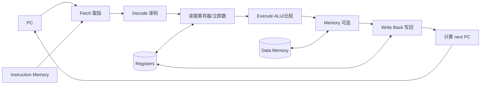

# 自学文档 3：项目 3——简化 CPU 模拟器

> [!abstract] 中心问题
> 如果不把 CPU 当黑盒，我们最少需要哪些状态和规则，才能让一串“机器指令”真的跑起来？

> [!info] 项目定位
> 这是连接数字逻辑与系统软件的桥梁。你不会设计真实 x86 CPU，而是自己定义一个极小指令集，在 C 中写解释执行器。通过它理解 PC、寄存器、内存、ALU、控制信号和跳转如何组成“执行”。

## 最终成果

实现一个 tinycpu 程序：

~~~text
./tinycpu program.bin
~~~

每执行一步可以输出：

~~~text
PC=0004  INST=ADD R1,R2
R0=0000 R1=0007 R2=0003 R3=0000
FLAGS: Z=0
~~~

至少支持：

~~~text
MOVI  把立即数写入寄存器
MOV   寄存器复制
ADD   加法
SUB   减法
LOAD  从内存读
STORE 写内存
JMP   无条件跳转
JZ    结果为零时跳转
HALT  停机
~~~

---

# 第 1 章 先抽象 CPU 状态

我们定义：

~~~c
#define REG_COUNT 8
#define MEM_SIZE  256

typedef struct {
    uint16_t pc;
    uint16_t reg[REG_COUNT];
    uint8_t  mem[MEM_SIZE];

    int zero_flag;
    int halted;
} CPU;
~~~

这就是你的“机器状态”。

每执行一条指令：

~~~text
CPU_old + instruction → CPU_new
~~~

对应数字逻辑：

| 模拟器字段 | 数字逻辑里的含义 |
| --- | --- |
| pc | 程序计数器寄存器 |
| reg[] | 寄存器堆 |
| mem[] | 存储器 |
| zero_flag | 状态寄存器的一部分 |
| decode | 控制器 |
| add/sub | ALU |
| 下一条 pc | 下一状态逻辑 |

---

# 第 2 章 设计自己的指令格式

为了容易观察，我们定义每条指令固定 4 字节：

~~~text
byte 0: opcode
byte 1: operand A
byte 2: operand B
byte 3: operand C / immediate
~~~

示例 opcode：

~~~c
enum {
    OP_MOVI  = 0x01,
    OP_MOV   = 0x02,
    OP_ADD   = 0x03,
    OP_SUB   = 0x04,
    OP_LOAD  = 0x05,
    OP_STORE = 0x06,
    OP_JMP   = 0x07,
    OP_JZ    = 0x08,
    OP_HALT  = 0xff
};
~~~

可以规定：

~~~text
MOVI rd, imm
  byte0 opcode
  byte1 rd
  byte2 unused
  byte3 imm

ADD rd, rs1, rs2
  byte0 opcode
  byte1 rd
  byte2 rs1
  byte3 rs2

LOAD rd, addrReg
  rd = memory[reg[addrReg]]

JMP addr
  pc = addr
~~~

> [!question] 为什么固定长度适合教学？
> 因为 pc 每次默认加 4，译码简单。真实 x86 是复杂的变长指令，这不是本项目目标。

---

# 第 3 章 Fetch：取指

每个循环先检查：

~~~c
if (cpu->pc + 3 >= MEM_SIZE) {
    fprintf(stderr, "PC out of range\n");
    return -1;
}
~~~

然后：

~~~c
uint8_t op = cpu->mem[cpu->pc];
uint8_t a  = cpu->mem[cpu->pc + 1];
uint8_t b  = cpu->mem[cpu->pc + 2];
uint8_t c  = cpu->mem[cpu->pc + 3];
~~~

这就是取指：

~~~text
PC
↓
访问 memory[PC..PC+3]
↓
得到 instruction
~~~

默认下一条：

~~~c
cpu->pc += 4;
~~~

跳转指令再覆盖 pc。

---

# 第 4 章 Decode：译码

最直接的教学写法：

~~~c
switch (op) {
case OP_MOVI:
    ...
    break;

case OP_ADD:
    ...
    break;

case OP_JMP:
    ...
    break;

default:
    fprintf(stderr, "illegal opcode: 0x%02x\n", op);
    return -1;
}
~~~

在真实硬件里，“switch”对应的是组合逻辑产生控制信号。

例如 ADD 可以抽象为：

~~~text
RegRead1 = rs1
RegRead2 = rs2
ALUOp    = ADD
RegWrite = 1
DstReg   = rd
PCNext   = PC + 4
~~~

因此 CPU 控制器本质上做的是：

> 根据指令位模式决定数据通路“从哪读、算什么、写到哪、下一条去哪”。

---

# 第 5 章 Execute：真正改变机器状态

## 5.1 MOVI

~~~c
case OP_MOVI:
    if (a >= REG_COUNT) return -1;
    cpu->reg[a] = c;
    cpu->zero_flag = (cpu->reg[a] == 0);
    break;
~~~

## 5.2 ADD

~~~c
case OP_ADD:
    if (a >= REG_COUNT || b >= REG_COUNT || c >= REG_COUNT)
        return -1;

    cpu->reg[a] = (uint16_t)(cpu->reg[b] + cpu->reg[c]);
    cpu->zero_flag = (cpu->reg[a] == 0);
    break;
~~~

注意这里自然接上项目 1：

~~~text
16 位寄存器
↓
加法结果最终只保留 16 位
↓
属于固定位宽机器算术
~~~

## 5.3 LOAD / STORE

规定：

~~~text
LOAD rd, ra
  reg[rd] = mem[reg[ra]]

STORE rs, ra
  mem[reg[ra]] = low8(reg[rs])
~~~

必须检查地址：

~~~c
uint16_t addr = cpu->reg[b];

if (addr >= MEM_SIZE) {
    fprintf(stderr, "memory out of range: %u\n", addr);
    return -1;
}
~~~

---

# 第 6 章 PC：控制流真正的核心

正常指令：

~~~text
PC_next = PC + 4
~~~

JMP：

~~~text
PC_next = target
~~~

JZ：

~~~text
if zero_flag:
    PC_next = target
else:
    PC_next = PC + 4
~~~

你在项目 2 看到的 if/loop，到 CPU 层最终都归结为：

> **下一条指令地址如何选择。**

---

# 第 7 章 第一个程序：1 + 2

假设：

~~~text
0x00: MOVI R1, 1
0x04: MOVI R2, 2
0x08: ADD  R0, R1, R2
0x0c: HALT
~~~

执行轨迹：

~~~text
Step 0
PC=0
R0=0 R1=0 R2=0

Step 1 MOVI R1,1
PC=4
R0=0 R1=1 R2=0

Step 2 MOVI R2,2
PC=8
R0=0 R1=1 R2=2

Step 3 ADD R0,R1,R2
PC=12
R0=3 R1=1 R2=2

Step 4 HALT
~~~

> [!success] 关键
> 如果你能手工预测每一步所有相关状态，说明你已经开始真正理解“CPU 执行指令”。

---

# 第 8 章 写 trace：让 CPU 自己解释自己

建议实现：

~~~c
void dump_cpu(const CPU *cpu) {
    printf("PC=%04x  ", cpu->pc);

    for (int i = 0; i < REG_COUNT; i++)
        printf("R%d=%04x ", i, cpu->reg[i]);

    printf(" Z=%d\n", cpu->zero_flag);
}
~~~

每一步：

~~~c
while (!cpu.halted) {
    dump_cpu(&cpu);

    if (step(&cpu) != 0) {
        fprintf(stderr, "CPU error\n");
        break;
    }
}
~~~

进阶：在 step 前打印反汇编文本。

例如：

~~~text
0008: ADD R0, R1, R2
~~~

这就构成了自己的“objdump + gdb 单步”的简化版。

---

# 第 9 章 循环：用 SUB + JZ + JMP 实现

目标：计算：

~~~text
1 + 2 + 3 + ... + N
~~~

寄存器约定：

~~~text
R0 = sum
R1 = i
R2 = 1
R3 = 0
~~~

伪汇编：

~~~text
MOVI R0, 0
MOVI R1, 5
MOVI R2, 1
MOVI R3, 0

loop:
ADD R0, R0, R1
SUB R1, R1, R2
JZ  R1, end
JMP loop

end:
HALT
~~~

如果你的 JZ 只看 zero_flag，那么 SUB 后会设置 zero_flag，再由 JZ 使用。

## 9.1 画状态机

~~~text
取指
 ↓
译码
 ↓
执行 ADD/SUB...
 ↓
更新 flag
 ↓
选择 next PC
 ↓
下一轮
~~~

---

# 第 10 章 指令编码器：别手写十六进制到崩溃

可以先做最简单的宏：

~~~c
#define EMIT4(buf, pos, a, b, c, d) do { \
    (buf)[(pos)++] = (a); \
    (buf)[(pos)++] = (b); \
    (buf)[(pos)++] = (c); \
    (buf)[(pos)++] = (d); \
} while (0)
~~~

更推荐后面写一个小 assembler，把：

~~~text
MOVI R1, 5
ADD R0, R0, R1
HALT
~~~

转成字节文件。

但完整汇编器属于可选拓展；核心目标是 CPU 模拟器本身。

---

# 第 11 章 非法状态必须显式处理

至少处理：

1. 非法 opcode；
2. 寄存器编号越界；
3. PC 越界；
4. LOAD/STORE 地址越界；
5. 程序永不 HALT；
6. 二进制文件过大；
7. 文件读取失败。

增加最大执行步数：

~~~c
#define MAX_STEPS 100000

for (size_t step_count = 0;
     step_count < MAX_STEPS && !cpu.halted;
     step_count++) {
    ...
}
~~~

超过后：

~~~text
execution limit exceeded
~~~

这能防止错误程序让模拟器无限循环。

---

# 第 12 章 从“软件 switch”映射到数字逻辑

以 ADD 为例：

~~~text
instruction
  ↓ decode
rs1 ───────┐
           │
rs2 ───────┼→ register file read
           ↓
          ALU(add)
           ↓
         result
           ↓
       register write(rd)
~~~

控制信号可以抽象为：

| 信号 | ADD | LOAD | STORE | JMP |
| --- | ---: | ---: | ---: | ---: |
| RegRead1 | 1 | 1 | 1 | 0 |
| RegRead2 | 1 | 0 | 1 | 0 |
| ALU | ADD | PASS | PASS | PASS |
| MemRead | 0 | 1 | 0 | 0 |
| MemWrite | 0 | 0 | 1 | 0 |
| RegWrite | 1 | 1 | 0 | 0 |
| PCSrc | next | next | next | jump |

这张表就是极简“控制器真值表”。

> [!question]
> 你在数字逻辑课学过 MUX。PCSrc 本质上就是控制“PC+4”和“jump target”谁进入 PC 寄存器的多路选择器。

---

# 第 13 章 将 CPU 执行分成阶段

教学上可分：

~~~text
IF  Instruction Fetch
ID  Instruction Decode
EX  Execute
MEM Memory access
WB  Write Back
~~~

你的解释器可以不真的分五个函数，但报告中要按这五个问题分析一条 ADD 和一条 LOAD。

### ADD

~~~text
IF  从 mem[PC] 取 4 字节
ID  解析 rd/rs1/rs2
EX  做加法
MEM 无
WB  写 rd
~~~

### LOAD

~~~text
IF  取指
ID  解析 rd/addressReg
EX  形成地址
MEM 从 memory[address] 读取
WB  写 rd
~~~

这为后续理解流水线提供概念接口。

---

# 第 14 章 自动测试：不要只肉眼看 trace

给 step() 做单元测试。

例如：

~~~c
void test_add(void) {
    CPU cpu = {0};

    cpu.reg[1] = 7;
    cpu.reg[2] = 9;

    cpu.mem[0] = OP_ADD;
    cpu.mem[1] = 0;
    cpu.mem[2] = 1;
    cpu.mem[3] = 2;

    int rc = step(&cpu);

    assert(rc == 0);
    assert(cpu.reg[0] == 16);
    assert(cpu.pc == 4);
}
~~~

测试至少覆盖：

- MOVI；
- ADD 正常；
- SUB 得 0，zero_flag=1；
- LOAD；
- STORE；
- JMP；
- JZ taken；
- JZ not taken；
- 非法寄存器；
- 非法地址；
- 非法 opcode。

---

# 第 15 章 推荐代码结构

~~~text
project3/
├── src/
│   ├── cpu.h
│   ├── cpu.c
│   ├── loader.c
│   └── main.c
├── programs/
│   ├── add.bin
│   └── sum.bin
├── tests/
│   └── test_cpu.c
├── Makefile
└── README.md
~~~

cpu.h：

~~~c
typedef struct CPU CPU;

void cpu_init(CPU *cpu);
int cpu_step(CPU *cpu);
int cpu_run(CPU *cpu, size_t max_steps);
void cpu_dump(const CPU *cpu);
~~~

把“加载文件”和“执行 CPU”分开，有助于建立模块边界。

---

# 第 16 章 实验任务

## 实验 A：最小三指令 CPU

先只支持：

~~~text
MOVI
ADD
HALT
~~~

确认 1+2 能跑。

## 实验 B：内存访问

加入：

~~~text
LOAD
STORE
~~~

测试：

~~~text
R1=42
R2=100
STORE R1,[R2]
LOAD R3,[R2]
~~~

最终 R3 应为 42。

## 实验 C：控制流

加入：

~~~text
SUB
JMP
JZ
~~~

完成倒计时循环。

## 实验 D：求和程序

计算 1..N，记录完整 trace。

## 实验 E：故障注入

分别制造：

- 非法 opcode；
- 越界地址；
- 无限循环；
- 错误寄存器编号。

检查模拟器是否明确失败而不是崩溃。

---

# 第 17 章 实验报告模板

~~~markdown
# 项目 3：简化 CPU 模拟器

## 1. 指令集规范

### 寄存器
### 内存
### 指令长度
### opcode 表
### 每条指令语义

## 2. CPU 状态结构

## 3. Fetch
## 4. Decode
## 5. Execute
## 6. PC 更新

## 7. 示例程序：1+2
### 手工预测
### 实际 trace
### 对照

## 8. 示例程序：1..N 求和

## 9. 错误处理

## 10. 与数字逻辑的对应
- 寄存器堆
- ALU
- 控制器
- MUX
- PC

## 11. 我目前模型的限制
~~~

---

# 第 18 章 常见误区

> [!warning] “CPU 就是 ALU”
> ALU 只负责运算。CPU 还需要寄存器、控制、PC、取指和内存接口。

> [!warning] “PC 永远 +4”
> 跳转时 PC 会被目标地址覆盖。

> [!warning] “LOAD 就是赋值”
> LOAD 涉及地址形成 + 内存读取 + 写回寄存器。

> [!warning] “switch 是 CPU 真正的实现”
> 不是。switch 只是用软件模拟硬件控制逻辑。

> [!warning] “我的 ISA 设计得越复杂越好”
> 相反，项目目的在于建立模型。少而清晰的指令比堆功能更有价值。

---

# 第 19 章 验收自测

你应能回答：

1. CPU 最少需要维护哪些状态？
2. PC 是什么？
3. 一条指令为什么需要编码？
4. Fetch、Decode、Execute 分别做什么？
5. ADD 的数据从哪里来，到哪里去？
6. LOAD 为什么比 ADD 多一次内存访问？
7. JMP 如何改变控制流？
8. JZ 为什么需要 flag 或某种条件输入？
9. 为什么要检查非法地址？
10. 为什么固定长度指令容易实现？
11. 你的 switch 如何对应硬件控制器？
12. 怎样把项目 2 中的循环映射成项目 3 的 PC 跳转？

> [!success] 通过标准
> 给你一段 5—10 条 tiny ISA 程序，你能手工列出每一步 PC、寄存器和关键内存状态，并让模拟器输出与预测一致。

---

# 第 20 章 可选拓展

完成核心后再选：

- 增加 CMP + 条件跳转；
- 增加 CALL/RET 与软件栈；
- 增加 16 位内存读写；
- 写文本汇编器；
- 写反汇编器；
- 把控制信号明确编码；
- 实现“单周期数据通路”可视化；
- 再进入流水线模型。

最重要的不是功能数量，而是你能否把每个功能同时从三个层面解释：

~~~text
指令语义
↕
模拟器状态变化
↕
数字逻辑数据通路
~~~

这三层对齐以后，数字逻辑、汇编和计算机系统才真正连在一起。

---

# 学习导航：资料、图解与扩展

> [!tip] 阅读策略
> 本项目目标不是“造真实 CPU”，而是把项目 2 看到的机器指令，落实成**状态机：当前状态 + 指令 → 下一状态**。

## A. 实验前必读

- **CS:APP 3e Ch.4**：§4.1 Y86-64 ISA、§4.2 Logic Design、§4.3 Sequential Implementation。
- 先不读流水线 §4.4–4.5；等顺序模拟器完全正确后再扩展。
- 总索引：[[实验参考指南与可视化索引]]

## B. 做实验时按需查

- CS:APP Y86-64 tools/documentation：https://csapp.cs.cmu.edu/3e/students.html
- Nand2Tetris Projects 4–5（Machine Language / Computer Architecture）：https://www.nand2tetris.org/course

## C. 视频/扩展

- Nand2Tetris Part I 对 CPU/数据通路的可视化非常适合本项目。
- 若想联系真实处理器，再回看 MIT 6.172 Lecture 4；不要把真实 x86 复杂度直接塞进教学 ISA。

## 机制图：CPU 是“状态转移器”

> [!question] 迁移检查
> 对一个 5–8 条指令的小循环，不运行模拟器，先逐步写出每一步 PC、寄存器和内存变化；再让 trace 找出第一处预测错误。

[打开交互式实验总览](visuals/计算机系统实验总览.html)
