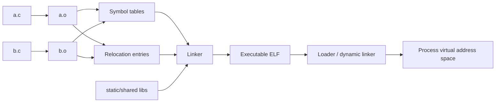

# 自学文档 4：项目 4——链接与装载

> [!abstract] 中心问题
> 一个程序由多个 .c 文件和库组成时，函数名、全局变量和地址究竟在什么时候被确定？可执行文件又怎样变成进程中的代码与数据？

> [!info] 项目定位
> 项目 0 里你已经看到“编译 → 汇编 → 链接 → 运行”。本项目把其中最容易被当黑盒的“链接”和“装载”拆开观察。核心不是背 ELF 字段，而是能沿着“符号 → 重定位 → 可执行文件 → 内存映射”解释一个真实多文件程序。

## 最终成果

你将完成一个多文件 C 项目，并保存以下证据：

- 每个 .o 的符号表；
- 未定义符号和已定义符号；
- relocation 表；
- 静态库 .a；
- 共享库 .so；
- ldd / readelf / objdump 输出；
- 程序运行后的 /proc/<pid>/maps；
- 两类典型链接错误的复现与修复。

---

# 第 1 章 为什么有了 .o 还不能直接运行

假设：

~~~c
// main.c
#include <stdio.h>

int add(int a, int b);

int main(void) {
    printf("%d\n", add(3, 4));
    return 0;
}
~~~

~~~c
// math.c
int add(int a, int b) {
    return a + b;
}
~~~

分别编译：

~~~bash
gcc -c main.c -o main.o
gcc -c math.c -o math.o
~~~

main.o 中已经有 main 的机器码，但它仍不知道 add 最终位于哪里。

检查：

~~~bash
nm main.o
nm math.o
~~~

你通常会看到类似：

~~~text
main.o:
                 U add
0000000000000000 T main
                 U printf

math.o:
0000000000000000 T add
~~~

含义：

- T：符号在代码节中定义；
- U：当前目标文件引用了它，但这里没有定义；
- 链接器要把 U 和其他目标文件/库里的定义匹配起来。

> [!question] 先预测
> 如果只运行 gcc main.o -o app，会报什么？为什么这不是“编译错误”？

---

# 第 2 章 声明、定义、符号：三个概念分开

## 2.1 声明

~~~c
int add(int, int);
extern int counter;
~~~

告诉编译器“这个名字存在、类型是什么”。

## 2.2 定义

~~~c
int counter = 0;

int add(int a, int b) {
    return a + b;
}
~~~

真正提供存储或函数实现。

## 2.3 符号

链接器工作时并不直接理解“高级语言含义”，它主要处理目标文件中的符号和重定位信息。

可以把链条理解为：

~~~text
C 名字
↓ 编译
ELF 符号表中的 symbol
↓ 链接
解析到某个定义和地址
~~~

---

# 第 3 章 查看 ELF 结构

使用：

~~~bash
readelf -h main.o
readelf -S main.o
readelf -s main.o
readelf -r main.o
~~~

重点不是看懂所有字段，只先抓住四类：

| 工具 | 观察什么 |
| --- | --- |
| readelf -h | ELF 总体类型和架构 |
| readelf -S | section |
| readelf -s | 符号表 |
| readelf -r | 重定位项 |

常见 section：

~~~text
.text      机器指令
.rodata    只读常量
.data      已初始化全局/静态数据
.bss       未显式初始化或零初始化数据
.symtab    符号表
.strtab    字符串表
.rela.*    重定位信息
~~~

## 3.1 实验：变量落在哪个 section

~~~c
int g1 = 42;
int g2;
static int s1 = 7;
const char *msg = "hello";
~~~

编译后：

~~~bash
gcc -c globals.c -o globals.o
objdump -h globals.o
nm -S globals.o
~~~

记录每个对象大致落在哪一类 section，并解释原因。

---

# 第 4 章 重定位：机器码已经生成，地址还没完全确定

看 main.o：

~~~bash
objdump -dr main.o
~~~

-d：反汇编  
-r：把 relocation 一起显示

你可能看到 call 附近对应一个 relocation，说明：

> 指令已经存在，但 call 的目标地址需要链接器以后补进去。

这就是“可重定位目标文件”的真正含义。

## 4.1 手工问题

假设 main.o 中：

~~~text
call add
~~~

在独立目标文件阶段，编译器能不能知道 add 最终在可执行文件的 0x401180？

不能。因为：

- math.o 可能还没参与链接；
- 链接器可能改变 section 布局；
- 还可能从库里选择实现。

因此目标文件保存：

~~~text
这里有一个地址相关位置
它引用符号 add
链接时请修正
~~~

---

# 第 5 章 符号解析：链接器怎样把名字拼起来

链接：

~~~bash
gcc main.o math.o -o app
~~~

再看：

~~~bash
nm app | grep add
objdump -d app | grep -A 10 "<add>"
~~~

此时 add 已有确定的虚拟地址（对于具体链接产物而言）。

## 5.1 制造“未定义引用”

删掉 math.o：

~~~bash
gcc main.o -o app
~~~

记录错误。

报告必须写：

~~~text
编译 main.c 成功
↓
说明语法/类型检查基本通过
↓
链接失败
↓
因为引用 add，但没有找到定义
~~~

## 5.2 制造“重复定义”

a.c：

~~~c
int value = 1;
~~~

b.c：

~~~c
int value = 2;
~~~

再链接：

~~~bash
gcc -c a.c
gcc -c b.c
gcc a.o b.o -o bad
~~~

观察 multiple definition 类错误。

修复策略之一：只在一个 .c 文件定义，在头文件中声明：

~~~c
// shared.h
extern int value;
~~~

---

# 第 6 章 头文件真正解决什么

头文件通常放：

- 类型定义；
- 函数声明；
- extern 声明；
- 宏；
- inline/常量等适合头文件的内容。

不要把普通全局变量定义直接复制到多个 .c 文件。

推荐结构：

~~~text
project4/
├── include/
│   └── mathutil.h
├── src/
│   ├── main.c
│   └── mathutil.c
└── Makefile
~~~

mathutil.h：

~~~c
#ifndef MATHUTIL_H
#define MATHUTIL_H

int add(int a, int b);

#endif
~~~

main.c：

~~~c
#include "mathutil.h"
~~~

mathutil.c：

~~~c
#include "mathutil.h"

int add(int a, int b) {
    return a + b;
}
~~~

> [!success]
> 头文件帮助编译阶段保持多个翻译单元对接口理解一致；链接器仍负责把符号引用与定义连接起来。

---

# 第 7 章 静态库 .a

创建：

~~~bash
gcc -c mathutil.c -o mathutil.o
ar rcs libmathutil.a mathutil.o
~~~

查看：

~~~bash
ar t libmathutil.a
nm libmathutil.a
~~~

链接：

~~~bash
gcc main.o -L. -lmathutil -o app_static
~~~

这里：

~~~text
-L.         在当前目录找库
-lmathutil  对应 libmathutil.a / libmathutil.so
~~~

静态库可以先粗略理解成：

> 一组目标文件的归档；链接器从中取出需要的对象代码参与最终链接。

## 7.1 实验

比较：

~~~bash
ls -lh app_static
nm app_static | grep add
~~~

然后改动库内部 add 实现但不重新链接 app_static，观察旧 app_static 是否变化。

---

# 第 8 章 共享库 .so

构建：

~~~bash
gcc -fPIC -c mathutil.c -o mathutil.pic.o
gcc -shared mathutil.pic.o -o libmathutil.so
gcc main.c -L. -lmathutil -Wl,-rpath,'$ORIGIN' -o app_shared
~~~

检查：

~~~bash
ldd ./app_shared
readelf -d ./app_shared
~~~

运行：

~~~bash
./app_shared
~~~

共享库的核心区别：

~~~text
可执行文件不把所有库机器码都复制进去
↓
运行时由动态链接器把需要的共享对象映射进进程
↓
完成相应符号绑定
~~~

不要简单总结为“动态库更小”。真正关键是代码可共享、依赖在运行时仍存在。

---

# 第 9 章 动态链接器与 PLT/GOT 先建立概念

在项目 0 中你可能看到：

~~~text
printf@plt
~~~

现在可以给出更完整的模型：

~~~text
程序里的 call printf
↓
可能先到 PLT
↓
借助 GOT/动态链接器找到真实实现
↓
后续调用可以直接/间接到已解析位置
~~~

本项目不要求手算 ELF relocation 公式，但应知道：

- PLT/GOT 是位置无关代码与动态符号解析的重要机制；
- printf 的实现通常来自 libc 共享库；
- “源码里叫 printf”与“运行时实际跳转地址”之间还有链接机制。

观察：

~~~bash
objdump -d ./app_shared | grep -A 8 "<printf@plt>"
readelf -r ./app_shared
~~~

---

# 第 10 章 从可执行文件到进程：装载

让程序停留一会：

~~~c
#include <stdio.h>
#include <unistd.h>

int main(void) {
    printf("pid=%d\n", getpid());
    sleep(60);
    return 0;
}
~~~

运行：

~~~bash
./mapdemo
~~~

另一终端：

~~~bash
cat /proc/<PID>/maps
~~~

你会看到多段映射，大致包含：

- 主程序；
- libc；
- 动态链接器；
- heap；
- stack；
- vvar/vdso 等。

## 10.1 不要把 section 和 segment 混为一谈

链接文件内部常谈 section：

~~~text
.text .data .bss ...
~~~

装载时内核更关心可装载 segment：

~~~bash
readelf -l ./mapdemo
~~~

理解：

~~~text
section：更偏链接组织
segment：更偏运行时装载
~~~

一个 segment 可以包含多个 section。

---

# 第 11 章 PIE 与 ASLR：为什么地址每次可能不同

现代 Linux 默认常编译 PIE。

运行几次：

~~~bash
./addr
./addr
./addr
~~~

程序打印函数地址：

~~~c
#include <stdio.h>

int main(void) {
    printf("main=%p\n", (void *)main);
}
~~~

你可能发现地址变化。

这通常与：

- PIE；
- ASLR；
- 动态装载

有关。

对比：

~~~bash
gcc addr.c -o addr_pie
gcc -no-pie addr.c -o addr_nopie
~~~

再多次运行。

> [!warning]
> 不要从一次地址输出推断“程序永远在这个地址”。实验条件会改变地址布局。

---

# 第 12 章 用 strace 看“装载后开始运行”的外部痕迹

~~~bash
strace -f ./app_shared
~~~

你会看到：

- 打开共享库；
- mmap 映射；
- 读取配置/缓存；
- 最终 write 输出等。

任务：选 10—20 行关键系统调用，按阶段注释：

~~~text
动态加载阶段
程序主体阶段
退出阶段
~~~

不要逐行解释全部 strace。

---

# 第 13 章 Makefile：把构建依赖显式写出来

最小例子：

~~~make
CC = gcc
CFLAGS = -std=c11 -Wall -Wextra -O0 -g

app: main.o mathutil.o
	$(CC) main.o mathutil.o -o app

main.o: main.c mathutil.h
	$(CC) $(CFLAGS) -c main.c -o main.o

mathutil.o: mathutil.c mathutil.h
	$(CC) $(CFLAGS) -c mathutil.c -o mathutil.o

clean:
	rm -f *.o app
~~~

理解依赖：

~~~text
mathutil.h 改了
↓
main.o / mathutil.o 可能都需要重编
↓
再重新链接 app
~~~

---

# 第 14 章 核心实验

## 实验 A：跨文件调用

main.c + math.c。

保留：

~~~bash
nm
readelf -s
readelf -r
objdump -dr
~~~

四类证据。

## 实验 B：两种链接错误

- undefined reference；
- multiple definition。

每种写：

~~~text
错误现象
错误发生阶段
符号层解释
修复方式
~~~

## 实验 C：静态库

建立 libmathutil.a 并链接。

## 实验 D：共享库

建立 libmathutil.so，使用 ldd 检查依赖。

## 实验 E：装载映射

sleep 程序 + /proc/PID/maps + readelf -l。

---

# 第 15 章 报告模板

~~~markdown
# 项目 4 链接与装载实验报告

## 1. 多文件项目结构

## 2. 编译阶段
### main.o 符号
### math.o 符号

## 3. 重定位
### relocation 表
### 一个 call 的分析

## 4. 链接
### 未定义符号实验
### 重复定义实验

## 5. 静态库

## 6. 共享库

## 7. 装载
### ELF segment
### /proc/PID/maps

## 8. 文件地址与运行时地址差异

## 9. 我的完整模型
源文件 → .o → symbol/relocation → executable → loader → process
~~~

---

# 第 16 章 验收自测

1. .o 为什么不能直接等同于可执行程序？
2. declaration 与 definition 有什么区别？
3. U add 表示什么？
4. relocation 为什么存在？
5. undefined reference 属于哪个阶段？
6. 重复定义为什么链接失败？
7. .a 与 .so 的核心区别是什么？
8. ldd 在观察什么？
9. section 与 segment 为什么要区分？
10. /proc/PID/maps 能提供什么证据？
11. PIE/ASLR 为什么使运行地址可能变化？
12. printf@plt 大致扮演什么角色？

> [!success] 通过标准
> 给你 main.o + util.o + 一个链接错误，你能从符号表和重定位角度解释错误，而不是只会“再运行一次 gcc”。

---

# 学习导航：资料、图解与扩展

> [!tip] 阅读策略
> 本项目先抓住三个名词：**symbol、relocation、section**。先制造“未定义符号/重复定义”两个错误，再去读链接器如何解决它们，理解会快很多。

## A. 实验前必读

- **CS:APP 3e Ch.7**：§7.1–7.7（编译驱动、目标文件、符号、重定位）。
- 做共享库实验前补 §7.8–7.12；工具部分看 §7.14。
- 总索引：[[实验参考指南与可视化索引]]

## B. 做实验时按需查

- GNU `ld`：https://sourceware.org/binutils/docs/ld/
- `nm` / `objdump` / `readelf`：https://sourceware.org/binutils/docs/binutils.html
- ELF 观察优先用 `readelf -h -S -s -r -d`，机器代码对照再用 `objdump`。

## C. 扩展

- 《Linkers and Loaders》John R. Levine：适合项目完成后系统补链接器思想，不作为前置阅读。
- 想理解“装载后地址为什么还能变化”，把本项目与项目 7 的虚拟内存、mmap 联系起来。

## 机制图：名字怎样变成地址

> [!question] 迁移检查
> 把一个函数从当前源文件移动到另一个源文件，但不改调用处。先预测：编译、符号表、重定位、最终机器行为分别哪里会变化。

[打开交互式实验总览](visuals/计算机系统实验总览.html)
