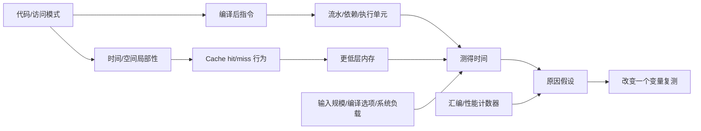

# 自学文档 5：项目 5——程序优化与 Cache

> [!abstract] 中心问题
> 两个算法复杂度同为 O(n) 的程序，为什么实际运行时间可能差几倍？CPU 明明很快，为什么却常常“等内存”？

> [!info] 项目定位
> 这里第一次系统地把“程序正确性”和“程序性能”分开研究。你要建立证据链：源码访问模式 → 编译后指令 → 内存访问局部性 → 测量结果。不要看到时间差就直接说“Cache miss”。

## 最终成果

一份可复现实验报告，至少包含：

- CPU/OS/编译器环境；
- 编译参数；
- 输入规模；
- 重复次数；
- 原始测量；
- 中位数或代表统计量；
- 正确性校验；
- 汇编证据；
- 对缓存/流水线/向量化等原因的“证据等级”说明。

---

## 第 1 章 性能实验第一原则：先保证结果真的被计算

错误 benchmark：

~~~c
for (int i = 0; i < n; i++) {
    sum += a[i];
}
~~~

如果 sum 从不被使用，优化器可能把整个循环删掉。

因此：

~~~c
printf("%lld\n", sum);
~~~

或把结果返回/写入不可轻易消除的位置。

### 1.1 编译器是实验变量

必须记录：

~~~bash
gcc --version
gcc -O0 ...
gcc -O2 ...
gcc -O3 ...
~~~

不要把不同优化等级混在同一结论里。

---

## 第 2 章 可靠计时

使用 clock_gettime：

~~~c
#include <time.h>

static double now_sec(void) {
    struct timespec ts;
    clock_gettime(CLOCK_MONOTONIC, &ts);
    return ts.tv_sec + ts.tv_nsec * 1e-9;
}
~~~

测量：

~~~c
double t0 = now_sec();

run_work();

double t1 = now_sec();
printf("%.6f\n", t1 - t0);
~~~

不要测太短的代码。单次只有几微秒时，调度噪声和计时开销会占很大比例。

建议：

- 增大输入；
- 循环多次；
- 预热；
- 至少重复 5—10 次；
- 报告中保留原始结果。

---

## 第 3 章 Memory Hierarchy

极简层次：

~~~text
寄存器
↓
L1 Cache
↓
L2 Cache
↓
L3 Cache
↓
主存 DRAM
↓
SSD/HDD
~~~

越靠近 CPU：

- 通常容量越小；
- 延迟越低；
- 带宽和访问特性不同。

Cache 的基本思想：

> 最近使用或附近的数据，很可能很快再次被使用。

---

## 第 4 章 局部性

### 4.1 时间局部性

同一个数据短时间内反复使用。

~~~c
for (...) {
    sum += x;
}
~~~

### 4.2 空间局部性

访问一个地址后，很快访问它附近地址。

~~~c
for (i = 0; i < n; i++)
    sum += a[i];
~~~

比：

~~~c
for (i = 0; i < n; i += 1024)
    sum += a[i];
~~~

更容易利用连续数据。

### 4.3 Cache line

缓存通常不是一次只搬 4 字节 int，而是按 cache line 搬一块连续数据。常见系统可能是 64 字节，但不要在报告里无证据地假定；可查：

~~~bash
getconf LEVEL1_DCACHE_LINESIZE
lscpu
~~~

如果本机工具提供信息，记录它。

---

## 第 5 章 实验 1：连续访问 vs 跨步访问

创建数组：

~~~c
size_t n = 64 * 1024 * 1024;
unsigned char *a = malloc(n);
~~~

初始化后测试不同 stride：

~~~text
1
2
4
8
16
32
64
128
256
...
~~~

核心循环：

~~~c
for (size_t i = 0; i < n; i += stride)
    sum += a[i];
~~~

但是直接比较总耗时不公平，因为 stride 越大，访问次数越少。

因此至少同时记录：

~~~text
总时间
访问次数
ns/access
~~~

计算：

~~~text
ns_per_access = elapsed_seconds × 1e9 / accesses
~~~

> [!success]
> 这一步体现“控制变量”。性能实验最常见的错不是代码错，而是比较口径错。

---

## 第 6 章 实验 2：矩阵按行 vs 按列

C 二维数组按行存放。

~~~c
#define N 2048
static int a[N][N];
~~~

按行：

~~~c
for (int i = 0; i < N; i++)
    for (int j = 0; j < N; j++)
        sum += a[i][j];
~~~

按列：

~~~c
for (int j = 0; j < N; j++)
    for (int i = 0; i < N; i++)
        sum += a[i][j];
~~~

两者访问元素总数相同、数学结果相同，但访问顺序不同。

报告：

| 版本 | 最快 | 中位数 | 最慢 | 结果校验 |
| --- | ---: | ---: | ---: | --- |
| row-major | | | | |
| column-major | | | | |

### 6.1 解释链

不要写：

~~~text
按列慢，因为 cache miss 多。
~~~

更严谨：

~~~text
观察：按列版本在本机明显更慢。
源码证据：按列访问相邻操作跨越整行。
布局证据：C 二维数组按行连续。
推断：空间局部性较差，缓存行利用率可能下降。
若 perf 可用：再用 cache-misses 等计数器补强。
~~~

---

## 第 7 章 Working Set：数据规模为什么重要

对不同大小重复测试：

~~~text
4 KB
32 KB
256 KB
2 MB
16 MB
128 MB
~~~

当数据规模跨过不同缓存容量时，可能出现性能区间变化。

查看：

~~~bash
lscpu
~~~

若提供 cache 信息，记录。

> [!warning]
> 不要期待图上一定出现漂亮的“阶梯”。现代 CPU 有预取、乱序执行、多级缓存、共享缓存等复杂因素。

---

## 第 8 章 实验 3：循环展开

基础：

~~~c
for (size_t i = 0; i < n; i++)
    sum += a[i];
~~~

展开 4 次：

~~~c
for (; i + 3 < n; i += 4) {
    sum += a[i];
    sum += a[i+1];
    sum += a[i+2];
    sum += a[i+3];
}
~~~

但只有一个 sum 时，仍存在依赖链：

~~~text
sum0 -> sum1 -> sum2 -> sum3
~~~

多累加器：

~~~c
long s0 = 0, s1 = 0, s2 = 0, s3 = 0;

for (; i + 3 < n; i += 4) {
    s0 += a[i];
    s1 += a[i+1];
    s2 += a[i+2];
    s3 += a[i+3];
}

sum = s0 + s1 + s2 + s3;
~~~

这个实验连接“指令级并行”。

观察汇编：

~~~bash
objdump -d -Mintel ./bench | less
~~~

---

## 第 9 章 向量化：一次处理多个元素

O3 可能使用 SIMD 指令。

编译：

~~~bash
gcc -O3 -march=native ...
~~~

再反汇编，寻找 xmm/ymm/zmm 等寄存器相关指令。

可以让 GCC 输出向量化信息：

~~~bash
gcc -O3 -march=native -fopt-info-vec-optimized ...
~~~

记录：

- 哪个循环被向量化；
- 哪个没有；
- 为什么编译器报告不能向量化。

> [!info]
> 本项目不要求手写 SIMD。目标是认识“源码循环”可能变成并行处理多个数据的机器指令。

---

## 第 10 章 编译优化不是“把 O0 变快”这么简单

比较：

~~~bash
gcc -O0
gcc -O1
gcc -O2
gcc -O3
~~~

记录：

- 可执行文件大小；
- 运行时间；
- 关键函数汇编；
- 是否 inline；
- 是否向量化。

同时验证结果完全一致。

---

## 第 11 章 perf：有条件时补充硬件计数器

如果 Linux 环境允许：

~~~bash
perf stat ./bench
~~~

更具体：

~~~bash
perf stat -e cycles,instructions,cache-references,cache-misses ./bench
~~~

但要注意：

- WSL/虚拟机可能限制硬件计数器；
- 不同 CPU 事件定义不同；
- cache-misses 是硬件事件，不能自动等同于“某一级缓存 miss”；
- 计数器结果也有测量误差。

如果不可用，报告中明确写：

> 本实验只有时间与源码访问模式证据，没有直接硬件 cache miss 计数，因此“缓存原因”属于基于体系结构模型的解释，不是直接测得。

---

## 第 12 章 简化 Cache 模拟器（可选但强烈推荐）

参数：

~~~text
S = set 数
E = 每组 line 数
B = block 大小
~~~

输入地址：

~~~text
0x0000
0x0040
0x0080
...
~~~

拆分：

~~~text
tag | set index | block offset
~~~

模拟：

- hit；
- miss；
- eviction；
- LRU。

这个小项目会让“cache line / set / tag”从图变成算法。

---

## 第 13 章 分块矩阵

普通矩阵乘法：

~~~text
C[i][j] += A[i][k] * B[k][j]
~~~

分块思想：

~~~text
把大矩阵切成适合缓存的小块
↓
在一个小块里尽可能多复用数据
↓
再切换到下一块
~~~

不要求一次写出高性能 GEMM，只需要：

- 实现 naive；
- 实现简单 blocking；
- 结果一致；
- 测量多个 N；
- 比较趋势。

---

## 第 14 章 性能实验的完整流程

任何性能问题都按：

~~~text
1. 明确问题
2. 写预测
3. 确认正确性
4. 固定环境/编译参数
5. 选择输入规模
6. 预热
7. 重复测量
8. 保存原始数据
9. 看汇编
10. 如可用，看硬件计数器
11. 区分观察与解释
12. 修改一个变量再验证
~~~

---

## 第 15 章 必做实验

### A. stride benchmark
输出 ns/access。

### B. matrix row/column
同样元素数量、不同顺序。

### C. working-set size
多个数据规模。

### D. O0/O2/O3
同一函数多优化等级。

### E. single accumulator vs multi accumulator
观察依赖链与性能。

### F. 汇编验证
至少选择一个有明显性能差异的函数，解释机器级变化。

---

## 第 16 章 报告模板

~~~markdown
# 项目 5 性能实验报告

## 1. 问题
## 2. 预测
## 3. 环境
- CPU
- OS
- GCC
- flags
- cache 信息

## 4. 正确性验证

## 5. 实验设计
- 输入
- 重复次数
- 预热
- 控制变量

## 6. 原始数据

## 7. 统计摘要

## 8. 汇编证据

## 9. 硬件计数器证据（若可用）

## 10. 解释
### 已直接观察到的
### 基于模型推断的
### 仍不能确定的

## 11. 新实验
~~~

---

## 第 17 章 常见错误

> [!warning] 只跑一次
> 单次时间不可靠。

> [!warning] 改了算法又改编译参数
> 一次改多个变量，无法知道原因。

> [!warning] 结果没被使用
> 编译器可能删掉工作。

> [!warning] 用总时间比较不同访问次数
> 应归一化。

> [!warning] 看见慢就说 cache miss
> 必须区分观察和推断。

> [!warning] “O3 一定更快”
> 不保证。代码、CPU、输入规模都可能影响。

---

## 第 18 章 验收自测

1. 时间局部性与空间局部性是什么？
2. cache line 为什么让连续访问有意义？
3. 为什么 stride 实验要算 ns/access？
4. 为什么矩阵按行/按列可能差很多？
5. working set 是什么？
6. 为什么要重复测量？
7. 为什么要保留编译选项？
8. 循环展开为什么可能有效？
9. 多累加器在解决什么依赖？
10. SIMD 是什么概念？
11. 为什么时间差不能单独证明 cache miss？
12. 如何设计“下一次实验”验证你的性能假设？

> [!success] 通过标准
> 你面对一个“程序为什么慢”的问题，不会立即给原因，而会先设计可测量、可复现、能区分假设的实验。

---

## 学习导航：资料、图解与扩展

> [!tip] 阅读策略
> 性能实验最容易“看见差异就编故事”。固定流程是：**先保证结果正确 → 控制变量 → 重复测量 → 看汇编/计数器 → 再解释**。

### A. 实验前必读

- **CS:APP 3e Ch.5**：§5.2–5.14，重点是性能表达、循环优化、并行性、瓶颈定位。
- **CS:APP Ch.6**：§6.2 Locality、§6.3 Memory Hierarchy、§6.4 Cache、§6.5–6.6 Cache-Friendly Code。
- 总索引：[[实验参考指南与可视化索引]]

### B. 做实验时按需查

- 编译器优化：GCC Optimize Options：https://gcc.gnu.org/onlinedocs/gcc/Optimize-Options.html
- 汇编证据：GNU objdump：https://sourceware.org/binutils/docs/binutils.html
- Linux 可尝试 `perf stat` / `perf record`；若 WSL/权限下计数器不可用，明确记录“只能凭时间与汇编推断”的证据边界。

### C. 视频/扩展

- MIT 6.172 Lecture 10 Measurement and Timing。
- MIT 6.172 Lecture 14 Caching and Cache-Efficient Algorithms。
  https://ocw.mit.edu/courses/6-172-performance-engineering-of-software-systems-fall-2018/

### 机制图：性能结论需要证据链

> [!question] 迁移检查
> 对矩阵按行/按列遍历，先画出内存访问顺序，再预测在“小到能进 Cache”和“大到明显超出 Cache”时差异是否一样。

[打开交互式实验总览](visuals/计算机系统实验总览.html)
