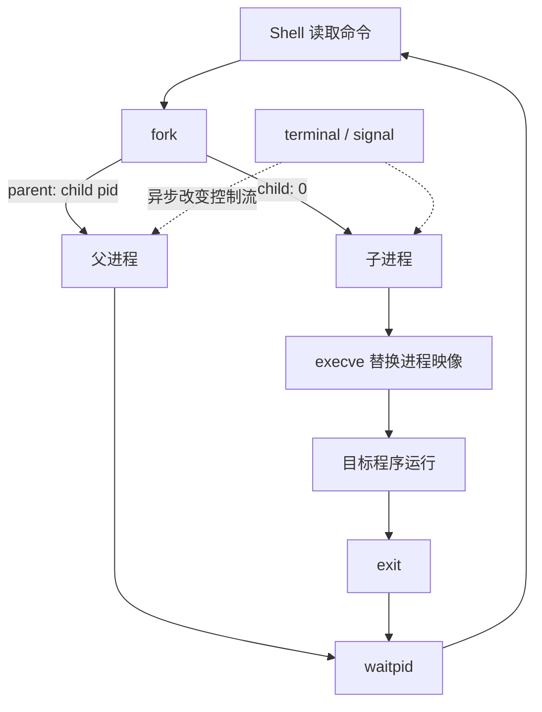

# 自学文档 6：项目 6——进程、异常控制流与极简 Shell

> [!abstract] 中心问题
> 当一个程序启动另一个程序时，究竟发生了什么？操作系统怎样让多个程序轮流运行，又怎样通过系统调用、信号和异常改变程序控制流？

> [!info] 最终项目
> 实现一个前台极简 Shell：
>
> - 读取一行命令；
> - 拆分命令与参数；
> - fork 创建子进程；
> - 子进程 exec 运行程序；
> - 父进程 waitpid 回收；
> - 正确处理命令不存在、空行、exec 失败；
> - 能观察 Ctrl-C / SIGINT 的基本行为。
>
> 管道、重定向、后台作业属于拓展。

---

## 第 1 章 程序与进程再区分一次

可执行文件：

~~~text
磁盘上的 ELF 文件
~~~

进程：

~~~text
正在运行的程序实例
+ 虚拟地址空间
+ 寄存器上下文
+ PID
+ 文件描述符
+ 调度状态
+ 信号状态
+ 内核中的其他元数据
~~~

同一个 ./app 可以启动多个进程。

实验：

~~~bash
sleep 100 &
sleep 100 &
ps -o pid,ppid,stat,cmd -C sleep
~~~

你会看到两个 PID。

---

## 第 2 章 PID 与父子关系

C：

~~~c
#include <stdio.h>
#include <unistd.h>

int main(void) {
    printf("pid=%d ppid=%d\n", getpid(), getppid());
    return 0;
}
~~~

运行：

~~~bash
./pid_demo
~~~

再在 shell 中：

~~~bash
echo $$
~~~

比较父 PID。

> [!question]
> 为什么你的程序结束后 PID 不再代表一个活动进程，而可执行文件仍存在？

---

## 第 3 章 fork：一次调用，两条执行路径

最小例子：

~~~c
#include <stdio.h>
#include <unistd.h>
#include <sys/types.h>

int main(void) {
    printf("before fork: pid=%d\n", getpid());

    pid_t pid = fork();

    if (pid < 0) {
        perror("fork");
        return 1;
    }

    if (pid == 0) {
        printf("child: pid=%d ppid=%d\n", getpid(), getppid());
    } else {
        printf("parent: pid=%d child=%d\n", getpid(), pid);
    }

    return 0;
}
~~~

fork 返回：

~~~text
失败：-1
子进程：0
父进程：子进程 PID
~~~

### 3.1 最关键的理解

fork 之后不是“从 main 重新开始”。

而是：

~~~text
父进程执行到 fork
↓
内核创建子进程
↓
父子都从 fork 返回之后继续
↓
返回值不同，因此走不同分支
~~~

### 3.2 输出为什么顺序不固定

父子进程由调度器安排运行。

因此：

~~~text
parent first
~~~

或：

~~~text
child first
~~~

都可能出现。

不要把偶然的一次输出顺序当成保证。

---

## 第 4 章 fork 后的内存：看起来复制，底层通常按需

~~~c
int x = 10;

pid_t pid = fork();

if (pid == 0) {
    x = 20;
    printf("child x=%d\n", x);
} else {
    x = 30;
    printf("parent x=%d\n", x);
}
~~~

你会发现两个进程的 x 互不影响。

从程序视角：

~~~text
父子拥有各自独立虚拟地址空间
~~~

底层系统通常通过 copy-on-write 避免立即物理复制全部页面。项目 7 会继续研究。

---

## 第 5 章 exec：不是创建新进程，而是替换当前进程映像

示例：

~~~c
#include <stdio.h>
#include <unistd.h>

int main(void) {
    printf("before exec pid=%d\n", getpid());

    execlp("ls", "ls", "-l", NULL);

    perror("execlp");
    return 1;
}
~~~

若 exec 成功：

~~~text
before exec
↓
当前进程的用户态程序映像被 ls 替换
↓
PID 通常保持
↓
从 ls 的入口开始执行
↓
原程序 exec 之后的代码不再运行
~~~

所以：

~~~c
perror("execlp");
~~~

只在 exec 失败时执行。

---

## 第 6 章 fork + exec：Shell 的核心模式

Shell 读取：

~~~text
ls -l /tmp
~~~

大致：

~~~text
shell(parent)
   |
   fork
   |
   +------ child
   |         |
   |         execvp("ls", argv)
   |         |
   |         变成 ls
   |
   waitpid
   |
读下一条命令
~~~

代码骨架：

~~~c
pid_t pid = fork();

if (pid < 0) {
    perror("fork");
} else if (pid == 0) {
    execvp(argv[0], argv);
    perror("execvp");
    _exit(127);
} else {
    int status;
    waitpid(pid, &status, 0);
}
~~~

> [!warning] 子进程 exec 失败后为什么常用 _exit？
> 因为子进程是 fork 出来的，直接 exit 可能重复处理继承的 stdio 缓冲等状态。作为教学 Shell，exec 失败后用 _exit 更清晰。

---

## 第 7 章 wait / waitpid：父进程为什么要回收子进程

如果子进程结束，内核仍需暂存其退出状态，直到父进程读取。

这段阶段中的子进程称为 zombie。

实验程序：

~~~c
#include <stdio.h>
#include <stdlib.h>
#include <unistd.h>

int main(void) {
    pid_t pid = fork();

    if (pid == 0) {
        _exit(42);
    }

    printf("child=%d, inspect with ps now\n", pid);
    sleep(30);

    return 0;
}
~~~

另一终端：

~~~bash
ps -o pid,ppid,stat,cmd -p <child_pid>
~~~

可能看到 Z 状态。

然后改成：

~~~c
int status;
waitpid(pid, &status, 0);
~~~

再观察。

### 7.1 读取退出状态

~~~c
if (WIFEXITED(status)) {
    printf("exit=%d\n", WEXITSTATUS(status));
}

if (WIFSIGNALED(status)) {
    printf("signal=%d\n", WTERMSIG(status));
}
~~~

这让 Shell 能区分：

- 正常 return/exit；
- 被信号终止。

---

## 第 8 章 异常控制流全景

“控制流”不仅由普通 jmp/call 改变。

还有：

~~~text
同步异常：
  除零、缺页、非法指令、系统调用等

异步事件：
  外部中断、某些信号等
~~~

从程序视角理解：

~~~text
正常执行用户代码
↓
发生事件
↓
CPU/内核切换到特定处理路径
↓
可能返回原程序
也可能终止/调度其他任务
~~~

项目 6 不深入 IDT/内核实现，但要建立“正常指令流可被系统事件打断”的观念。

---

## 第 9 章 系统调用：用户态请求内核服务

例如：

~~~text
read
write
open
fork
execve
wait4
~~~

用：

~~~bash
strace ./fork_exec_demo
~~~

重点找：

~~~text
clone/fork
execve
wait4
write
exit_group
~~~

不同系统/版本可能显示 clone/clone3 来实现进程创建，这是正常的。

> [!success]
> C 库函数 fork() 是你写的接口；真正进入内核时，strace 看到的是具体系统调用层面的证据。

---

## 第 10 章 信号：异步通知机制

最小程序：

~~~c
#include <stdio.h>
#include <signal.h>
#include <unistd.h>

volatile sig_atomic_t got_sigint = 0;

static void on_sigint(int sig) {
    (void)sig;
    got_sigint = 1;
}

int main(void) {
    signal(SIGINT, on_sigint);

    while (!got_sigint) {
        pause();
    }

    puts("SIGINT observed");
    return 0;
}
~~~

教学重点：

- SIGINT 常由终端 Ctrl-C 触发；
- 信号可能异步到来；
- handler 中能安全调用的函数有限；
- sig_atomic_t 适合简单标志；
- 真正工程代码更推荐 sigaction 而不是 signal。

### 10.1 使用 sigaction

~~~c
struct sigaction sa = {0};
sa.sa_handler = on_sigint;
sigemptyset(&sa.sa_mask);
sa.sa_flags = 0;

if (sigaction(SIGINT, &sa, NULL) == -1) {
    perror("sigaction");
}
~~~

---

## 第 11 章 终端、Shell 与 Ctrl-C

如果你的 shell 启动：

~~~text
sleep 100
~~~

然后 Ctrl-C，简单版本中 Shell 和 child 可能都会收到终端前台进程组相关信号，具体行为与进程组、终端控制有关。

核心版项目不要求完整 job control。

你只需：

1. 观察默认行为；
2. 明确记录 Shell 是否被终止；
3. 如果需要，让 Shell 自己忽略 SIGINT，而子进程在 exec 前恢复默认行为；
4. 把“完整进程组/作业控制”列为进阶。

不要在核心版里一下跳进 tcsetpgrp 的复杂细节。

---

## 第 12 章 Shell 第一步：读一行

推荐 getline：

~~~c
char *line = NULL;
size_t cap = 0;

ssize_t n = getline(&line, &cap, stdin);

if (n == -1) {
    // EOF or error
}
~~~

提示符：

~~~c
printf("mini$ ");
fflush(stdout);
~~~

为什么 fflush？因为 stdout 在不同场景下缓冲策略不同，提示符没有换行时应明确刷新。

---

## 第 13 章 Shell 第二步：最小参数切分

核心版可以只支持空格分词，不支持：

- 引号；
- 转义；
- 变量展开；
- 通配符。

例如：

~~~text
echo hello world
~~~

变成：

~~~text
argv[0] = "echo"
argv[1] = "hello"
argv[2] = "world"
argv[3] = NULL
~~~

简单实现可用 strtok_r。

> [!warning]
> 必须在 README 明确写“当前语法子集”。不要让用户误以为这是完整 Bash parser。

---

## 第 14 章 Shell 第三步：内建命令

为什么 cd 不能简单 fork 后 exec 一个 /bin/cd？

因为：

~~~text
子进程改变自己的 cwd
↓
子进程退出
↓
父 Shell 的 cwd 没变
~~~

所以 cd 必须在 Shell 自己的进程中处理。

核心内建：

~~~text
cd
exit
~~~

cd：

~~~c
if (chdir(argv[1]) == -1) {
    perror("cd");
}
~~~

---

## 第 15 章 Shell 主循环

整体：

~~~text
while true:
    打印 prompt
    读一行

    if EOF:
        break

    parse argv

    if empty:
        continue

    if builtin:
        execute in shell
        continue

    fork

    child:
        execvp
        on failure _exit

    parent:
        waitpid
        report status
~~~

这就是核心版的完整架构。

---

## 第 16 章 错误路径必须单独设计

至少测试：

| 情况 | 预期 |
| --- | --- |
| 空行 | 不崩溃，继续提示 |
| EOF | Shell 正常退出 |
| 不存在命令 | child 报错，Shell 继续 |
| fork 失败 | Shell 报错 |
| exec 失败 | child 退出，父回收 |
| cd 无参数 | 给出明确处理 |
| cd 不存在目录 | perror |
| child 正常退出 | waitpid 回收 |
| child 被信号终止 | Shell 识别 |

---

## 第 17 章 用 strace 观察你的 Shell

~~~bash
strace -f ./minish
~~~

输入：

~~~text
echo hello
exit
~~~

寻找：

~~~text
read
write
clone/fork
execve
wait4
exit_group
~~~

画出：

~~~text
Shell C 代码
↓
libc 函数
↓
system call
↓
内核
↓
子进程
~~~

---

## 第 18 章 /proc 观察父子进程

在 child sleep 时：

~~~bash
ps -ef --forest
cat /proc/<PID>/status
ls -l /proc/<PID>/fd
cat /proc/<PID>/maps
~~~

观察：

- PPid；
- State；
- Threads；
- open fds；
- 内存映射。

项目 6 重点是 process 关系，maps 会在项目 7 继续。

---

## 第 19 章 拓展 1：I/O 重定向

目标：

~~~text
echo hello > out.txt
~~~

思想：

~~~text
open out.txt
↓
fork
↓
child 中 dup2(fd, STDOUT_FILENO)
↓
exec echo
~~~

因为文件描述符 1 是 stdout。

注意关闭不再需要的 fd。

---

## 第 20 章 拓展 2：管道

目标：

~~~text
ls | wc -l
~~~

pipe：

~~~text
pipefd[0] read end
pipefd[1] write end
~~~

父 Shell：

~~~text
pipe
fork child1
fork child2

child1 stdout → pipe write
child2 stdin  → pipe read

所有进程关闭不需要的端
父 wait 两个 child
~~~

最常见 bug：某个进程忘记关闭 pipe 写端，导致读端永远等不到 EOF。

---

## 第 21 章 项目目录建议

~~~text
project6/
├── src/
│   ├── main.c
│   ├── parse.c
│   ├── parse.h
│   ├── exec.c
│   └── exec.h
├── tests/
│   └── cases.txt
├── Makefile
└── README.md
~~~

核心版不必过度工程化，但至少把 parsing 与 process execution 分开。

---

## 第 22 章 必做实验

### A. fork 双路径
记录 PID/PPID/返回值。

### B. exec 替换
证明 exec 成功后原代码不继续执行。

### C. wait/zombie
观察 Z 状态，再修复。

### D. signal
观察 Ctrl-C。

### E. 极简 Shell
实现外部命令 + cd + exit。

### F. strace
保存一次 echo 的 fork/exec/wait 证据。

---

## 第 23 章 实验报告模板

~~~markdown
# 项目 6 进程与 Shell

## 1. fork 实验
### 预测
### PID 证据
### 调度顺序观察

## 2. exec 实验

## 3. wait 与 zombie

## 4. signal

## 5. Mini Shell 设计
### parser
### builtin
### fork/exec
### wait
### error paths

## 6. strace 证据

## 7. 一条命令的完整生命周期
输入命令 → fork → child → exec → program → exit → waitpid
~~~

---

## 第 24 章 验收自测

1. fork 为什么返回两次？
2. child 如何区分自己？
3. fork 后普通变量为什么互不影响？
4. exec 是否创建新 PID？
5. 为什么 exec 成功后通常不返回？
6. zombie 是什么？
7. waitpid 为什么必要？
8. exit status 与 signal termination 怎么区分？
9. shell 为什么用 fork + exec，而不是直接 exec？
10. cd 为什么必须是 builtin？
11. system call 与普通函数调用有什么层级区别？
12. signal 为什么叫异步控制流？
13. 管道为什么必须关闭多余 fd？
14. 你如何用 strace 证明一条 shell 命令经过了哪些内核接口？

> [!success] 通过标准
> 输入一条 echo hello，你能从 Shell 源码一路解释到 fork、execve、write、exit、waitpid，并指出父子进程各自负责什么。

---

## 学习导航：资料、图解与扩展

> [!tip] 阅读策略
> 先把 Shell 看成一个循环：**read command → fork → child exec → parent wait**。信号和异常是第二层，等这个主循环跑通再加。

### A. 实验前必读

- **CS:APP 3e Ch.8**：§8.1 Exceptions、§8.2 Processes、§8.4 Process Control；Shell 完成后再细读 §8.5 Signals。
- **OSTEP**：Ch.4 Processes、Ch.5 Process API、Ch.6 Limited Direct Execution。
- 总索引：[[实验参考指南与可视化索引]]

### B. 做实验时按需查

- `fork(2)`：https://man7.org/linux/man-pages/man2/fork.2.html
- `execve(2)`：https://man7.org/linux/man-pages/man2/execve.2.html
- `wait/waitpid(2)`：https://man7.org/linux/man-pages/man2/wait.2.html
- signals 总入口：https://man7.org/linux/man-pages/man7/signal.7.html

### C. 视频/扩展

- MIT 6.1810（2026）系统调用、线程切换等讲次：https://pdos.csail.mit.edu/6.S081/2026/schedule.html
- Shell 跑通后再做 pipe/redirection，避免一次把进程、fd、信号三套模型混在一起。

### 机制图：Shell 的两条控制流

> [!question] 迁移检查
> 在 `fork` 前后各加一条带缓冲的 `printf`，分别在终端运行和重定向到文件。先预测输出次数与顺序，再解释 stdio buffer 为什么会影响现象。

[打开交互式实验总览](visuals/计算机系统实验总览.html)
