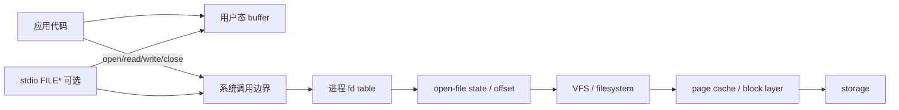

# 自学文档 8：项目 8——文件与系统 I/O

> [!abstract] 中心问题
> read(fd, buf, n) 调用之后，数据究竟从哪里到哪里？为什么一次成功的 read/write 也可能只处理一部分数据？

> [!info] 最终成果
> 实现可靠的 cp-lite：
>
> ~~~text
> ./cp-lite source.bin dest.bin
> ~~~
>
> 支持二进制文件；正确处理 short read/write、EOF、EINTR 和错误路径；保证文件描述符被关闭；用 cmp/哈希验证内容一致；用 strace 观察系统调用并比较不同缓冲区大小。

---

## 第 1 章 File Descriptor

~~~c
int fd = open("data.txt", O_RDONLY);
~~~

fd 常是小整数，例如 3。

更准确的模型：

~~~text
当前进程
fd table
  0 → stdin
  1 → stdout
  2 → stderr
  3 → 某个打开文件状态
~~~

数字 3 只是进程内部索引，不是“文件本身的编号”。

---

## 第 2 章 open

~~~c
#include <fcntl.h>

int in = open("data.txt", O_RDONLY);

if (in == -1) {
    perror("open");
}
~~~

创建目标：

~~~c
int out = open(
    "out.bin",
    O_WRONLY | O_CREAT | O_TRUNC,
    0644
);
~~~

常见 flags：

~~~text
O_RDONLY
O_WRONLY
O_RDWR
O_CREAT
O_TRUNC
O_APPEND
~~~

O_CREAT 时才需要 mode 参数。

---

## 第 3 章 read 的契约

~~~c
ssize_t n = read(fd, buf, capacity);
~~~

返回：

~~~text
n > 0   实际读到 n 个字节
n = 0   EOF
n = -1  error
~~~

最重要的规则：

> 请求 4096 字节，不等于一定返回 4096。

它可能返回任何 1..4096 的正值，也可能是 0 或 -1。

因此永远使用返回值 n 作为“这次真正有效的数据长度”。

---

## 第 4 章 EOF 不是错误

标准循环：

~~~c
for (;;) {
    ssize_t n = read(fd, buf, sizeof(buf));

    if (n > 0) {
        // process n bytes
        continue;
    }

    if (n == 0) {
        // normal EOF
        break;
    }

    // n == -1
    ...
}
~~~

不要把：

~~~text
0 bytes
~~~

写成“读取失败”。它在普通文件末尾是正常结束条件。

---

## 第 5 章 write 也可能只写一部分

~~~c
ssize_t n = write(fd, buf, len);
~~~

即便 n > 0，也可能：

~~~text
n < len
~~~

可靠函数：

~~~c
#include <errno.h>
#include <unistd.h>

ssize_t write_all(int fd, const void *buf, size_t len) {
    const unsigned char *p = buf;
    size_t done = 0;

    while (done < len) {
        ssize_t n = write(fd, p + done, len - done);

        if (n > 0) {
            done += (size_t)n;
            continue;
        }

        if (n == -1 && errno == EINTR)
            continue;

        return -1;
    }

    return (ssize_t)done;
}
~~~

这段模式会原样迁移到 Socket/HTTP。

---

## 第 6 章 EINTR

某些阻塞系统调用可能被信号打断：

~~~text
return -1
errno = EINTR
~~~

常见处理：

~~~c
if (n < 0 && errno == EINTR)
    continue;
~~~

项目里对 read/write 都显式处理，不要把所有负值一律直接退出。

---

## 第 7 章 cp-lite 主循环

~~~c
unsigned char buf[8192];

for (;;) {
    ssize_t n = read(in_fd, buf, sizeof(buf));

    if (n > 0) {
        if (write_all(out_fd, buf, (size_t)n) == -1) {
            perror("write");
            goto cleanup;
        }
        continue;
    }

    if (n == 0) {
        rc = 0;
        break;
    }

    if (errno == EINTR)
        continue;

    perror("read");
    break;
}
~~~

二进制安全的关键：

~~~text
长度来自 read 返回值
不是 strlen
不是字符串结束符
~~~

---

## 第 8 章 资源所有权与 cleanup

推荐初始化：

~~~c
int in_fd = -1;
int out_fd = -1;
int rc = 1;
~~~

清理：

~~~c
cleanup:
if (in_fd >= 0)
    close(in_fd);

if (out_fd >= 0) {
    if (close(out_fd) == -1) {
        perror("close output");
        rc = 1;
    }
}

return rc;
~~~

这样任何错误分支都能统一清理。

---

## 第 9 章 close 也属于 I/O 生命周期

很多程序只检查 write，却完全忽略 close。

对于输出文件，某些错误可能到 close/最终写回阶段才显现，所以至少要对输出 fd 检查 close。

资源链：

~~~text
open 成功
↓
当前函数拥有 fd
↓
read/write
↓
所有路径最终 close
↓
ownership 结束
~~~

---

## 第 10 章 文件 Offset

~~~c
off_t pos = lseek(fd, 0, SEEK_CUR);
~~~

设置：

~~~c
lseek(fd, 0, SEEK_SET);
lseek(fd, 100, SEEK_SET);
lseek(fd, -10, SEEK_END);
~~~

实验：

1. 打开一个已知内容文件；
2. read 4 字节；
3. 查看 offset；
4. 再 read 4；
5. lseek 回 0；
6. 再 read。

写下每一步 offset。

---

## 第 11 章 fork 后 fd

项目 6 的 fork 后，父子都保留对应 fd。

更深一层：

> 两个进程的 fd table 项可能引用同一个底层打开文件状态，因此文件 offset 等状态可能相关。

实验：

~~~c
int fd = open("letters.txt", O_RDONLY);
pid_t pid = fork();
~~~

让父子各 read 5 字节并打印。

由于调度顺序不固定，输出顺序可能变，但常能观察到 offset 并不是各自完全独立从 0 开始。

---

## 第 12 章 dup2 与重定向

~~~c
dup2(fd, STDOUT_FILENO);
~~~

结果：

~~~text
fd 1 (stdout)
↓
改为指向与 fd 相同的打开文件
~~~

之后：

~~~c
printf("hello\n");
fflush(stdout);
~~~

内容进入文件。

这正是 Shell 的：

~~~text
command > out.txt
~~~

底层关键机制。

---

## 第 13 章 stdio 与 system call I/O

高级：

~~~text
FILE *
fopen
fread
fwrite
fprintf
fclose
~~~

底层：

~~~text
fd
open
read
write
close
~~~

stdio 通常维护用户态缓冲。

实验 1：

~~~c
printf("a");
printf("b");
printf("c");
~~~

实验 2：

~~~c
write(1, "a", 1);
write(1, "b", 1);
write(1, "c", 1);
~~~

观察：

~~~bash
strace -e write ./demo
~~~

比较 write 系统调用数量。

---

## 第 14 章 缓冲行为

~~~c
printf("hello");
sleep(10);
~~~

再试：

~~~c
printf("hello\n");
sleep(10);
~~~

再试：

~~~c
printf("hello");
fflush(stdout);
sleep(10);
~~~

注意 stdout 连接终端、文件、管道时可能采用不同缓冲策略。

这解释了项目 6 中 prompt：

~~~c
printf("mini$ ");
fflush(stdout);
~~~

---

## 第 15 章 二进制数据

Unix read/write 处理字节序列。

复制程序绝不能：

~~~c
strlen(buf)
printf("%s", buf)
~~~

来决定任意二进制 buffer 的长度。

因为文件中可能合法包含：

~~~text
0x00
~~~

而 C 字符串会把它当终止符。

---

## 第 16 章 stat 与 inode

~~~c
#include <sys/stat.h>

struct stat st;

if (stat("file", &st) == -1)
    perror("stat");
~~~

可以观察：

- size；
- mode；
- inode；
- 时间；
- 文件类型。

命令：

~~~bash
stat file
ls -li file
~~~

---

## 第 17 章 路径名、目录项、inode 的初步模型

教学级：

~~~text
/path/name
↓
目录查找
↓
目录项把 name 关联到 inode
↓
inode/文件系统对象描述数据与元数据
~~~

硬链接实验：

~~~bash
echo hello > a.txt
ln a.txt b.txt
ls -li a.txt b.txt
~~~

若 inode 相同：

~~~bash
echo world >> a.txt
cat b.txt
~~~

会看到更新。

---

## 第 18 章 unlink 与打开文件生命周期

终端 A 的程序：

~~~c
int fd = open("temp.txt", O_RDONLY);
sleep(30);
// after sleep, read from fd
~~~

终端 B：

~~~bash
rm temp.txt
~~~

文件名消失后，A 中已经打开的 fd 通常仍可读取。

因此：

~~~text
目录项名字生命周期
≠
打开文件引用生命周期
~~~

---

## 第 19 章 /proc/PID/fd

让程序打开两个文件后 sleep。

另一终端：

~~~bash
ls -l /proc/<PID>/fd
~~~

记录：

~~~text
0
1
2
3
4
...
~~~

每个符号链接指向什么。

这个实验是资源 ownership 的直接证据。

---

## 第 20 章 strace 观察 cp-lite

~~~bash
strace -o trace.txt ./cp-lite src.bin dst.bin
~~~

从 trace 中标记：

- openat；
- read；
- write；
- close；
- exit_group。

回答：

1. src 是哪个 fd？
2. dst 是哪个 fd？
3. 每次 read 请求多少？
4. 实际返回多少？
5. write 的长度由什么决定？
6. 最后两个 fd 在哪里关闭？

---

## 第 21 章 Buffer Size 性能实验

测试同一大文件：

~~~text
1 B
16 B
256 B
4 KiB
64 KiB
1 MiB
~~~

记录：

| Buffer | Time | read count | write count |
| --- | ---: | ---: | ---: |
| 1 B | | | |
| 16 B | | | |
| 256 B | | | |
| 4 KiB | | | |
| 64 KiB | | | |
| 1 MiB | | | |

系统调用次数可用：

~~~bash
strace -c ./cp-lite src dst
~~~

过小 buffer 通常导致大量系统调用。

但不要总结成“越大越快”，因为收益会趋缓，且缓存、内核实现和存储设备都影响结果。

---

## 第 22 章 内容一致性

空文件：

~~~bash
: > empty.bin
~~~

随机二进制：

~~~bash
dd if=/dev/urandom of=random.bin bs=1M count=16 status=progress
~~~

验证：

~~~bash
cmp src.bin dst.bin
echo $?
~~~

或：

~~~bash
sha256sum src.bin dst.bin
~~~

测试至少：

- empty；
- 1 byte；
- text；
- random binary；
- large file。

---

## 第 23 章 错误路径测试

### 源文件不存在

~~~bash
./cp-lite no-such-file out
~~~

### 目标路径不可写

必须有明确错误且不泄漏输入 fd。

### 源 = 目标

这是重要陷阱：

~~~text
先以 O_TRUNC 打开目标
↓
如果目标其实就是源
↓
源可能先被清空
~~~

基础版至少检测完全相同路径；进阶用 fstat 比较 st_dev + st_ino。

### 空文件

必须产生合法 0 字节目标文件。

---

## 第 24 章 推荐结构

~~~text
project8/
├── src/
│   ├── main.c
│   ├── io.c
│   └── io.h
├── tests/
│   └── test.sh
├── Makefile
└── README.md
~~~

io.h：

~~~c
ssize_t write_all(int fd, const void *buf, size_t len);
int copy_fd(int in_fd, int out_fd);
~~~

让“打开路径”和“复制字节流”分离，项目 9 可以直接复用 write_all 思路。

---

## 第 25 章 必做实验清单

| 实验 | 必留证据 |
| --- | --- |
| read/EOF | 返回值序列 |
| lseek | offset 前后 |
| cp-lite | 源码 + 测试 |
| binary | cmp/hash |
| stdio buffering | strace write |
| /proc/PID/fd | fd 映射 |
| buffer benchmark | time + syscall count |
| error paths | 错误输出 + cleanup |

---

## 第 26 章 报告模板

~~~markdown
# 项目 8 文件与系统 I/O

## 1. fd 模型
## 2. open/read/write/close
## 3. EOF 与 error
## 4. short read/write
## 5. cp-lite
### ownership
### read loop
### write_all
### cleanup
## 6. offset
## 7. dup2
## 8. stdio buffering
## 9. inode / hard link / unlink
## 10. /proc/PID/fd
## 11. strace
## 12. buffer benchmark
## 13. correctness tests
## 14. failure tests
~~~

---

## 第 27 章 验收自测

1. fd 3 的 3 是什么？
2. read 返回 0 是什么？
3. read 请求 4096 是否承诺得到 4096？
4. write 为什么需要循环？
5. EINTR 怎么处理？
6. 为什么二进制复制不能用 strlen？
7. lseek 修改什么？
8. dup2 为什么可以实现重定向？
9. stdio 与 read/write 是哪两层？
10. printf 为什么可能没有立刻 write？
11. fork 后 fd 有什么共享关系值得注意？
12. hard link 为什么可以有两个名字一个 inode？
13. unlink 后打开 fd 为什么可能仍有效？
14. 如何用 strace 证明你的 copy 工具实际做了什么？
15. 如何证明复制结果完全一致？

> [!success] 通过标准
> 你不再把 read/write 当“读文件/写文件按钮”，而能准确解释它们的返回值、文件偏移、fd 生命周期、用户态缓冲和内核系统调用之间的关系。

---

## 学习导航：资料、图解与扩展

> [!tip] 阅读策略
> 本项目不要把 `open/read/write/close` 当成四个要背的函数；始终追踪 **fd 指向什么、offset 在哪里、一次调用实际处理了多少字节、失败后谁清理资源**。

### A. 实验前必读

- **CS:APP 3e Ch.10**：§10.1 Unix I/O、§10.2 Files、§10.3–10.5 open/read/write 与 robust I/O；完成基础实验后读 §10.8–10.11。
- **OSTEP**：Ch.39 Files and Directories、Ch.40 File System Implementation；想深入持久化再看后续章节。
- 总索引：[[实验参考指南与可视化索引]]

### B. 做实验时按需查

- `open(2)`：https://man7.org/linux/man-pages/man2/open.2.html
- `read(2)`：https://man7.org/linux/man-pages/man2/read.2.html
- `write(2)`：https://man7.org/linux/man-pages/man2/write.2.html
- `close(2)`：https://man7.org/linux/man-pages/man2/close.2.html
- 用 `strace` 对照 libc/stdio 与真正系统调用：https://strace.io/

### C. 视频/扩展

- MIT 6.1810（2026）文件系统相关讲次：https://pdos.csail.mit.edu/6.S081/2026/schedule.html
- 基础复制工具正确后再研究 stdio buffering、fd duplication、redirection。

### 机制图：一次文件读取穿过哪些层

> [!question] 迁移检查
> 把复制程序的 buffer 从 1B、4KB、64KB 依次改变。先预测系统调用次数与总耗时怎样变，再用 `strace -c` 和重复计时验证。

[打开交互式实验总览](visuals/计算机系统实验总览.html)
