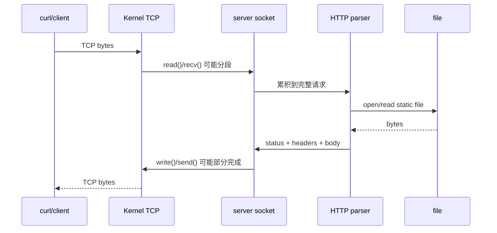

# 自学文档 9：项目 9——Socket 与 HTTP

> [!abstract] 中心问题
> curl 发出的请求怎样通过 TCP 到达你的 C 程序？为什么一次 recv 不能等于“收到一个完整 HTTP 请求”？

> [!info] 最终成果
> 先实现 TCP Echo Server，再升级为**顺序处理**的 HTTP/1.0 风格静态文件服务器：监听端口、accept 连接、循环读取完整请求头、只支持 GET、返回固定文本或静态文件、正确设置 Content-Length、处理 400/404/405、限制 www 根目录、循环处理 partial send，每连接处理一次请求后关闭。并发留到项目 10。

## 全貌：从连接到响应

~~~text
socket → bind → listen → accept
                         ↓
                    client_fd
                         ↓
                  read / recv loop
                         ↓
                 request buffer
                         ↓
                    HTTP parse
                         ↓
                 open static file
                         ↓
                  response header
                         ↓
                    send_all
                         ↓
                      close
~~~

---

## 第 1 章 Socket 也是一种文件描述符

Unix 中很多内核资源通过 fd 暴露：

~~~text
普通文件 fd
socket fd
pipe fd
terminal fd
~~~

因此项目 8 的很多经验可以直接迁移：

- 检查返回值；
- read/write 可能只完成一部分；
- fd 有 ownership；
- 错误路径必须 close；
- 不能假定一次 I/O 就完成逻辑消息。

---

## 第 2 章 IP、端口与 TCP 连接

最低限度模型：

~~~text
IP address：定位主机/网络接口
port：定位主机上的服务端点
TCP：在两个端点之间提供可靠、有序的字节流
~~~

一条连接可表示为：

~~~text
client_ip:client_port
↔
server_ip:server_port
~~~

本机实验：

~~~text
127.0.0.1:<临时端口>
↔
127.0.0.1:8080
~~~

---

## 第 3 章 网络字节序

项目 1 已学过大小端。网络协议中的多字节整数通常使用 network byte order。

常见转换：

~~~c
htons
htonl
ntohs
ntohl
~~~

例如：

~~~c
addr.sin_port = htons(8080);
~~~

不要把“本机整数 8080 的内存字节顺序”和“网络协议字段顺序”混为一谈。

---

## 第 4 章 创建监听 Socket

~~~c
#include <sys/socket.h>
#include <netinet/in.h>
#include <arpa/inet.h>

int listen_fd = socket(AF_INET, SOCK_STREAM, 0);

if (listen_fd == -1) {
    perror("socket");
    return 1;
}
~~~

地址：

~~~c
struct sockaddr_in addr = {0};

addr.sin_family = AF_INET;
addr.sin_addr.s_addr = htonl(INADDR_ANY);
addr.sin_port = htons(8080);
~~~

bind：

~~~c
if (bind(
        listen_fd,
        (struct sockaddr *)&addr,
        sizeof(addr)
    ) == -1) {
    perror("bind");
}
~~~

listen：

~~~c
if (listen(listen_fd, 128) == -1) {
    perror("listen");
}
~~~

---

## 第 5 章 SO_REUSEADDR

开发时服务器刚退出，立即重启可能遇到：

~~~text
Address already in use
~~~

常见设置：

~~~c
int yes = 1;

if (setsockopt(
        listen_fd,
        SOL_SOCKET,
        SO_REUSEADDR,
        &yes,
        sizeof(yes)
    ) == -1) {
    perror("setsockopt");
}
~~~

应在 bind 之前设置。

---

## 第 6 章 accept：监听 fd 与连接 fd

~~~c
int client_fd = accept(listen_fd, NULL, NULL);
~~~

二者职责：

| fd | 生命周期 | 作用 |
| --- | --- | --- |
| listen_fd | 服务器整体 | 接收新连接 |
| client_fd | 单个连接 | 与一个客户端收发数据 |

顺序服务器：

~~~text
while true:
    client_fd = accept(listen_fd)
    handle_client(client_fd)
    close(client_fd)
~~~

> [!warning]
> 不要在处理一个客户端后把 listen_fd 一起关闭。

---

## 第 7 章 先做 Echo Server

~~~c
unsigned char buf[4096];

for (;;) {
    ssize_t n = read(client_fd, buf, sizeof(buf));

    if (n > 0) {
        if (write_all(client_fd, buf, (size_t)n) == -1)
            break;
        continue;
    }

    if (n == 0)
        break;

    if (errno == EINTR)
        continue;

    perror("read");
    break;
}
~~~

测试：

~~~bash
nc 127.0.0.1 8080
~~~

输入任意文字，服务器原样返回。

这一步确认：

~~~text
TCP connection
+
socket fd
+
read/write loop
~~~

已经工作，再进入 HTTP。

---

## 第 8 章 TCP 是字节流，不是消息队列

项目 9 最重要的一句话：

> TCP 不保留每次 send 的边界。

客户端：

~~~text
send("hello")
send("world")
~~~

服务端可能收到：

~~~text
read #1 -> "helloworld"
~~~

也可能：

~~~text
read #1 -> "hel"
read #2 -> "lowo"
read #3 -> "rld"
~~~

因此：

~~~text
一次 read/recv
≠
一个应用层消息
~~~

应用层协议必须自己定义“消息什么时候完整”。

---

## 第 9 章 HTTP 请求头的边界

curl：

~~~bash
curl -v http://127.0.0.1:8080/
~~~

典型请求：

~~~text
GET / HTTP/1.1\r\n
Host: 127.0.0.1:8080\r\n
User-Agent: curl/...\r\n
Accept: */*\r\n
\r\n
~~~

HTTP 请求头以：

~~~text
\r\n\r\n
~~~

结束。

所以服务器必须：

~~~text
read 一批
↓
append 到 request buffer
↓
检查是否已有 \r\n\r\n
├─ 没有：继续 read
└─ 有：请求头完整
~~~

---

## 第 10 章 有界 Request Buffer

~~~c
#define REQUEST_MAX 8192

char request[REQUEST_MAX + 1];
size_t used = 0;
~~~

循环：

~~~c
while (used < REQUEST_MAX) {
    ssize_t n = read(
        client_fd,
        request + used,
        REQUEST_MAX - used
    );

    if (n > 0) {
        used += (size_t)n;
        request[used] = '\0';

        if (strstr(request, "\r\n\r\n") != NULL)
            break;

        continue;
    }

    if (n == 0) {
        // peer closed before a complete request
        break;
    }

    if (errno == EINTR)
        continue;

    // real read error
    break;
}
~~~

为什么多分配 1 字节？因为 strstr 需要 NUL 终止字符串。

但真实数据长度仍是 used。

若达到 REQUEST_MAX 仍未发现结束符：

- 返回 400/431 风格错误；
- 关闭连接；
- 不允许 buffer 无限增长。

---

## 第 11 章 请求行解析

核心版只支持：

~~~text
GET /path HTTP/1.0
GET /path HTTP/1.1
~~~

结构：

~~~text
METHOD SP TARGET SP VERSION CRLF
~~~

处理规则：

- method 非 GET → 405；
- target 不合法 → 400；
- version 不支持 → 400；
- 行过长 → 400；
- 多余复杂语法暂不支持。

如果用 sscanf，一定限制宽度：

~~~c
char method[16];
char target[1024];
char version[16];

int fields = sscanf(
    line,
    "%15s %1023s %15s",
    method,
    target,
    version
);
~~~

更稳健的做法是自己寻找两个空格并按长度复制。

---

## 第 12 章 第一份 HTTP Response

固定 body：

~~~text
hello\n
~~~

合法响应：

~~~text
HTTP/1.0 200 OK\r\n
Content-Type: text/plain\r\n
Content-Length: 6\r\n
Connection: close\r\n
\r\n
hello\n
~~~

C：

~~~c
const char *body = "hello\n";
char header[512];

int n = snprintf(
    header,
    sizeof(header),
    "HTTP/1.0 200 OK\r\n"
    "Content-Type: text/plain\r\n"
    "Content-Length: %zu\r\n"
    "Connection: close\r\n"
    "\r\n",
    strlen(body)
);
~~~

然后：

~~~c
write_all(client_fd, header, (size_t)n);
write_all(client_fd, body, strlen(body));
~~~

---

## 第 13 章 Content-Length 必须准确

对于内存文本，可以用明确长度。

对于静态文件：

~~~c
struct stat st;

if (fstat(file_fd, &st) == -1) {
    ...
}
~~~

文件大小：

~~~text
st.st_size
~~~

用它生成：

~~~text
Content-Length: <file size>
~~~

之后按块 read 文件并 send_all。

---

## 第 14 章 静态文件服务器

设：

~~~text
www/
├── index.html
├── hello.txt
└── image.png
~~~

请求：

~~~text
GET /hello.txt HTTP/1.1
~~~

流程：

~~~text
parse target
↓
validate
↓
map to ./www/hello.txt
↓
open
↓
fstat
↓
send header
↓
loop read file
↓
send_all each chunk
↓
close file_fd
~~~

根路径：

~~~text
/
~~~

可映射：

~~~text
/index.html
~~~

---

## 第 15 章 路径安全

不能直接：

~~~text
"./www" + 用户路径
↓
open
~~~

而完全不检查。

危险输入：

~~~text
/../secret.txt
/a/../../secret
~~~

核心版策略：

- target 必须以 / 开头；
- 拒绝包含独立 ".." 路径段；
- 拒绝明显控制字符；
- 限制总长度；
- / 映射 index.html；
- query string 可以明确“不支持”或在 ? 处截断；
- URL 百分号解码暂不实现。

README 必须说明协议和路径子集。

---

## 第 16 章 Content-Type

简单扩展名映射：

~~~text
.html → text/html
.txt  → text/plain
.css  → text/css
.js   → application/javascript
.png  → image/png
.jpg  → image/jpeg
其他  → application/octet-stream
~~~

二进制文件必须按 read 返回值发送，不能使用 strlen。

---

## 第 17 章 错误响应

至少支持：

~~~text
200 OK
400 Bad Request
404 Not Found
405 Method Not Allowed
500 Internal Server Error
~~~

错误也应是完整 HTTP 响应：

~~~text
status line
headers
blank line
body
~~~

而不是只在服务器终端 perror 后让客户端空等。

---

## 第 18 章 send_all

~~~c
int send_all(int fd, const void *buf, size_t len) {
    const unsigned char *p = buf;
    size_t done = 0;

    while (done < len) {
        ssize_t n = send(fd, p + done, len - done, 0);

        if (n > 0) {
            done += (size_t)n;
            continue;
        }

        if (n < 0 && errno == EINTR)
            continue;

        return -1;
    }

    return 0;
}
~~~

与项目 8 的 write_all 本质一致：

~~~text
系统调用返回值
↓
告诉你这次实际完成多少
↓
剩余部分继续处理
~~~

---

## 第 19 章 客户端提前断开

若客户端只发：

~~~text
GET /index
~~~

然后关闭连接：

~~~text
read 返回 0
↓
请求尚未出现 \r\n\r\n
↓
判为不完整请求
↓
释放 client_fd
↓
服务器回到 accept
~~~

整个服务器不能因此退出。

---

## 第 20 章 请求分段实验

用 nc 故意分三次发：

~~~bash
{
  printf 'GET /index.html HTTP/1.1\r\n'
  sleep 1
  printf 'Host: localhost\r\n'
  sleep 1
  printf '\r\n'
} | nc 127.0.0.1 8080
~~~

如果服务器只能处理一次 read 收到完整请求，这个测试会暴露问题。

---

## 第 21 章 curl 测试矩阵

~~~bash
curl -v http://127.0.0.1:8080/
curl -v http://127.0.0.1:8080/hello.txt
curl -v http://127.0.0.1:8080/not-found
curl -v -X POST http://127.0.0.1:8080/
~~~

二进制：

~~~bash
curl http://127.0.0.1:8080/image.png -o got.png
cmp www/image.png got.png
~~~

确保：

- status 正确；
- Content-Length 正确；
- body 正确；
- 服务器仍然继续 accept。

---

## 第 22 章 strace 一次请求

~~~bash
strace -f -o trace.txt ./server 8080
~~~

一次 GET 后找：

~~~text
socket
bind
listen
accept
read / recvfrom
openat
fstat
read
write / sendto
close
~~~

画出数据路径：

~~~text
curl
↓ TCP
内核 socket receive buffer
↓
read(client_fd)
↓
request[]
↓
parser
↓
open(file)
↓
read(file_fd)
↓
file buffer
↓
send(client_fd)
↓
内核 socket send buffer
↓ TCP
curl
~~~

---

## 第 23 章 用 ss 和 /proc 观察

监听：

~~~bash
ss -ltnp | grep 8080
~~~

已建立连接：

~~~bash
ss -tnp | grep 8080
~~~

进程 fd：

~~~bash
ls -l /proc/<PID>/fd
~~~

观察：

- listen_fd；
- client_fd；
- file_fd。

把每个 fd 的创建与关闭时间写到请求时间线中。

---

## 第 24 章 顺序服务器为什么会被慢客户端拖住

模型：

~~~text
accept A
↓
完整处理 A
↓
close A
↓
accept B
~~~

如果 A 一秒只发一个字节，服务器会长时间卡在 A 的 read 上，B 得不到处理。

这不是本项目 bug，而是**顺序模型本身的限制**。

项目 10 将：

~~~text
accept
↓
把 client_fd 交给其他执行流
↓
主线程继续 accept
~~~

---

## 第 25 章 推荐工程结构

~~~text
project9/
├── src/
│   ├── main.c
│   ├── net.c
│   ├── net.h
│   ├── http.c
│   ├── http.h
│   ├── io.c
│   └── io.h
├── www/
│   ├── index.html
│   └── hello.txt
├── tests/
│   └── test.sh
├── Makefile
└── README.md
~~~

接口：

~~~c
int open_listen_socket(const char *port);

int read_request_headers(
    int fd,
    char *buf,
    size_t cap,
    size_t *len
);

int parse_request(
    const char *buf,
    size_t len,
    request_t *req
);

int send_error(
    int fd,
    int status,
    const char *reason
);

int serve_file(
    int fd,
    const char *path
);
~~~

---

## 第 26 章 必做实验

| 实验 | 必留证据 |
| --- | --- |
| Echo Server | nc 回显 |
| TCP 分段 | 多次 read 仍正确 |
| 固定 HTTP 响应 | curl -v |
| 静态文本 | 内容一致 |
| 二进制文件 | curl + cmp |
| 404 | 完整错误响应 |
| POST | 405 |
| ../ | 被拒绝 |
| 超长请求 | 有界失败 |
| 客户端断连 | 服务器继续运行 |
| strace | 一次请求 syscall 时间线 |

---

## 第 27 章 报告模板

~~~markdown
# 项目 9 Socket 与 HTTP

## 1. Socket 生命周期
## 2. listen_fd 与 client_fd
## 3. TCP 字节流
## 4. 请求边界
## 5. Request buffer
## 6. Parser 支持范围
## 7. Response 格式
## 8. Content-Length
## 9. Static file
## 10. Path 策略
## 11. Partial send
## 12. Disconnect/Error paths
## 13. curl 验证
## 14. strace
## 15. fd ownership
## 16. 当前限制
~~~

---

## 第 28 章 验收自测

1. socket 为什么也能用 fd 表示？
2. bind、listen、accept 分别做什么？
3. listen_fd 与 client_fd 区别？
4. TCP 为什么没有应用层消息边界？
5. 为什么一次 recv 不能代表一个 HTTP 请求？
6. HTTP 请求头如何判断结束？
7. 为什么 request buffer 必须有限？
8. Content-Length 从哪里得到？
9. 二进制响应为什么不能 strlen？
10. file_fd 谁创建、谁关闭？
11. ../ 为什么危险？
12. 客户端断开时服务器应该做什么？
13. 如何验证分段请求仍能正确解析？
14. 如何用 strace 和 /proc 证明一次请求用了哪些 fd？

> [!success] 通过标准
> 你能沿一次 curl 请求，从 TCP 字节进入 socket 开始，一直解释到 request buffer、HTTP parser、file fd、send loop 和资源关闭，而不是把网络通信理解成“调用一个接口就得到一个请求对象”。

---

## 学习导航：资料、图解与扩展

> [!tip] 阅读策略
> 先做 echo server，只解决 **TCP 字节流 + socket API**；再加 HTTP 文本格式。不要一开始同时处理 TCP、HTTP、文件、安全路径与并发。

### A. 实验前必读

- **CS:APP 3e Ch.11**：§11.1 Client-Server Model、§11.3 Internet Connections、§11.4 Sockets Interface；HTTP 再读 §11.5–11.6。
- Beej's Guide to Network Programming：https://beej.us/guide/bgnet/
- 总索引：[[实验参考指南与可视化索引]]

### B. 做实验时按需查

- Linux sockets 总入口：https://man7.org/linux/man-pages/man7/socket.7.html
- `socket(2)`：https://man7.org/linux/man-pages/man2/socket.2.html
- `bind(2)` / `listen(2)` / `accept(2)`：在 man-pages 中按函数名查。
- HTTP/1.0（本实验简化协议的历史参考）：https://www.rfc-editor.org/rfc/rfc1945
- 当前 HTTP 语义：RFC 9110：https://www.rfc-editor.org/rfc/rfc9110

### C. 视频/扩展

- MIT 6.1810（2026）Networking 讲次：https://pdos.csail.mit.edu/6.S081/2026/schedule.html
- CS:APP 官方 Tiny Web Server 资料可在学生站找到：https://csapp.cs.cmu.edu/3e/students.html

### 机制图：TCP 是字节流，HTTP 是字节流上的协议

> [!question] 迁移检查
> 把一条 HTTP 请求拆成两次甚至多次发送。先预测服务器哪里会出错；修复后再测试“响应一次 write 不能全部发送”的情况。

[打开交互式实验总览](visuals/计算机系统实验总览.html)
