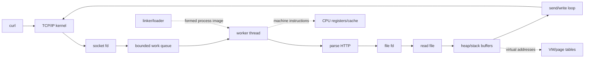

# 综合自学文档：Mini Linux Web Server——从 C 程序到系统闭环

> [!abstract] 综合问题
> 能不能不依赖 Web 框架，只用 C、Linux 系统接口和前 10 个项目建立的模型，完整解释“一次 HTTP 请求怎样被接收、解析、读取文件、并发执行并返回”？

> [!info] 项目定位
> 这不是再学习一组新 API，而是把项目 0—10 的能力放到同一个真实程序里。最终验收重点不是功能数量，而是：**正确、可解释、可验证、可复现。**

## 一、最终功能边界

实现一个 HTTP/1.0 风格有限子集：

- IPv4 TCP；
- GET；
- 每连接处理一次请求后关闭；
- 固定 www 根目录；
- 静态文件；
- / 映射 index.html；
- 200 / 400 / 404 / 405 / 500；
- Content-Length；
- 有界 request header；
- 支持请求分段到达；
- partial send 循环；
- 固定线程池；
- 有界任务队列；
- 基本访问日志。

明确不做：

- HTTPS；
- HTTP/2；
- chunked encoding；
- keep-alive；
- CGI；
- 完整 URL decode；
- 完整浏览器级协议兼容。

> [!success]
> 明确只支持一个小协议子集，比“号称支持 HTTP 但边界不清”更符合系统实验目标。

---

## 二、建议目录

~~~text
mini-linux-web-server/
├── src/
│   ├── main.c
│   ├── net.c
│   ├── net.h
│   ├── http.c
│   ├── http.h
│   ├── io.c
│   ├── io.h
│   ├── queue.c
│   ├── queue.h
│   ├── thread_pool.c
│   └── thread_pool.h
├── www/
│   ├── index.html
│   ├── hello.txt
│   └── test.bin
├── tests/
│   ├── smoke.sh
│   ├── fragmented_request.sh
│   └── stress.sh
├── Makefile
└── README.md
~~~

---

## 三、一次请求的完整生命周期

你必须能够不看代码画出：

~~~text
curl
↓
TCP / kernel networking
↓
listen socket
↓
accept
↓
client_fd
↓
bounded work queue
↓
worker thread
↓
read request bytes
↓
request buffer
↓
HTTP parser
↓
validated path
↓
open static file
↓
file_fd
↓
fstat
↓
response header
↓
read file chunks
↓
send_all(client_fd)
↓
close file_fd
↓
close client_fd
↓
worker 回到 queue
~~~

对每个箭头都回答：

- 数据是什么？
- 数据在用户态还是内核态？
- 当前用哪个 fd？
- 哪个函数负责？
- 谁拥有资源？
- 失败时谁清理？

---

## 四、把项目 0—10 映射到综合项目

| 项目 | 在服务器中的体现 |
| --- | --- |
| 0 系统观察 | gcc、gdb、objdump、strace、/proc |
| 1 数据表示 | 字节、整数、网络字节序、长度字段 |
| 2 机器级程序 | 关键函数汇编、调用栈、寄存器 |
| 3 简化 CPU | 理解指令如何改变机器状态 |
| 4 链接与装载 | 多 .c 文件、符号、ELF、共享库 |
| 5 Cache/优化 | buffer size、编译优化、性能实验 |
| 6 进程/异常 | 系统调用、信号、错误路径 |
| 7 虚拟内存 | stack、heap、映射、request buffer |
| 8 文件 I/O | fd、read/write、静态文件 |
| 9 Socket/HTTP | TCP 请求与 HTTP 响应 |
| 10 并发 | worker、queue、mutex、condvar |

综合项目的价值就在于：原来分散的概念现在出现在同一条请求链中。

---

## 五、资源 Ownership 表

在 README 中长期维护：

| Resource | Created by | Owner after creation | Released by |
| --- | --- | --- | --- |
| listen_fd | main | main | main |
| client_fd | accept | main → queue → worker | worker |
| file_fd | serve_file | worker / serve_file | serve_file |
| request buffer | worker stack | worker | automatic |
| queue storage | pool init | thread pool | pool destroy |
| worker thread | main | thread pool | join/destroy |

遇到泄漏、double close 或错误路径问题，先查 ownership，而不是先乱加 close。

---

## 六、共享状态表

| Object | Shared? | Writers | Protection |
| --- | --- | --- | --- |
| queue items/head/tail/count | yes | main + workers | queue mutex |
| request buffer | no | one worker | none |
| file_fd | ownership exclusive | one worker | ownership |
| total_requests | yes | workers | atomic or mutex |
| log output | yes | workers | log mutex |
| www root configuration | read-only | none after init | none needed |

一个重要判断：

> 共享不等于必须加锁。只读共享数据通常不需要锁；被单线程独占 ownership 的对象也不需要共享锁。

---

## 七、构建要求

建议 Makefile 支持：

~~~bash
make
make clean
~~~

基础编译参数：

~~~text
-std=c11
-Wall
-Wextra
-Wpedantic
-g
-O2
-pthread
~~~

开发阶段额外构建：

~~~text
-fsanitize=address,undefined
~~~

独立 race demo 可尝试 ThreadSanitizer。

---

## 八、核心模块边界

### net.c

负责：

- socket；
- setsockopt；
- bind；
- listen；
- accept 相关基础封装。

不解析 HTTP。

### http.c

负责：

- request header 边界；
- request line；
- method/version；
- path validation；
- response header；
- status code。

不负责线程同步。

### io.c

负责：

- write_all / send_all；
- 文件流式发送；
- EINTR；
- partial I/O。

### queue.c

只负责线程安全有界队列。

### thread_pool.c

负责 worker 生命周期和 queue 消费。

### main.c

负责配置、初始化、accept 循环和最终 shutdown。

> [!success]
> 每个模块只解决一层问题，可以让你在调试时明确“错误属于协议、I/O、网络还是同步”。

---

## 九、功能测试矩阵

### 正常请求

- GET /；
- GET /hello.txt；
- GET /test.bin；
- 空文件；
- 较大文件。

### HTTP 错误

- 不存在文件 → 404；
- POST → 405；
- malformed request → 400；
- header 超限；
- 不支持的 version。

### Path

- /../secret；
- /a/../../secret；
- 超长路径；
- query string 按 README 中声明的策略处理。

### Transport

- 请求拆成多段；
- 只发半个请求就断开；
- 响应过程中客户端断开。

### Concurrency

- 1 client；
- 10 clients；
- 50 clients；
- 100 clients；
- queue 接近满。

每个测试记录：

~~~text
input
expected
actual
pass/fail
evidence
~~~

---

## 十、系统工具验收

### GDB

在 handle_client 设置断点：

~~~text
break handle_client
run
bt
info registers
p client_fd
~~~

要求解释：

- 当前线程是谁；
- 谁调用 handle_client；
- client_fd 在哪；
- request buffer 在栈还是 heap；
- 返回后资源由谁处理。

### objdump

选择：

- send_all；
- queue_push；
- handle_client；

其中至少一个做机器级分析。

要求标出：

- 参数寄存器；
- 条件分支；
- 循环；
- call；
- 返回值。

### strace

一次 GET 中定位：

~~~text
accept
read
openat
fstat
read
write/send
close
close
~~~

给每个 fd 加注释。

### /proc

~~~bash
cat /proc/<PID>/status
cat /proc/<PID>/maps
ls -l /proc/<PID>/fd
ls /proc/<PID>/task
~~~

分别回答：

- 有多少线程？
- 地址空间有哪些主要区域？
- 当前有哪些打开 fd？
- worker 在线程层面怎样出现？

---

## 十一、一次请求的数据流图

在最终报告中画一张：

~~~text
client bytes
   ↓
kernel socket receive buffer
   ↓ read
worker stack request[]
   ↓ parse
request_t
   ↓ path validation
filesystem path
   ↓ open
file_fd
   ↓ read
worker file buffer
   ↓ send
kernel socket send buffer
   ↓
client
~~~

同时标记：

- 用户态；
- 内核态；
- fd；
- buffer；
- ownership。

---

## 十二、一次请求的控制流图

~~~text
main thread
│
├─ accept
├─ queue_push
└─ accept next

worker
│
├─ queue_pop
├─ read_request
├─ parse_request
├─ serve_file / send_error
├─ close client_fd
└─ queue_pop next
~~~

这张图用来区分“数据在哪流动”和“哪个线程在执行”。

---

## 十三、错误路径清单

对每一步都问“失败怎么办”：

| Step | Failure | Cleanup |
| --- | --- | --- |
| socket | -1 | exit startup |
| bind | -1 | close listen_fd |
| accept | -1 | retry / handle EINTR |
| read request | error | close client_fd |
| parse | invalid | send 400 + close |
| open file | ENOENT | send 404 |
| fstat | error | close file_fd + 500 |
| send | disconnect | close file_fd/client_fd |
| queue push | shutdown/error | ownership must be explicit |

正常路径清楚并不难，系统程序真正容易出错的是失败路径。

---

## 十四、故障注入

有意识测试：

- 文件不存在；
- 没权限；
- malformed request；
- header 太长；
- client 只发一半；
- client 提前断开；
- queue 满；
- 多个 worker 同时记日志；
- 服务器 shutdown 时 worker 正在等待。

目标不是“制造异常”，而是验证：

> 所有失败路径最终都能回到稳定状态，并释放自己拥有的资源。

---

## 十五、正确性验证

静态二进制文件：

~~~bash
curl http://127.0.0.1:8080/test.bin -o got.bin
cmp www/test.bin got.bin
~~~

状态码：

~~~bash
curl -i http://127.0.0.1:8080/no-such
~~~

分段请求：

~~~bash
{
  printf 'GET / HTTP/1.1\r\n'
  sleep 1
  printf 'Host: localhost\r\n'
  sleep 1
  printf '\r\n'
} | nc 127.0.0.1 8080
~~~

并发：

~~~bash
for i in $(seq 1 50); do
    curl -s http://127.0.0.1:8080/ > /dev/null &
done
wait
~~~

---

## 十六、性能实验

固定相同请求集合，分别测试：

~~~text
1 worker
2 workers
4 workers
8 workers
~~~

记录：

- 总请求数；
- 总时间；
- success / failure；
- throughput；
- average latency；
- 若工具方便，可记录 p50 / p95；
- RSS；
- thread 数；
- fd 峰值。

表：

| Workers | Requests/s | Avg Latency | Failures | RSS |
| --- | ---: | ---: | ---: | ---: |
| 1 | | | | |
| 2 | | | | |
| 4 | | | | |
| 8 | | | | |

再分别测试：

~~~text
small file
large file
~~~

避免把一种负载结论直接推广到所有场景。

---

## 十七、先预测，再测量

至少完成一次完整科学式循环。

例：

> 将 worker 从 1 增加到 4，在 20 个并发小文件请求下，总吞吐预计上升，但不会线性提升 4 倍。

预测前写：

- 预计结果；
- 原因；
- 条件；
- 可能反例。

实验后写：

- 实际数据；
- 与预测差异；
- 新假设。

如果不符合预期，可以继续问：

- client 是否成为瓶颈？
- 文件是否已在 page cache？
- 请求太小导致线程调度开销占比大？
- queue mutex 是否竞争？
- loopback 网络是否使工作负载过轻？

系统思维不是第一次就猜对，而是能用证据修改模型。

---

## 十八、资源泄漏验证

压力测试前：

~~~bash
ls /proc/<PID>/fd | wc -l
~~~

压力中、压力后重复。

线程数：

~~~bash
ls /proc/<PID>/task | wc -l
~~~

期望：

- thread pool 线程数基本固定；
- 请求结束后 client/file fd 回落；
- RSS 不持续无界增长。

如果 fd 持续增加，按 ownership 表逐路径审查。

---

## 十九、Sanitizer 验证

开发构建：

~~~bash
gcc ... -fsanitize=address,undefined ...
~~~

测试：

- 正常请求；
- 404；
- 长请求；
- 分段请求；
- 并发压力。

记录是否出现：

- buffer overflow；
- use-after-free；
- leak；
- undefined behavior。

并发数据竞争单独使用 ThreadSanitizer 实验，不要和 AddressSanitizer 混成一个结论。

---

## 二十、最终完成标准

### Correctness

- 功能测试通过；
- 二进制文件完整一致；
- HTTP 长度正确。

### Robustness

- malformed 请求不会崩服务器；
- client disconnect 不会终止进程；
- 错误路径明确。

### Resource Safety

- ownership 清楚；
- 无明显 fd leak；
- 动态资源生命周期可解释。

### Concurrency Safety

- queue 不变量明确；
- 共享状态同步明确；
- 压力测试稳定。

### Observability

- gdb 有运行时证据；
- objdump 有机器级证据；
- strace 有系统调用证据；
- /proc 有进程资源证据。

### Explainability

- 能沿一次请求讲清所有主要层次。

---

## 二十一、最终答辩问题

1. 从 curl 到 accept，中间大致发生了什么？
2. 为什么 accept 返回一个新的 fd？
3. 为什么一次 read 不能等于一个完整 HTTP 请求？
4. request buffer 在哪个线程、哪类内存中？
5. Content-Length 从哪里得到？
6. 为什么文件 read 与 socket send 都必须检查返回值？
7. client_fd ownership 怎样变化？
8. queue 为什么需要 mutex？
9. cond_wait 为什么使用 while？
10. 如果 worker 被慢客户端阻塞，会发生什么？
11. /proc/PID/fd 能证明什么？
12. /proc/PID/maps 能证明什么？
13. objdump 能看到什么，看不到什么？
14. strace 能直接看到 HTTP parser 吗？为什么？
15. buffer 越大是否一定越快？
16. worker 越多是否一定吞吐越高？
17. 哪些操作可能阻塞？
18. 哪些资源在线程间共享？
19. 一个 404 请求经历哪些关键系统调用？
20. 如果下一步做生产级服务器，你最先需要补哪些能力？

> [!success] 最终通过标准
> 你不再把 Web Server 理解为框架里的一个对象，而能把它还原成：**字节、指令、虚拟地址、进程、fd、文件、socket、线程和同步规则共同组成的一段可验证系统行为。**

---

## 二十二、课程完成后的方向

完成综合项目后再分流：

~~~text
操作系统：
OSTEP → xv6 / MIT 6.S081

体系结构：
CSAPP 性能部分 → CS61C → 流水线 / Cache

系统工程：
更完整 HTTP → epoll → event loop → 高性能服务器
~~~

进入下一阶段前，先把当前综合项目的失败案例、性能数据、工具证据和最终解释整理完整。

系统能力不是“知道更多名词”，而是：

> 面对陌生系统问题时，能分层提出假设，选择合适工具收集证据，再修正自己的模型。

---

## 学习导航：资料、图解与扩展

> [!tip] 综合项目的学习策略
> 不再按章节学习，而是按**一次请求的生命周期**回查：网络 → fd/I/O → 文件 → 内存 → 线程/同步 → 机器级执行。哪个环节解释不完整，就回到对应项目的 A 级资料和实验记录。

### A. 回看主线

- CS:APP Ch.10 System-Level I/O：请求与文件的 fd/读写。
- CS:APP Ch.11 Network Programming：socket、HTTP、Tiny Web Server。
- CS:APP Ch.12 Concurrent Programming：线程池、共享状态、同步。
- 遇到链接/装载问题回看 Ch.7；进程/信号回看 Ch.8；地址/分配回看 Ch.9；性能问题回看 Ch.5–6。
- 总索引：[[实验参考指南与可视化索引]]

### B. 验证资料

- CS:APP 官方 Tiny Web Server / labs：https://csapp.cs.cmu.edu/3e/students.html
- Linux man-pages：https://man7.org/linux/man-pages/
- strace：https://strace.io/
- GDB：https://sourceware.org/gdb/current/onlinedocs/gdb.html
- Beej Network Guide：https://beej.us/guide/bgnet/

### 机制图：沿一次请求解释整个系统

### 最终“解释链”验收

完成后随机挑一次请求，不看笔记说明：

1. 客户端字节何时进入内核、何时被用户线程看到？
2. 该线程此时拥有哪些私有状态，和其他 worker 共享哪些对象？
3. 文件描述符分别指向哪些内核对象，谁负责关闭？
4. 请求/响应 buffer 位于哪里，它们的虚拟地址由谁翻译？
5. 关键函数最终如何成为机器指令，Cache/访问模式可能怎样影响性能？
6. 若客户端中途断开，错误从哪一层出现，资源如何回收？
7. 你有哪些**观测证据**支持上述解释，而不只是“教材说如此”？

> [!success] 综合项目真正完成的标准
> 不是“浏览器能打开页面”，而是你能沿整条路径做预测、用工具取证、解释异常，并在改变一个条件后重新验证。

[打开交互式实验总览](visuals/计算机系统实验总览.html)
