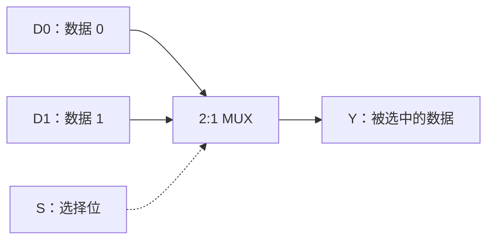
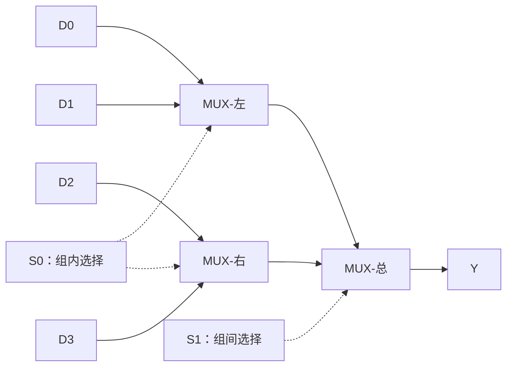
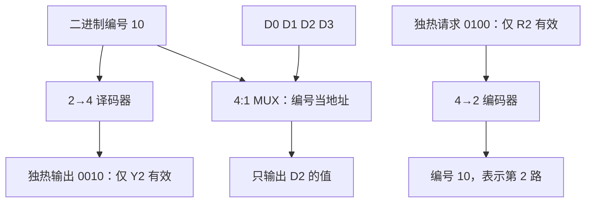
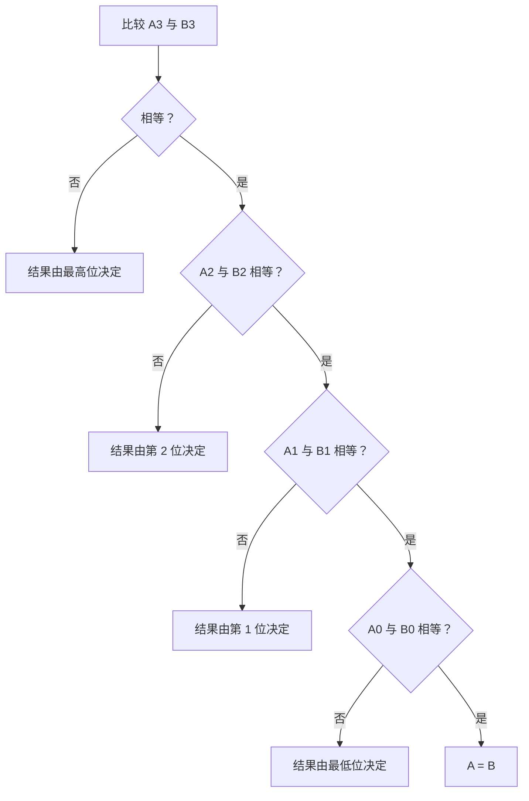
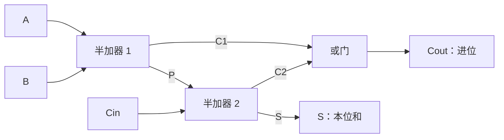
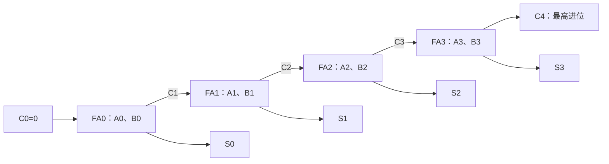
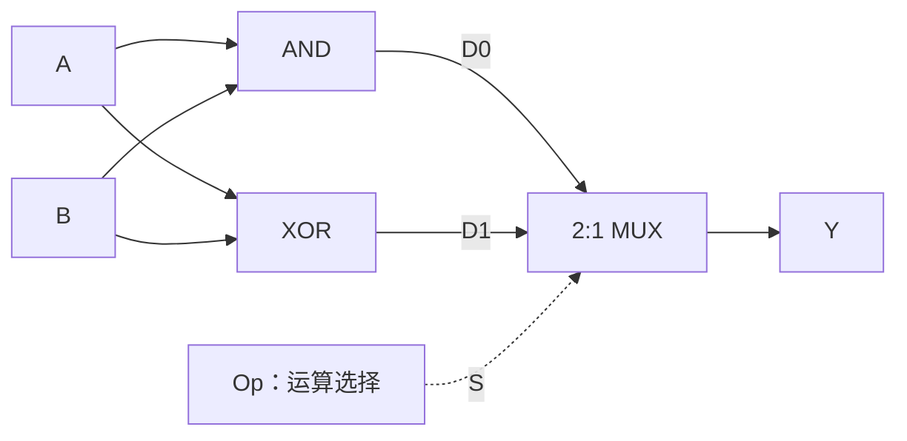
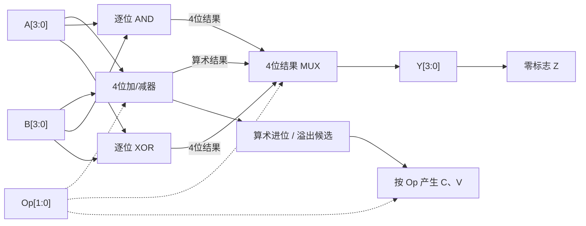

# 组合逻辑｜核心模块可视化图解

> [!abstract] 使用方法
> 本页是 [[lessons/数字逻辑与系统/课程阶段#阶段 3｜组合模块|阶段 3 · 组合模块]] 的**参考图解**，不是练习完成记录。推荐先在 [[lessons/数字逻辑与系统/项目-4位ALU|项目 · 从 1 位到 4 位 ALU]] 里独立预测、画图，再回来核对。
>
> 每幅图按 **功能问题 → 接口（输入/输出/控制）→ 数据流向 → 例子 → 自检** 阅读。Mermaid 用 Obsidian 阅读模式或实时预览查看；如果某个图未显示，先检查是否进入预览模式。

## 图 0｜同一条设计链，如何变成不同视图？

- **真值表**解释“功能是什么”；**结构图**解释“如何实现”；**波形/时间图**解释“何时有效”。组合逻辑虽然不保存过去，但真实电路仍有传播延迟。
- 别把图中方框当成“一个神秘器件”：任何方框都应有明确输入、输出、位宽、控制规则。

## 图 1｜2 选 1 MUX：不是把两根线直接接在一起

**问题**：有两路数据 `D0`、`D1`，只把选中的一路送到 `Y`。

| S | Y | 路径 |
| --- | --- | --- |
| 0 | D0 | 选择第一路 |
| 1 | D1 | 选择第二路 |

`Y = (¬S ∧ D0) ∨ (S ∧ D1)`。例如 `D0=1, D1=0, S=1`，被选中的是 `D1`，所以 `Y=0`。**不是对 D0 和 D1 做或运算。**

> [!question] 自检
> `D0=0, D1=1` 时，想让输出 `Y=1`，选择位应是多少？如果把 D0 和 D1 都换成 4 位宽，S 需要变成 4 位吗？
>
> **核对**：`S=1`；S 仍只需 1 位，但两路数据和 Y 都扩成 4 位。

### 4 选 1：先在组内选，再在组间选

| S1S0 | 输出 |
| --- | --- |
| 00 | D0 |
| 01 | D1 |
| 10 | D2 |
| 11 | D3 |

**信号追踪**：`S1S0=10`，组内都取第 0 路，组间取右侧，因此 Y=D2。这里“4 选 1”说的是**4 条候选路径**，不是“每条数据有 4 位”。

## 图 2｜译码器、编码器与 MUX：一个编号的三种用途

注意 `Y3Y2Y1Y0=0100` 才对应 Y2 有效。上图中译码输出采用 **Y3Y2Y1Y0** 从左到右的书写次序，故应读作 `0100`（而不是 `0010`）。

| 器件 | 输入承担的角色 | 输出承担的角色 | 必须确认的约束 |
| --- | --- | --- | --- |
| 译码器 | 编号/地址 | 对应一路的有效指示 | 输出高有效还是低有效；是否使能 |
| 普通编码器 | 某一路有效 | 这一路的编号 | 通常要求恰有一路有效 |
| 优先编码器 | 多路请求 | 优先级最高一路的编号 | 优先顺序、是否有有效标志 V |
| MUX | 地址 + 多路数据 | 被选中的数据 | 选择位序、数据位宽、使能 |

**举例**：高电平有效的 2→4 译码器输入 `A1A0=10`，输出应为 `Y3Y2Y1Y0=0100`。如果器件输出是低电平有效，不能照搬这个数值；应把“有效”理解成该输出为 0。

> [!warning] 编码器的前提
> `R2=1`、`R3=1` 同时出现时，普通编码器的输出**不应被直接当成唯一编号**；需要题目规定互斥输入，或使用带优先规则的编码器。

## 图 3｜比较器：为什么高位优先？

**问题**：比较 4 位无符号数 A 与 B，不能只把每位“谁大”的结果直接或起来。

**对照例子**：`A=1000`、`B=0111`。最高位 `1>0` 已经决定 A>B，虽然低三位都是 `000<111`。该图是**无符号**比较流程；补码有符号数还必须考虑符号解释。

## 图 4｜全加器：本位和 + 跨位进位，是两种输出

**半加器**的输入是 A、B，输出 `S=A⊕B`、`C=A∧B`。**全加器**再接收一个低位进位 `Cin`：

`S=A⊕B⊕Cin`；`Cout=(A∧B)∨(Cin∧(A⊕B))`。

| A | B | Cin | S | Cout | 验算：A+B+Cin |
| --- | --- | --- | --- | --- | --- |
| 0 | 0 | 0 | 0 | 0 | 0 |
| 0 | 0 | 1 | 1 | 0 | 1 |
| 0 | 1 | 0 | 1 | 0 | 1 |
| 0 | 1 | 1 | 0 | 1 | 2 |
| 1 | 0 | 0 | 1 | 0 | 1 |
| 1 | 0 | 1 | 0 | 1 | 2 |
| 1 | 1 | 0 | 0 | 1 | 2 |
| 1 | 1 | 1 | 1 | 1 | 3 |

**验证不变量**：普通整数关系 `A+B+Cin=2×Cout+S`，适用于上面八行。

### 四位加法：进位要从最低位逐级传上去

举例 `1011 + 0110`，逐位得到 `C1=0, C2=1, C3=1, C4=1`，低四位输出 `0001`，完整五位结果 `10001`（即 17）。这条进位链也解释了为什么真实电路的结果并非输入一变就瞬间稳定。

## 图 5｜1 位双功能 ALU：先各自计算，再选择结果

> [!warning] 先做项目第 1 层，再看下面的对照图
> 若还没有尝试 [[lessons/数字逻辑与系统/项目-4位ALU#1｜一位、两种运算：把函数变成模块（当前入口）|1 位双功能单元]]，请先独立画出 A、B、Op、Y 的连接和 8 行真值表。本节给出**核对用的完整答案**。

- **数据输入**是 A、B；**功能选择**是 Op。两条运算路径同时计算，只由末端 MUX 决定哪一路成为输出。
- `Op=0`：Y=A AND B；`Op=1`：Y=A XOR B。
- 若 Op 两种含义交换，可交换 MUX 的 D0、D1 接法，而不必改变 AND/XOR 的内部运算。

| A | B | Op | AND | XOR | Y |
| --- | --- | --- | --- | --- | --- |
| 0 | 0 | 0 | 0 | 0 | 0 |
| 0 | 0 | 1 | 0 | 0 | 0 |
| 0 | 1 | 0 | 0 | 1 | 0 |
| 0 | 1 | 1 | 0 | 1 | 1 |
| 1 | 0 | 0 | 0 | 1 | 0 |
| 1 | 0 | 1 | 0 | 1 | 1 |
| 1 | 1 | 0 | 1 | 0 | 1 |
| 1 | 1 | 1 | 1 | 0 | 0 |

> [!question] 变式
> 新增“加法”运算后，为什么只有 Y 一条输出可能不够？再扩成 4 位后，哪些线路需要按位复制，哪些线路需要跨位传递？

## 图 6｜4 位 ALU：数据通路与控制通路分开观察

以下是**未来的模块级目标概览**，不是要求当前一次画出的门级电路；严格接口与标志定义以 [[lessons/数字逻辑与系统/项目-4位ALU#4｜拓展为完整4位ALU：减法与标志|项目第 4 层]] 为准。

**解释边界**：四位加减复用同一加法器时，用控制位决定 `B` 是否逐位反相，以及最低位初始进位是否为 1。Z 由最终 Y 判断；C/V 的意义受运算类型制约。**C 不是有符号溢出 V**。

## 图 7｜发生错误时，先定位信号

| 观察到的问题 | 先检查什么 | 具体测试 |
| --- | --- | --- |
| MUX 总取错一路 | 选择位序、S 极性、D0/D1 接线 | 固定 D0=0、D1=1，切换 S |
| 译码器只有部分地址对 | 输出位序、使能、电平有效性 | 枚举全部地址、确认独热 |
| 编码器多个请求时奇怪 | 是否需要优先编码与 V | 只开 R2，再同时开 R2/R3 |
| 4 位加法部分位出错 | Cin→Cout 跨位连接 | `0011+0001`、`1111+0001` |
| 大小比较与直觉不符 | 有无从最高位开始；有无符号 | `1000` 对 `0111` |
| ALU 运算正确但最终 Y 错 | Op 编码、MUX 数据输入次序 | 固定 A=B=1，切换 Op |

## 不把“看懂图”误认为“会做”

按下面顺序核对：**遮住图自己画接口 → 给定一组输入沿线追踪 → 重画关键公式/真值表 → 修改一个条件重算 → 设计边界反例**。练习与错误事实写到当天的 `calendar/YYYY-MM-DD.md` 对应小标题，课程页只保留稳定参考和证据链接。

补充：[[lessons/数字逻辑与系统/visuals/组合逻辑-交互实验室.html|组合逻辑交互实验室（HTML，建议用浏览器打开）]] 可以切换选择位、运算码和四位加数，观察输出如何变化。
