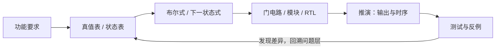

# 数字逻辑与系统｜课程阶段

> [!important] 课程总目标
> 给出功能要求，能转成电路；给出电路，能预测行为；结果不对时，能定位原因。
> 主线：**功能要求 → 数学表示 → 电路结构 → 时间行为 → 验证结果**。

## 从学习到掌握：五种检验

| 层次 | 检验问题 | 应留下的证据 |
| --- | --- | --- |
| 辨认 | 输入、输出、控制端分别是什么？ | 接口标注 |
| 解释 | 输入或条件变化会怎样影响输出？ | 自己的文字、结构图 |
| 推演 | 给定条件能算出什么结果？ | 真值表、演算、波形 |
| 构造 | 能从文字规格独立设计吗？ | 表达式、电路、RTL |
| 迁移与验证 | 修改要求后还能做对、找出反例吗？ | 测试记录、错误定位 |

## 六个课程阶段

### 阶段 1｜位、数与编码
- **核心问题**：相同位串在不同解释规则下，为什么含义不同？
- **学习范围**：进制与位权、位宽、无符号数与补码、截断/扩展/溢出、BCD、独热编码。
- **练习产物**：用不同规则解释 `1110`；四位加法 `0111+0001` 的不同解释；为十个状态比较二进制/独热编码。
- **验收**：先说明位宽和编码规则，再预测数值、溢出及扩展结果；能举反例。

### 阶段 2｜布尔逻辑与规格翻译
- **核心问题**：一句功能要求，怎样变为严格且可检查的逻辑关系？
- **学习范围**：与/或/非/异或、真值表、布尔表达式、德摩根定律、标准形式、卡诺图与化简。
- **练习产物**：自然语言 ↔ 真值表 ↔ 表达式 ↔ 门电路；修改一个条件后重新推导。
- **验收**：独立翻译包含否定与多个条件块的规格，提供满足例与反例，确认化简前后等价。

### 阶段 3｜组合模块
- **核心问题**：怎样利用接口和可复用模块实现要求？
- **学习范围**：编码器/译码器、多路选择器 MUX、比较器、加法器、多位加法、简单 ALU。
- **练习产物**：MUX 端口与真值表、功能表达式、门级实现；由小 MUX 组合大 MUX；用 MUX 实现给定逻辑函数；构造并检查小 ALU。
- **验收**：不看解答完成一题“要求 → 表/式 → 电路”，能预测各选择组合的输出并说明错误原因；再做一题变式。
- **学习记录**：[[calendar/2026-10-10#21:57 · 数字逻辑与系统｜数据选择器（MUX）家庭作业学习启动|2026-10-10 · MUX 家庭作业学习启动]]。这条链接指向当天的小标题，实际进展、错误和验收证据均在日记更新。
- **下一任务**：[[calendar/2026-10-10#23:46 · 数字逻辑与系统｜10-11 进阶任务|2026-10-11 · 1位双功能单元入门]]。

#### 专题参考｜数据选择器从入门到深入
1. **辨认与解释**：分清数据输入、选择端、输出、使能端（若题中存在），解释“选择”和“逻辑运算”的关系。
2. **手工推演**：以四选一 MUX 为例，列出四种选择码分别对应哪路数据；若有低有效使能，先确认有效条件。
3. **构造与等价**：从真值表推导输出表达式，用基本门或小 MUX 构造；核对所有选择组合。
4. **综合应用**：实现任意指定布尔函数，比较“变量接选择端”和“数据端接常量/变量”的思路；分析多级 MUX。
5. **变式与诊断**：题目改变位宽、使能极性、选择端次序或功能时，自己重推并列边界测试。

**练习原则**：先独立给出预测和过程，再让 AI 逐层提示；作业题号、原题图、自己的尝试、提示程度及修改后的结果记录到当天日记。具体完成情况只记录在对应日记中。

#### 图表入口｜组合模块的结构和信号追踪
- **图解参考**：[[lessons/数字逻辑与系统/组合逻辑-核心模块可视化图解|组合逻辑核心模块图解]]：MUX 选路、译码/编码、比较器高位优先、全加器和进位链、1 位双功能单元、4 位 ALU 概览；包含对应真值表、例子和错误定位。
- **交互验证**：[[lessons/数字逻辑与系统/visuals/组合逻辑-交互实验室.html|组合逻辑交互实验室 HTML]]：本地浏览器打开，可切换选择位、地址、运算码和四位加数，实时显示选路及进位。Obsidian 中的 HTML 文件未必直接运行脚本，建议在浏览器中打开。
- **使用顺序**：先独立推演和画图，再看图解核对，最后用交互页面做反例。项目第 1 层的完整结构和真值表在图解页中，**不要先看答案**。

#### 进阶项目｜4 位 ALU：综合设计
- **长期目标**：从布尔函数、MUX 和加法器逐步搭建可验证的运算单元，再研究传播延迟与寄存器化。
- **项目说明与引导问题**：[[lessons/数字逻辑与系统/项目-4位ALU|项目 · 从1位到4位ALU]]。先从1位双功能运算与选择出发，再加入加法、进位、多位扩展、减法和标志，最后验证与分析时延。
- **任务入口**：[[calendar/2026-10-10#23:46 · 数字逻辑与系统｜10-11 进阶任务|2026-10-11 · ALU 第 1 层任务]]；完成后在实际学习日期记录成果。

### 阶段 4｜时序与存储
- **核心问题**：电路为什么不仅依赖输入，还依赖采样时刻与先前状态？
- **学习范围**：锁存器、D 触发器、时钟边沿、寄存器、传播延迟、建立和保持时间。
- **练习产物**：根据 D/CLK 画 Q 波形，标出寄存器路径，判断最小时钟周期与时序约束。
- **验收**：独立逐边沿推演；区分功能逻辑正确与时序是否满足。

### 阶段 5｜有限状态机 FSM
- **核心问题**：为了决定未来行为，系统需要记住过去的哪些信息？
- **学习范围**：Moore/Mealy、状态图/表、下一状态与输出逻辑、复位、状态编码和非法状态。
- **练习产物**：设计可重叠检测 `101` 的序列检测器；比较二进制/独热编码；变更为不重叠检测。
- **验收**：从行为规格独立设计并用输入序列测试；能解释重叠和复位。
- **状态**：待独立验收。

### 阶段 6｜数据通路与控制
- **核心问题**：运算、存储、数据选择和控制怎样共同完成一个任务？
- **学习范围**：寄存器、ALU、MUX、比较器、FSM 控制器、RTL；可选延伸到简化 CPU 的 PC/指令执行。
- **练习产物**：构造输入 N、逐周期累加 `1+2+…+N` 的数据通路与控制器；画逐周期寄存器变化表；再修改一条功能要求。
- **验收**：独立完成规格 → 模块选择 → 状态设计 → 逐周期推演 → 实现与验证 → 新需求修改。

## 表示与验证链条

## 遇到困难，返回哪一层？

| 错误表现 | 回到哪里 |
| --- | --- |
| 位串解释有分歧 | 阶段 1：位宽与编码 |
| 功能要求翻译错、不会化简 | 阶段 2：条件分组、真值表与表达式 |
| MUX 或模块接错、选错数据 | 阶段 3：接口、选择端、使能与位宽 |
| Q 在预期边沿没有更新 | 阶段 4：边沿、延迟与采样规则 |
| 状态跳错、复位后异常 | 阶段 5：下一状态与初始化 |
| 各模块正确但系统整体失效 | 阶段 6：控制顺序和数据通路 |

## 学习资料与维护
- 首选来源：课程教材、课堂讲义、家庭作业及实验要求（实际使用后补充章节/题号）。
- 辅助资源：https://www.nand2tetris.org/course
- **此文档只存稳定信息**：课程目标、阶段划分、应掌握的能力与验收标准。
- **当天日记存动态信息**：目前在学什么、作业题号、独立推理、AI 提示程度、错误、复习任务和是否通过验收。
- 每发生一次真实学习，就在对应阶段添加一个 `[[calendar/YYYY-MM-DD#当日学习小标题|日期 · 学习主题]]` 链接；不要把实时状态重复写入课程阶段。
- 新的阶段链接可以追加，历史证据保留；没有独立检验就不声称掌握。
