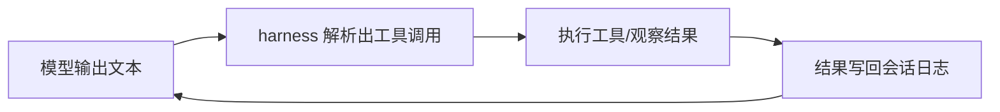

# DeepSeek Harness 开发学习主线

> [!abstract] 这份文档是什么
> 一条从「只有 C 和 Python 基础语法」到「能参与 DeepSeek Harness 开发」的自学主线。文档只给**主线**和**地图**：每个概念讲清它是什么、为什么存在；技术细节不在这里展开，而是明确告诉你**去哪一份文件、查什么关键词**。学一条、过一条，不要跳。

> [!tip] 使用方法
> - 按阶段顺序走；每阶段末尾有**验收标准**，过不了就回头补。
> - 「去哪查」列出的文件必须真的打开看，不要只收藏。
> - 每完成一个阶段，在这条主线旁边写一页自己的笔记（概念用自己的话复述一遍，画图）。
> - 本笔记是地图，不是权威：仓库会演进，指针失效时以仓库实际文件为准。仓库的权威入口是根目录 `AGENTS.md` 和 `docs/`。

## 前置
**前置项目**：[[JavaScript 指南]]、[[pythonBasics]]

**知识框架体系**：概念层（agent loop、插件与依赖注入、异步编程、TS 类型系统）；技能层（JS/TS 语法、Promise/async-await、Node.js、写插件与 preset、读仓库 packages/）；工具层（Node、pnpm、Vitest、GitHub PR 流程）。

## 目标产出
> 按阶段完成 DeepSeek Harness 开发学习主线，达到能独立开发、测试并提交一个工具/插件 PR 的水平。

**交付物**：

- [ ] 通过阶段 1 语言最小补课（JS / TS / 异步编程）
- [ ] 能独立编写并测试一个工具或插件
- [ ] 向 DeepSeek Harness 提交一个可合并的 PR
- [ ] 每完成一个阶段写一页自己的笔记（概念用自己的话复述）

## 项目关键点
**核心内容**：从「只有 C 和 Python 基础」到「能参与 DeepSeek Harness 开发」的自学主线——先建立 harness（agent 运行时）图景，再按阶段补语言与思想，每阶段带验收标准。

**关键难点**：

- 异步编程（Promise / 事件循环）是硬性门槛，不过关后面全部卡住。
- 插件 / 依赖注入思想与 C、Python 的过程式思维差异大，需要换脑子。
- 「在 harness 之上开发」和「开发 harness 本身」是两条线，别混为一谈。

## 0. 先建立图景：harness 是什么
**一句话**：harness（挽具/支架）是给大模型装上「手脚、记忆、边界」的运行时框架。模型只会输出文本；harness 负责把文本解析成工具调用、执行、把结果写回日志、再喂给模型，循环直到任务完成——这个循环叫 **agent loop（智能体循环）**。

**类比（帮助理解，不是定义）**：Python 解释器之于 Python 代码 ≈ harness 之于 AI agent。模型是「实习生」，harness 是工位、工具柜、门禁和汇报制度。

**DeepSeek Harness**（本机位于 `D:\deepseek-harness`，远程 `github.com/deepseek-ai/deepseek-harness`）的核心设计一句话：**everything is a plugin（一切都是插件）**。模型适配器、工具注册表、会话日志、甚至 agent loop 本身都是插件，都可以被配置替换——不存在需要打补丁的特权内核。

「harness 软件开发」有两个层面，这条主线两层都覆盖：

1. **在 harness 之上开发**：写插件、工具、preset（组合配置）——入门从这里开始。
2. **开发 harness 本身**：改这个仓库的 `packages/`——主线后半段进入。

**和你已有知识的关系**：C 让你理解程序怎么跑（内存、进程、顺序执行）；Python 让你熟悉高层动态语言。这里的主力语言是 **TypeScript**（JavaScript 的超集），语法门槛不高；真正的新东西是**异步编程**和**插件/依赖注入**思想，这两个概念才是前半段的学习重点。



## 1. 最小补课清单：外部体系知识地图
原则：**只补到「能读懂代码、能写小程序」**，不要系统学完再回来。学不动的时候回到主线，用到再深挖。

| 体系               | 大致是什么                        | 补到什么程度                  | 去哪里查                                                                                          |
| ---------------- | ---------------------------- | ----------------------- | --------------------------------------------------------------------------------------------- |
| JavaScript 核心    | 仓库语言底座：变量、函数、对象、数组、类、模块      | 语法无障碍                   | MDN《JavaScript 指南》：developer.mozilla.org/zh-CN/docs/Web/JavaScript/Guide                      |
| TypeScript       | JS 加静态类型；仓库全部 TS，strict 模式   | 会写 interface/泛型，能读懂类型标注 | TypeScript Handbook：typescriptlang.org/docs/handbook/intro.html                               |
| 异步编程             | Promise / async-await / 事件循环 | **必须过关**（仓库里到处都是 async） | MDN《异步 JavaScript》：developer.mozilla.org/zh-CN/docs/Learn_web_development/Extensions/Async_JS |
| Node.js          | 让 JS 跑在操作系统上（读文件、开进程）        | 会跑脚本、会看 API 文档          | nodejs.org/docs                                                                               |
| pnpm + workspace | 包管理器 + monorepo（一个仓库装几十个子包）  | 会 install / run / 加依赖   | pnpm.io/zh/workspaces                                                                         |
| Git / GitHub     | 版本控制与 PR 流程                  | 日常命令熟练                  | 《Pro Git》中文版：git-scm.com/book/zh                                                              |
| PowerShell       | 本机（Windows）的日常命令行            | 日常操作                    | learn.microsoft.com/zh-cn/powershell                                                          |
| Vitest           | 单元测试框架                       | 会写基本断言、会跑单个测试文件         | vitest.dev                                                                                    |
| YAML             | 配置文件格式（cordis.yml 用它写）       | 会读会改                    | 任意 YAML 入门教程                                                                                  |
| 大模型基础（可选）        | prompt、tool calling、上下文窗口等概念 | 知道概念即可                  | DeepSeek API 文档：api-docs.deepseek.com                                                         |

**进阶时再补**（现在只需要知道它们存在）：

- React（浏览器端插件 UI 用它）→ react.dev
- JSON-RPC（进程外 SDK 协议）→ jsonrpc.org/specification；仓库实现见 `packages/sdk/`
- SQLite（会话持久化后端之一）→ sqlite.org
- VitePress（`website/` 文档站）→ vitepress.dev
- Cordis 上游源码（仓库以 vendor 方式引入）→ `vendor/README.md`

**对照表：新概念都能挂到你已有的知识上**

| 要学的概念 | 你已有的对应物 | 差异提醒 |
|---|---|---|
| 变量 `let` / `const` | C 局部变量 / Python 变量 | `const` 不可重新赋值；没有 int/float 之分 |
| 对象 `{}` | C struct / Python dict | 字段就是属性，随处可扩展 |
| 函数是一等值（回调） | C 函数指针 / Python 函数 | 回调、闭包到处都在用 |
| TS 类型标注 | C 的类型声明 | 结构化的（按「形状」匹配），编译期擦除 |
| `async` / `await` | Python 的 async/await（若有印象） | C 无对应物，是**最需要新建的心智模型** |
| 模块 ESM import/export | Python import / C 头文件 | 每个文件是一个模块 |
| 泛型 | C 没有（宏勉强接近） | 类似 Python typing 的泛型思路 |

## 2. 主线阶段
### 阶段 0：把仓库跑起来（第 1 周，约 8 小时）

- **目标**：环境就绪，测试、类型检查、构建全绿。
- **做什么**
  1. 装 Node.js（要求 `^22.19 || >=24`，LTS 即可）和 pnpm（`npm i -g pnpm`）。
  2. 本机已有仓库副本 `D:\deepseek-harness` 就直接用；否则 `git clone https://github.com/deepseek-ai/deepseek-harness.git`。
  3. 依次跑：`pnpm install` → `pnpm run test` → `pnpm run typecheck` → `pnpm run build`。
  4. 打开 `packages/`，对每个目录先猜职责，再对照 `packages/README.md` 验证。
- **验收**：四个命令全绿；能说出 5 个以上 `packages/*` 目录的职责。
- **去哪查**：`packages/README.md`（包分组与职责表）、`docs/development.zh.md`（工程布局与日常工作流）、根目录 `AGENTS.md`（全部命令清单）。
- **新知识**：monorepo 与 workspace（查 pnpm 文档）；报错先读报错信息本身。

### 阶段 1：语言最小补课（第 2–3 周，约 16 小时）

- **目标**：能**读懂**仓库里的 TS 代码（还不用会写）。
- **做什么**
  1. 按 MDN《JavaScript 指南》快速过一遍语法（跳过浏览器 DOM 章节，这里用不到）。
  2. 重点练：函数、对象、模块、`async/await`；用 Node 在本地写 20 个小脚本。
  3. 看 TypeScript Handbook 的 Everyday Types 一章；动手给前面几个脚本加类型。
  4. 读一段真实仓库代码（如 `packages/todo/`，todo_write 工具所在组），标出你不认识的语法，逐个查。
- **验收**：不查资料能说出下面这段代码在干什么（大意即可）：

  ```ts
  export const name = 'demo'
  export const inject = ['tools']

  export function apply(ctx) {
    ctx.tools.register(defineTool({
      name: 'add',
      description: 'Add two numbers',
      parameters: {
        a: { type: 'number', required: true },
        b: { type: 'number', required: true },
      },
      async execute(args) {
        return args.a + args.b
      },
    }))
  }
  ```

- **去哪查**：MDN、TypeScript Handbook（见第 1 节表格）。
- **新知识**：异步编程（唯一必须彻底过关的新概念）。

### 阶段 2：建立心智模型：插件、服务、事件、生命周期（第 3–4 周，约 10 小时）

- **目标**：理解「一切皆插件」到底怎么落地。
- **做什么**
  1. 通读 `docs/architecture.zh.md`（先读，不求全懂，建立地图感）。
  2. 精读 `docs/cordis-primer.zh.md`，重点五个概念：**插件、上下文（ctx）、inject 依赖、类型化事件、可逆副作用**；以及四种事件分发模式（emit / waterfall / parallel / serial）和 **Waterfall 必须调用 `next()`** 的语义。
  3. 按 `docs/cordis-tutorial/index.zh.md` 教程动手写最小插件（01–07 课全有中文版），体会挂载与卸载（dispose）。
  4. 打开一个最小真实插件（`packages/todo/`，todo_write 工具）做「解剖」：谁提供了什么、谁消费了什么、注册了什么。
- **验收**：能不看文档画出插件生命周期图（挂载 → 注册 → dispose 撤销）；能回答「Service 和 Event 的区别」「Waterfall 不调 `next()` 会怎样」。
- **去哪查**：`docs/cordis-primer.zh.md`、`docs/cordis-tutorial/`、`docs/glossary.zh.md`（术语表）、`docs/architecture.zh.md`、`vendor/README.md`（Cordis 来源说明）。
- **新知识**：**依赖注入/控制反转**（查 Martin Fowler 的 Dependency Injection 文章）；**观察者/发布订阅模式**（任意设计模式资料）。

### 阶段 3：第一次动手：跟着教程加一个工具（第 5–6 周，约 14 小时）

- **目标**：走通「改代码 → 跑测试 → 看到行为变化」完整闭环。
- **做什么**
  1. 按 `docs/user/develop/basic/tool.zh.md`（构建工具教程）一步步实现一个玩具工具（比如掷骰子、回显大写）。
  2. 再读 `docs/cookbook/adding-a-tool.zh.md`（工具编写参考，约定以此为准），对照检查你的实现：参数 schema、输出声明、`exec.signal` 取消等。第一遍看不懂的地方先标记，不求全会。
  3. 为你的工具写单测；按 `docs/testing.zh.md` 理解仓库测试分层。
  4. 用过滤方式只跑相关测试（`pnpm run test <过滤词>`），然后 `pnpm run typecheck`、`pnpm run lint` 修到全绿。
- **验收**：玩具工具能跑通并有测试覆盖；有 API key 时可用 `pnpm dsh --profile headless "任务"` 让真实模型调用它（无 key 时单测即验收）。
- **去哪查**：`docs/user/develop/basic/tool.zh.md`、`docs/cookbook/adding-a-tool.zh.md`、`docs/testing.zh.md`、`docs/cookbook/extension-cookbook.zh.md`（扩展点示例）。
- **新知识**：JSON Schema（查 json-schema.org 入门）；Vitest 的 describe/it/expect（查 vitest.dev）。

### 阶段 4：读懂一条完整的「能力缝」capability seam（第 7 周，约 8 小时）

- **目标**：理解一个真实能力怎么拆成三角色，学会看仓库的分层方式。
- **做什么**
  1. 精读 `docs/capability-seams.zh.md`，理解 **Service Definition / Service Provider / Consumer** 三角色：Definition 声明接口与 `ctx.<key>`，Provider 真正实现，Consumer 是使用方（通常是面向模型的工具）。
  2. 选 `packages/fs/`（文件系统能力）做解剖：找出三个角色各自的包与关键文件；对照 `packages/shell/` 再看一个，找共同骨架。
  3. 翻 `docs/module-graph.md`（生成的依赖图），体会「扩展插件只依赖 Service Definition，绝不依赖具体 Provider」。
- **验收**：写一页解剖笔记，画出两个 seam 的三角色对照图。
- **去哪查**：`docs/capability-seams.zh.md`、`docs/glossary.zh.md` 的 capability-seam 词条、`packages/README.md`（分组职责表）、`packages/fs/README.md` 与 `packages/shell/README.md`（包级契约）、`docs/module-graph.md`。
- **新知识**：接口与实现分离（前面 DI 知识的实战应用）。

### 阶段 5：看懂 agent loop 与数据流（第 8 周，约 8 小时）

- **目标**：理解「模型想调用一个工具」到「结果写回」的完整链路。
- **做什么**
  1. 读 `docs/architecture.zh.md` 的「轮次流程」一节和核心包表格（session、system-prompt、tools、agent、agent-loop）。
  2. 读 `docs/agent-lifecycle.zh.md` 与 `docs/tool-execution-pipeline.zh.md`（工具执行流水线）。
  3. 读 `docs/event-producer-consumer.zh.md`，理解三类事件（会话事件、agent 事件、能力事件）各自什么时候用。
  4. 记住一条不变量：**「模型可见 ⇔ 有日志」**——任何到达模型请求的内容必须能从会话日志重建。
- **验收**：画出「模型输出 → 工具调用 → 执行 → 观察写回 → 下一轮」的数据流，标注每段代码所在的包和文件。
- **去哪查**：`docs/architecture.zh.md`、`docs/subsystems/`（按包的子系统参考页，均有 .zh 版）、`docs/agent-lifecycle.zh.md`、`docs/tool-execution-pipeline.zh.md`、`docs/event-producer-consumer.zh.md`。
- **新知识**：事件流与日志。对照 C 里「先写日志再执行」的直觉——但这里是**结构化事件**，不是文本日志。

### 阶段 6：会组合：profile、组合包与 preset（第 9 周，约 6 小时）

- **目标**：理解「运行中的 dsh 是一棵按序叠加的插件树」，会自己配置一个组合。
- **做什么**
  1. 读 `docs/architecture.zh.md` 的「Profile 与组合包」一节：profile 列出叠放的组合包，patch 按 id 替换条目 config 或插入新条目。
  2. 跑 `pnpm dsh --profile web --dump-config`（或 headless），看看本机实际启动的配置树。
  3. 挑 `examples/` 下一个叶子（如 `examples/headless-agent/` 或 `examples/web-cordis/`），读它的 `cordis.yml`，再用 `--patch` 改一行配置并观察差异。
  4. 读 `packages/preset/README.md`，了解 per-session 的 preset 组合机制。
- **验收**：能从零写一个最小可运行的 `cordis.yml` 组合；能说清一条插件该放哪一层、为什么。
- **去哪查**：`docs/architecture.zh.md`（Profile 与组合包）、`examples/README.zh.md` 与各叶子 README、`examples/AGENTS.md`、`docs/config-catalog.zh.md`（配置字段目录；英文版为生成权威版）、`docs/user/develop/basic/config.zh.md`。
- **新知识**：YAML 语法（见第 1 节）；配置分层/覆盖（patch 语义）。

### 阶段 7：按仓库规矩贡献（第 10 周起，持续）

- **目标**：把前面的练习变成一次真正的贡献。
- **做什么**
  1. 通读根目录 `AGENTS.md`（仓库约定）与 `docs/AGENTS.md`（文档标准）——至少理解：注册即副作用、Waterfall 语义、capability seam 三件套、「模型可见 ⇔ 有日志」、测试与文档门禁。
  2. 读 `.agents/notes/README.zh.md`，理解 Agent Note 是什么、什么时候必须写。
  3. 找一个文档级或测试级小任务起步（typo、缺失测试、死链），按 `docs/testing.zh.md` 的「用证据匹配检查」原则跑最小相关检查，提交 PR。
  4. 读一两篇 `docs/postmortem/` 的事故复盘，体会这个仓库怎么从真实事故中沉淀规则。
- **验收**：一个被 review 的 PR（哪怕只是修文档）；能解释自己的 PR 为什么这样拆、跑了哪些检查。
- **去哪查**：`AGENTS.md`、`docs/AGENTS.md`、`docs/testing.zh.md`、`.agents/notes/`、GitHub PR 流程官方文档。
- **新知识**：CI/CD 与门禁（查 GitHub Actions 入门）；代码评审文化。

### 可选深度路线（按兴趣选一条）

- **LLM 能力线**：读 `packages/llm/`（Service Definition + DeepSeek Provider）；外部查 DeepSeek API 文档。
- **沙箱与安全线**：读 `packages/sandbox/`、`packages/e2b/`、`native/`；外部查进程隔离/容器基础。
- **多智能体线**：读 `packages/subagent/`、`packages/workflow/`、`packages/goal/`。
- **浏览器 UI 线**：读 `packages/client/`、`packages/host/`；外部查 React（react.dev）。

## 3. 概念速查表
| 术语 | 一句话 | 详查 |
|---|---|---|
| Plugin（插件） | 实现 Service 的单元，`apply(ctx)` 挂载 | `docs/cordis-primer.zh.md` |
| Context（ctx） | 服务容器，服务挂在 `ctx.<key>` | 同上 |
| Service（服务） | 挂在 ctx 上的能力对象 | 同上 |
| inject | 声明式依赖，服务就绪才启动 | 同上 |
| Event（事件） | emit / waterfall / parallel / serial 四种分发 | 同上 |
| Waterfall | 中间件链；不调 `next()` 即短路 | 同上 |
| effect / disposer | 注册是可逆副作用，卸载自动撤销 | 同上 |
| capability seam | Definition / Provider / Consumer 三角色 | `docs/capability-seams.zh.md` |
| agent loop | 模型↔工具循环的驱动器 | `docs/architecture.zh.md` |
| 会话事件日志 | 仅追加的结构化日志；模型可见 ⇔ 有日志 | `docs/architecture.zh.md`、`docs/subsystems/session.zh.md` |
| 轮次 / 步骤（turn / step） | 一次排空 / 一次模型请求+工具执行 | `docs/glossary.zh.md` |
| Agent Note | 决策记录：为什么这么做、放弃了什么 | `.agents/notes/README.zh.md` |
| 快照测试（snapshot） | 无密钥固定对外行为/输出 | `docs/testing.zh.md` |
| 目录（catalog） | 工具/配置/事件的生成式参考 | `docs/tool-catalog.md`、`docs/config-catalog.md` |

## 4. 常见坑与排障
> [!warning] 三条最容易被忽视的规则
> 1. **注册是副作用**：注册工具、监听事件都要通过 `ctx.effect()` / `ctx.on()`，返回 disposer；卸载时要能自动撤销。
> 2. **Waterfall 必须调用 `next()`**：返回而不委托会短路整条链——对策略监听器这是设计意图，对观察型监听器就是 bug。
> 3. **模型可见 ⇔ 有日志**：任何到达模型请求的内容必须能从会话日志重建。

- 排障顺序：先读报错 → 用 grep 在仓库里搜关键词 → 查文档 → 最后才问人/问 AI。
- 提问要带：命令原文、环境（Node/pnpm 版本、平台）、最小复现步骤。
- 改动后跑**相关**检查而不是全套（`docs/testing.zh.md` 的证据匹配原则）。
- 不要修改 `vendor/` 和出厂配置；要改配置就复制一份 preset 再改。
- 生成目录（tool-catalog、config-catalog、module-graph 等英文源）是机器生成的，不要手改。

**用 AI 辅助学习的正确姿势**：让 AI 解释概念、领读文件、指出下一段该看哪，而不是替你写代码；提问时把具体文件路径和行号喂给它。你正在用的这个环境本身就是一个 harness——边学边观察它是怎么工作的，是最好的教材。

## 5. 里程碑检查表
- [ ] Node/pnpm 装好；`pnpm install / test / typecheck / build` 全绿
- [ ] 能向别人讲清楚「一切皆插件」和 Cordis 五个核心概念
- [ ] 画得出插件生命周期图（挂载 → 注册 → dispose）
- [ ] 按教程跑通一个玩具工具，单测全绿
- [ ] 写出一页 capability seam 解剖笔记（fs 与 shell 对照）
- [ ] 画得出「模型 → 工具 → 观察写回」完整数据流
- [ ] 从零写出一个可运行的 cordis.yml 组合
- [ ] 提交并被 review 第一个 PR

> **项目完成即归档**：上表 8 项全部打勾后，将 `status` 改为 `completed`，并把项目移入 `wiki/archives/`。若连续两周无进展，应拆小任务或降级为长期 area。

## 6. 建议节奏总表
| 周   | 阶段         | 约小时 | 产出            |
| --- | ---------- | --- | ------------- |
| 1   | 阶段 0 环境    | 8   | 四命令全绿         |
| 2–3 | 阶段 1 语言    | 16  | 能读懂仓库示例代码     |
| 3–4 | 阶段 2 心智模型  | 10  | 生命周期图         |
| 5–6 | 阶段 3 第一个工具 | 14  | 玩具工具 + 单测     |
| 7   | 阶段 4 能力缝   | 8   | 解剖笔记          |
| 8   | 阶段 5 数据流   | 8   | 数据流图          |
| 9   | 阶段 6 组合    | 6   | 自写 cordis.yml |
| 10+ | 阶段 7 贡献    | 持续  | 第一个 PR        |

> [!info] 一句话总结
> 语言补 JS/TS 与异步 → 概念读 Cordis 入门与架构 → 动手跟教程做工具 → 解剖能力缝与 agent loop → 学会组合 → 按仓库规矩贡献。地图在 `docs/`，规则在 `AGENTS.md`，答案在代码里。

---

